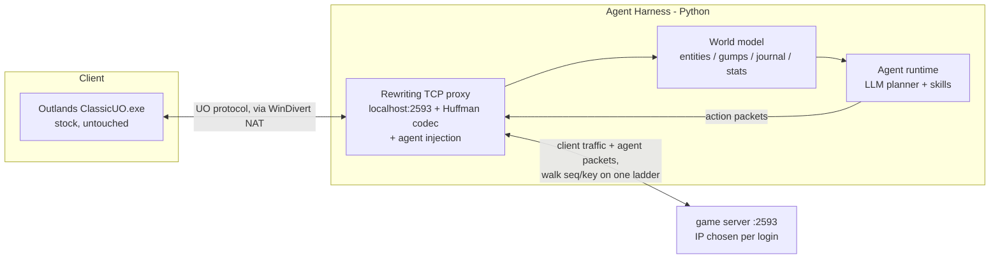

# uo-harness

An AI agent harness that plays **Ultima Online Outlands**.

Current status: **Phases 1 and 3 done; Phase 2 (world model) re-validated offline after an S2C decode correction; Phase 4 (agent runtime) under way: the lumberjack loop (harvest → boards → inn rental room storage, no deeds) ran end to end live on the Test Shard on 2026-09-29** ([`docs/LUMBER_LOOP.md`](docs/LUMBER_LOOP.md) §13). Phase 3's acceptance task, an unattended bank run (walk to the banker, open the bank box, walk back), completed live on the Test Shard on 2026-09-29. The proxy runs the world model live (state port), records durable harness memory ([`docs/MEMORY.md`](docs/MEMORY.md)), hides agent walk confirms from the client and re-anchors it client-side, and never sends anything of its own to the server. See [`HANDOFF.md`](HANDOFF.md), [`docs/MOVEMENT.md`](docs/MOVEMENT.md), [`docs/CIPHER.md`](docs/CIPHER.md). Read [`ANTICHEAT.md`](ANTICHEAT.md) first — it defines the safety constraints every design decision follows.

## Architecture (decided)

- **Localhost proxy** between the stock client and the game server; the client reaches it through a WinDivert NAT ([`docs/INTERCEPTION.md`](docs/INTERCEPTION.md)), `settings.json` is untouched. No client modification, no synthetic OS input.
- **What the server sees:** the client's own traffic plus the agent's injected packets, each built in the stock client's shape (layouts from the client's own packet table, companion packets and ordering as the client sends them). Walks from both senders share one seq/fastwalk-key ladder (docs/MOVEMENT.md). The proxy never originates a packet of its own; it drops one kind of client packet: a reply to a target cursor the agent already answered (ANTICHEAT.md §8.18).
- **What only the client sees:** agent walk confirms are hidden; the proxy hands the client fabricated 0x21 re-anchors, gump closes and target cancels so its screen matches the server (ANTICHEAT.md §8.11, §8.18).
- Protocol ground truth: upstream ClassicUO source (`ClassicUO-main/` locally, not committed; fetch via codeload — see below).
- See [`docs/PLAN.md`](docs/PLAN.md) for phases and rejected alternatives, [`docs/NOTES.md`](docs/NOTES.md) for the operational knowledge base.

## Hard facts (verified 2026-09-27)

| Fact | Value |
|---|---|
| Client | `ClassicUO.exe` STANDARD_BUILD **1.0.2.544** at analysis time (2026-09-27); the launcher patched it to **1.0.2.550** on 2026-09-28 (JWT `version` claim). NativeAOT native binary (no IL, no injection surface) |
| Launcher | `Outlands.exe` — patcher + OutlandsID login UI, elevates (UAC), `-installed` arg |
| Install dir | `C:\Program Files (x86)\Ultima Online Outlands` — **never write into it** |
| Game server | literal IP from the HTTPS login response, varying by login: 74.91.115.123 (Test Shard), 35.71.142.123 and 52.223.17.219 (2026-09-30), all on :2593. The NAT diverts any IP on :2593 (`play.uooutlands.com` does not resolve) |
| Auth | `https://login.uooutlands.com` (Cloudflare), JWT with `uooutlands.com/identity/claims/*` |
| Runtime net surface | exactly 2 connections: short HTTPS auth + persistent game TCP. No telemetry/beacons |
| Test account | shard "Test Server", character `TestWorth` (settings.json) |
| Assistant | Razor CE fork compiled into client; scripts dir `ClassicUO/Data/Plugins/Assistant/Scripts/` |

## Safety doctrine (summary — full version in ANTICHEAT.md §8)

1. Never touch the client process or files. 2. The proxy never originates server-visible packets; `Send_TimeSyncPingReq`/keepalives pass through unaltered; agent packets are stock-shaped. 3. Human pacing with jitter, human-length sessions. 4. Honor Razor-gating signals (halt when server restricts assistants). 5. No DeviceId/TPM/2FA spoofing; log in via official launcher. 6. No writes to the install dir. 7. CAPTCHAs are auto-solved from the gump layout (`harness/captcha.py`), margin-gated with a pause + alert fallback.

## Repo layout

| Path | Content |
|---|---|
| `ANTICHEAT.md` | Anti-cheat/automation-detection research report (the core document) |
| `docs/PLAN.md` | Build plan: phases, deliverables, rejected alternatives |
| `docs/NOTES.md` | Operational knowledge base (environment, gotchas, protocol nuggets) |
| `extract_strings.py` | ASCII+UTF-16 string extractor for native binaries |
| `scan_ac.py` | Categorized anti-cheat string scanner + context dumper |
| `scan_endpoints.py` | Network endpoint extractor (URLs/hosts/paths) |
| `scan_launcher.py` | Launcher fingerprint + API surface extractor |
| `ghidra_scripts/ACXrefs.java` | Ghidra headless xref script for flagged strings |
| `monitor_endpoints.ps1` | Per-process TCP endpoint monitor (behavioral capture) |
| `launch_game.ps1` | Game launcher helper (handles elevation) |
| `api_surface.txt`, `endpoints.txt`, `grep_hits.txt`, `launcher_hits.txt`, `behavioral_endpoints.csv` | Evidence artifacts |

## Not committed (regenerable / third-party)

- `ClassicUO.exe` copy, `strings.txt`, `launcher_strings.txt` — regenerate with `extract_strings.py`
- `ghidra/` — Ghidra project (re-run headless import; see NOTES.md for invocation gotchas)
- `ClassicUO-main/`, `Razor-master/` — upstream source trees:
  - `curl -sL https://codeload.github.com/ClassicUO/ClassicUO/tar.gz/refs/heads/main | tar xz`
  - `curl -sL https://codeload.github.com/markdwags/Razor/tar.gz/refs/heads/master | tar xz`

## Toolchain (this machine)

Python `C:\Users\chris\AppData\Local\Programs\Python\Python313\python.exe` · Git `C:\Program Files\Git\cmd` · Ghidra `C:\Users\chris\ghidra_12.1.4_PUBLIC` · Java 25 (Temurin) · Wireshark `C:\Program Files\Wireshark` · git push via SSH host alias `github.com-uoharness` (deploy key `~/.ssh/uo_harness_deploy`)
