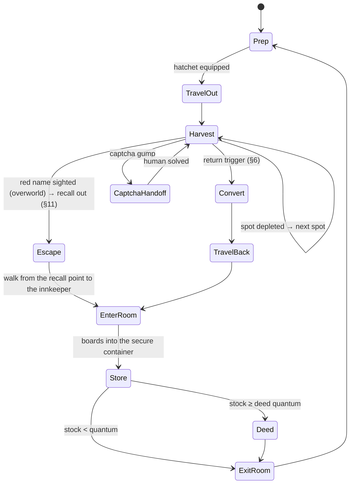

# LUMBER_LOOP.md — first repeatable game loop: chop trees → boards → deed → store in inn room

Status (2026-09-29): **M0 done.** The user's demonstration run (`logs/session_20260929_204225`) is
mined into `harness/data/loops/lumber.json` and pinned by `harness/test_loop_demo.py`; findings are in
§12. Open: the storage decision in §12.4. Builds on Phase 4 (docs/PLAN.md). This loop is the Phase 4
workload: the planner, the skill library, the rails and the captcha handoff all get exercised by it.

## 1. Goal and hard constraints

The agent should **learn** the loop, **run** it, and **improve** it over sessions:
- chop trees
- convert the logs to boards
- walk back to the inn and enter the rental room
- store the boards, and turn them into commodity deeds, in a secure container

Test Shard only, character TestWorth. Venue: Shelter Island first, the regular overworld later (§7).

These constraints come from existing docs and aren't optimization targets:
- **Captcha = attended loop.** Lumberjacking triggers a captcha every 5–10 min, and a solved one buys
  10–15 min. Per AGENTS.md rule 7 / ANTICHEAT.md §8.3 and §8.8, the loop runs only while the user is
  present: detect → pause → sound → human solves → resume. Expect ~4–6 handoffs per hour (derived
  from the wiki cadence). Auto-solve stays out of scope until the §8.8 accuracy bar is met.
- **Pacing is a floor, not a knob.** The optimizer never tightens jitter, proxy walk pacing
  (0.2/0.4 s), break schedule or daily cap (PLAN.md Phase 4).
- **Speech allowlist.** The loop needs one new trigger word near the innkeeper (`room`). Securing a
  container ("I wish to secure this") is one-time human setup, so it stays off the list.
- **Nothing server-visible that a stock client wouldn't send.** Skills use the existing
  `actions.py` builders only.
- **Never renounce Young status (Shelter phase).** Leaving Shelter Island by moongate, hike, recall
  or gate first asks the player to confirm renouncing Young status, and that is permanent
  ([Shelter Island](https://wiki.uooutlands.com/Shelter_Island)). The agent never uses travel on
  Shelter, and any gump that mentions renouncing Young aborts the loop without a reply. Moving to
  the overworld is a user action.

## 2. Game mechanics (wiki, read 2026-09-29; unverified in-game unless marked)

| Fact | Source | Loop consequence |
|---|---|---|
| Smart Harvest: double-click the equipped hatchet → auto-harvests every nearby tree with wood left | [Lumberjacking](https://wiki.uooutlands.com/Lumberjacking) | Harvest = one dclick per spot, then wait for depletion. No per-tree targeting. **Conflict:** [Smart Harvest](https://wiki.uooutlands.com/Smart_Harvest) says tools other than pickaxes need a self-target → verify on the wire |
| Harvesting on Shelter Island needs Young status. Harvest chance there is 50 % of normal, and skills cap at 80 | [Shelter Island](https://wiki.uooutlands.com/Shelter_Island) | Shelter yield is half the overworld's, so the r measured there doesn't transfer (§6). Lumberjacking is otherwise blocked in town regions |
| No hostile player actions on Shelter Island. Bank and vendors need Young status | Shelter Island | PK hazard on Shelter = 0 (§6). Bank and banker purchases work only while Young |
| **TestWorth is Young (capture evidence, 2026-09-29).** The client received the Young-only login gump "Welcome to Shelter Island" (`0xC16E0192`) in sessions 163420 and 202723 | Shelter Island + `loop_mine.py timeline 20260929_163420` | Venue decision holds |
| 60 s harvest lockout after recall / moongate / hike / teleport / rope | [Harvesting](https://wiki.uooutlands.com/Harvesting) | Walk, don't recall (Shelter: never recall, §1). Leaving the room teleports you → [INFERENCE] probably triggers the lockout; the demo checks it |
| Captcha: 5–10 min cadence; 3 fails = 6 h harvest block; closing it cancels the harvest; the same captcha persists across relog | [Captcha](https://wiki.uooutlands.com/Captcha) | Handoff state; the loop never closes or answers a captcha |
| Log/board weight 0.025 st | Harvesting | Weight isn't binding until thousands; the return trigger is risk/overhead (§6) |
| Double-click logs with a hatchet in the pack → boards (**user-confirmed: deeds need boards**) | Harvesting, Lumberjacking | Conversion is a loop step; can run in the field |
| Blank commodity deed: 5 gp at a banker; double-click the deed, target the resource | [Commodities](https://wiki.uooutlands.com/Commodities) | Needs gold + the target-cursor flow (S2C `0x6C` → `actions.target_object`) |
| 5 000 regular boards (2 500 colored) per commodity deed | Commodities | Unknown: partial stacks allowed? Must the boards sit in the bank box (RunUO rule, [INFERENCE] for Outlands)? The demo tests it |
| Rental room: say `rent`/`room`/`house` near an Innkeeper (or context menu "Rent") → room gump → Enter Room. Exit: dclick the front door → Exit to Town → **random room at the inn** | [Rental Room System](https://wiki.uooutlands.com/Rental_Room_System) | Two gump flows to learn. After exiting, the start position varies, so plan from the live position. Renting on Shelter while Young keeps Young |
| No recall/gate into a room; no access within 2 min of PvP | Rental Room System | Walking return is the only way in |
| Floor items decay after 1 h unless locked down; secure containers don't decay | Rental Room System | Boards and deeds go into a secure container (one-time human setup) |
| Commodities aren't blessed and can be looted | Commodities | Whatever is carried is at risk; §6 prices that |
| **Test Shard: all houses and inn rooms are cleared every 24 h at midnight UTC** | [Test Shard](https://wiki.uooutlands.com/Test_Shard) | Room contents are ephemeral on the Test Shard. The loop needs a "room missing → re-rent + re-secure" path, or stored goods are treated as a daily scratch pad. Test Shard state also re-mirrors from live saves occasionally |
| Renting costs gold (small room 5 000 gp/week, from the bank box); the first character on an account gets a 10 000 gp Rental Room Credit Deed | Rental Room System | TestWorth has 0 gold (2026-09-29). Renting works only if it holds a credit deed; otherwise gold comes first |
| NPC vendors on Shelter didn't buy what TestWorth offered ("You have nothing I would be interested in", sessions 141253/164548). The wiki's earning advice for resources is selling to players (~9–10 gp per board) | captures + [New Player Guide](https://wiki.uooutlands.com/New_Player_Guide) | No NPC gold sink for boards; boards are the stored product, not an income source |
| Test Shard resource stockpiles are in North Prevalia and Corpse Creek | Test Shard | Off-island: reaching them renounces Young, so they're out of reach during the Shelter phase |

## 3. The loop as a state machine

The trip threshold and the deed quantum are decoupled. Boards bank in the room every trip; a deed is
made once the room stock reaches the quantum. If the demo shows that deeding needs the bank box,
Deed becomes "take the quantum to the banker" and moves before EnterRoom.

Any state can be pre-empted by a proxy-enforced pause, break or kill (agent gate), or by a failure
(HP loss, movement stall, unknown gump). A failure goes to the LLM planner (§5).

## 4. Learn

The existing pattern is that knowledge is mined from captures and persisted as data, like
`nav.py build` → `walkmem.json`. The loop follows it:

1. **Learning by demonstration (first).** The user plays one full loop by hand through the proxy,
   which already captures everything (§10). `harness/loop_mine.py timeline <TAG>` (**built**)
   replays the capture through the proxy's own SessionTap and prints what the player did and what
   the server answered:
   - dclicks, lifts, drops, target cursors and responses
   - gumps with reply-button and text-entry ids, context menus, vendor lists, purchases
   - cliloc messages rendered from Cliloc.enu
   - amount changes in the backpack, bank box and opened containers
   - every entity acted on
   - the packet ids still unparsed

   From that evidence, `harness/data/loops/lumber.json` is written. It holds:
   - serials: hatchet, innkeeper, door, secure container
   - gump ids and button ids: room menu, door menu, captcha
   - cliloc numbers for chop success, "not enough wood", failure and captcha
   - the deed and conversion flows
   - the route

   A replay test pins those facts to the capture. Extracting them automatically before seeing a
   demo would mean guessing at their shape; after the demo they're read off the timeline.
2. **World memory (online).** `harness/data/harvestmem.json`, keyed by the standing tile of each
   Smart Harvest spot:
   - trees in reach (from statics + tiledata, read-only from the install dir; Phase 4 decision)
   - per-attempt yield
   - depletion time
   - estimated regrowth (time from depletion until the spot yields again)
   Blocked moves keep feeding walk memory as today.
3. **Episode log.** Every cycle appends one row to `harness/data/episodes/lumber.jsonl`:
   - time spent in each state
   - boards gained
   - steps, denies and reanchors
   - captchas, with human solve latency
   - hostile sightings, deaths, losses
   - failures and their type
   The optimizer and the reflection step read this log and nothing else.

## 5. Perform

- **Skills** (deterministic Python controllers generalised from `errand_bank.py`; each skill has
  preconditions, a success check against world-model evidence, a timeout and a typed failure):
  `goto`, `smart_harvest(spot)`, `convert_logs`, `buy_blank_deeds`, `make_deed`, `enter_room`,
  `store_in_container`, `take_from_container`, `exit_room`.
- **Routine runner:** executes §3 from `lumber.json` with no LLM call in the steady state, so every
  cycle costs 0 API calls.
- **LLM planner (Phase 4)** is called in three cases:
  - at start, to turn the natural-language objective into routine parameters
  - on a typed failure the routine can't handle: unknown gump, deny storm, unexpected message, HP loss
  - after a session, for reflection (§6)

  It picks skills only (PLAN.md decision). LLM-authored skill code stays deferred.
- **Rails:**
  - captcha → pause + sound
  - visualizer pause/kill
  - breaks and daily cap
  - never renounce Young (§1)
  - the runner schedules the return so a forced break starts inside the room, which is safe and looks natural

## 6. Optimize

Objective: **boards banked per agent-active hour, net of expected losses**, subject to §1.

### Return trigger: carried-value risk vs. trip overhead (user decision 2026-09-29)

Carrying more goods means a bigger loss if a PK kills you. Going home more often costs overhead. And
recall-hopping isn't free, because each recall or teleport adds a 60 s harvest lockout. Model per
trip, with the quantities measured from the episode log:

- `r`: boards per minute while harvesting (includes conversion, captcha pauses, spot moves)
- `T`: round-trip overhead in minutes (walk back, room in/out, walk out, and any 60 s lockout after
  a recall or the room exit)
- `h`: hazard of losing the carried goods, per minute in the field (PK encounters × P(death))

If a trip returns at `Q` boards, the carried load grows linearly, so the expected loss per trip is
about `h·Q²/(2r)`, plus `h·Q·T_back` on the way home. Cost per banked board:

$$c(Q) = \frac{rT}{Q} + \frac{hQ}{2r} + h\,T_{back} \quad\Rightarrow\quad Q^* = r\sqrt{2T/h}$$

- **Shelter Island: `h = 0`** (no hostile player actions, wiki). `Q*` is unbounded, so the trip ends
  on the next forced break (so the break is spent in the room), the weight cap or the session end.
  Shelter trips are where `r` and `T` get measured. Shelter halves harvest chance, so its `r` does
  not carry over to the overworld.
- **Overworld (later): `h` is learned from our own data.** The episode log records exposure
  (minutes in the field per region) and hazard events (red/grey player sightings, attacks,
  deaths, goods lost). `h` per region comes from a Gamma-Poisson estimate: a user-set prior
  (e.g. "PK-heavy forest"), then `α + k` events over `β + minutes` exposed. It sharpens as sessions
  accumulate and could later split by time of day. `Q*` recomputes each trip. Deaths are rare, so
  early on the prior dominates; sighting counts carry information much sooner than deaths.
- **Red name → recall out immediately (user decision 2026-09-29; design deferred, see §11).** In the
  overworld, a sighted murderer (red, notoriety 6) or an unfriendly grey player ends the trip at
  once: recall home, not walk. The 60 s harvest lockout is irrelevant at that point. On Shelter it's
  not needed (no hostile player actions).
- **Recall as a knob (overworld, later):** a routine recall home cuts `T_back` but adds a 60 s
  lockout on the way back out. The model takes it when `T` drops.

### Other knobs

| Knob | Method |
|---|---|
| Which spot next | Bandit (Thompson sampling) over harvest-memory spots. Reward = yield ÷ (travel + harvest time); a spot is eligible only once its regrowth estimate has passed |
| Spot order within a trip | Greedy nearest-eligible, with random tie-breaks among near-equal options |
| Where to convert/deed | Pick from measured episode times once §2 is verified (field vs. room vs. bank) |
| Route | A* over map data plus learned denies. Sample among near-optimal paths so trips don't repeat tile for tile |

Loop between sessions:
- `harness/loop_report.py` computes metrics from the episode log.
- The LLM reflection reads the report and proposes a diff to `lumber.json` parameters.
- Spot statistics and the return-trigger estimates (`r`, `T`, `h`) update automatically within bounds.
  Structural changes (new states, deed location, venue) need user approval.

Anti-pattern guard: optimizing toward one identical path and cadence is itself a behavioral
signature (ANTICHEAT.md §8.3). Variation is required, not an inefficiency to remove.

## 7. Decisions (user, 2026-09-29)

1. **Venue:** start on Shelter Island (TestWorth is Young, confirmed by capture, §2). The regular
   overworld comes later and is a user-initiated move, because leaving Shelter renounces Young.
2. **Deed/return:** logs must be converted to boards for commodity deeds. The return trigger is the
   §6 risk/overhead trade-off (PK loss vs. trip overhead, including the 60 s post-recall/teleport
   harvest lockout). Boards bank in the room every trip; deeds are made at the quantum.
3. **Optimizer autonomy:** as proposed. Spot and trigger statistics update automatically within
   bounds; structural routine changes are user-approved per session. Grow later.
4. **Setup + demonstration:** the user does it once the tooling is in place (§10).

## 8. Prerequisites

1. ~~Cliloc messages aren't parsed~~ **done:**
   - S2C `0xC1`/`0xCC` → `cliloc` event (number + args)
   - `harness/uo/cliloc.py` renders from Cliloc.enu, read-only; 107 922 entries (e.g. 500498
     "You put some logs into your backpack.", 500493 "There's not enough wood here to harvest.")
   - also parsed now: vendor buy list/purchase (`0x74`/`0x3B`), context menus (`0xBF` 0x13/0x14/0x15),
     text commands (`0x12`), lift/drop/equip (`0x07`/`0x08`/`0x13`)
   - C2S `0x6C` and `0xB1` corrected to the Outlands layouts
2. ~~Captcha detection~~ **known from the demo (§12.2):** real captcha = gump id `0x00000001` with
   text entry 2 and submit button 594. Decoy "Captcha" gumps open on every attempt and must never
   be answered. The runner's handoff trigger keys on the gump id + entry + button, never on text.
3. ~~Pause/kill/break proxy flag + budget file~~ **built** (commit 2ffb29a: the proxy-enforced agent
   gate, `harness/agent_gate.py`). The routine runner has to honor gate refusals as a typed
   `paused` failure and resume cleanly.
4. **Map/statics/tiledata reader** (Phase 4 decision, not built). Outlands ships its own formats:
   `facet0N.mul`, `art.uoo`, `artdata.uoo`, not `map0.mul`/`artLegacyMUL.uop`. The reader has to
   handle them. Needed for tree positions and pathing beyond walk memory; not needed for the demo.
5. **Live validation of target / lift / drop.** Builders exist (`actions.target_object`, `lift`,
   `drop`). HANDOFF lists speech, dclick, gumps, spells and item queries as proven live, not these.
   The demonstration capture provides the stock-client reference packets to compare against.
6. Add `room` to the speech allowlist (built with the agent runtime; not needed for the demo).

## 9. Milestones

| # | Deliverable | Done when |
|---|---|---|
| M0 ✅ | Demonstration capture (`20260929_204225`) + `loop_mine.py timeline` + `lumber.json` | Done 2026-09-29: §12; `test_loop_demo.py` pins the facts. Still open: Smart Harvest self-target, deed from a 5 000 backpack stack |
| M1 | Perception: cliloc parsing (built), captcha gump detection, harvest events | Replay of the demonstration yields every harvest outcome and the captcha as events |
| M2 | Skills, each offline-tested (simulated world like `test_errand.py`), then live one at a time, attended | Each skill passes live on the Test Shard |
| M3 | Routine runner, full loop | 1 cycle unattended except captcha handoffs; then N cycles across a forced break |
| M4 | Harvest memory, episode log, report | Report reproduces from the logs; `r`, `T` and regrowth estimates exist |
| M5 | Bandit + return trigger + reflection | Boards/active-hour improves over a baseline session on the same venue without violating §1 |
| M6 | LLM planner composes and repairs the routine | Phase 4 done criterion: NL objective → loop run, with the captcha handoff demonstrated |

## 10. Demonstration runbook (user)

**Setup (one-time, by hand, can be done through the proxy):**
1. Start the chain as in HANDOFF.md "Operate": proxy (restart it so the live state port has the new
   parsers), divert NAT, launch the game.
2. Check Young: single-click yourself; the label shows `(Young)`.
3. Rent a room: say `rent` (or `room`) near the Shelter innkeeper, click Rent Room three times.
   Enter, drop a container on the floor, say "I wish to secure this" and target it. Exit.
4. Equip a hatchet. Carry some gold for blank commodity deeds (5 gp each).
5. Note TestWorth's Lumberjacking skill; if it's low, a Test Shard template can set 60.

**Demonstration (one continuous session through the proxy, ~20–30 min so a captcha shows up):**
1. If you have gold: at the banker, buy a few blank commodity deeds, the way you normally would.
   With 0 gold, skip this step and step 6; the rest of the demo doesn't depend on them.
2. Walk to trees where harvesting works. Double-click the hatchet (if a target cursor appears, target
   yourself). Harvest until the spot is empty, move to another spot, keep going.
3. When the captcha appears, solve it normally.
4. Convert logs to boards (double-click the logs).
5. Walk to the inn, say `room`, Enter Room.
6. Try a deed: double-click a blank deed and target the boards in your backpack, even though it's
   fewer than 5 000; the message tells us whether partial stacks or the backpack are allowed. If
   it's refused, try with the boards in the bank box on a later trip.
7. Put the boards (and any deed) into the secure container.
8. Exit via the door (Exit to Town). Walk out and double-click the hatchet straight away. A lockout
   message confirms the teleport lockout.
9. Tell me the session tag (`logs/session_<tag>.*`). I run `python harness/loop_mine.py timeline
   <tag>`, write `lumber.json`, and pin the facts in a replay test.

Nothing in the harness injects during the demonstration; the proxy only relays and records.

## 11. Deferred: come back to these before the overworld (noted 2026-09-29)

1. **Hazard learning pipeline.** Episode-log schema for exposure and hazard events per region;
   the Gamma-Poisson `h` estimator; the report showing `h` and its uncertainty per region; how the
   user sets priors.
2. **Red-name escape by recall.** Needs Magery (or recall scrolls), reagents and a rune/runebook
   marked home: town/inn, since recall into the rental room is impossible. Open questions:
   - cast time vs. how fast a PK closes in
   - interruption by damage
   - fallback when fizzled or out of reagents: run, drop the harvest, or hide
   - escape latency budget from sighting to cast
   The agent cast path exists (`actions.cast_spell` + target, proven live); the rune target flow
   isn't captured yet.
3. **Detection range: do we need Tracking?** The world model only knows mobiles the server sends
   (0x20/0x77/0x78 with notoriety), so detection range = the server's update range. That's about
   18 tiles for UO servers ([INFERENCE] for Outlands; measure from captures as the distance at
   which mobiles first appear). The Tracking skill may reveal players beyond that range. To check:
   Outlands Tracking mechanics (range, what it reports, cooldown, whether its result arrives as a
   gump/cliloc the world model can read), and whether the earlier warning is worth the skill
   points. Hidden/stealthed PKs are invisible either way.

## 12. Demonstration findings (session 20260929_204225, user-played)

Source: `python harness/loop_mine.py timeline 20260929_204225`. Every fact below is pinned by
`harness/test_loop_demo.py`.

### 12.1 Mechanics verified in-game
- **Harvesting = one attempt per use.**
  - Double-click the equipped hatchet → cliloc 1010018 "What do you want to use this item on?" plus
    a location cursor (type 1).
  - Target the tree (a static: 0x0CE0 at (1898, 2622, 10)).
  - The result arrives about 4.1 s later: fail cliloc 500495, success plain text "You chop some
    logs and put them in your backpack." (+5 and +7 logs).
  - Nothing auto-repeated, because the demo targeted trees, not the character. Whether targeting
    yourself starts Smart Harvest is still **untested**.
  - Yield on Shelter at Lumberjacking 60.2: 2 successes in 12 attempts, 12 logs, one attempt about
    every 9.5 s by hand, so about 6 logs/min. [INFERENCE from a small sample]
- **Conversion:**
  - Double-click the hatchet, target the log stack → "You shape the logs into boards."
  - The ratio is **1 log → 1 board**. Logs of one kind stack, so a trip needs one conversion per
    stack.
- **Weight: logs and boards weigh the same.** The status weight moved +1 for +5 logs, 0 on 5 logs →
  5 boards, +1 for +7 logs, and −1 when the 7 logs merged into the 5-board stack. That matches
  0.025 st each with the server rounding each stack up to whole stones. Max weight is 570 st, so
  weight never limits a trip.
  → **Convert once per trip, just before storing.** Converting during harvesting gains nothing: same
  weight, same loss if killed, same number of actions.
- **Deed:** double-click the blank commodity → "What resource to you wish to create a commodity
  for?" → target the boards → "Commodity for that item must be of at least 5000." (12 boards in the
  backpack). So the quantum is confirmed. Whether a backpack stack is acceptable at 5 000 is still
  open, because the quantity check fired first.
- **Travel lockout confirmed:**
  - "You exit the rental room." at 13:17.7
  - "…must wait 19 seconds…" at 13:59.2
  - 41.5 s + 19 s = 60 s from the room exit
- **Banker purchase:** context menu index 1 (Buy, 3006103) on Len → buy list "Blank Commodity 5gp,
  Vendor Rental Contract 100gp". Backpack gold is used (21 → 16). With 0 gold the answer is cliloc
  500191.
- **Rental room:**
  - Context menu "Rent" (index 1) on Jayne the innkeeper, or saying `room` from 11 tiles away,
    opens gump `0x8EAEFBDB`. Button 4 three times rents (paid with 5 000 rental credits), then
    button 4 enters.
  - Inside you land at (39, 65, 1). The door `0x45757DCB` opens the same gump; button 4 exits to
    (1932, 2589).
  - Securing: drop the container on the floor, say "I wish to secure this", target it →
    "Secures Used: 1 / 2".
  - Drops into a container use x = y = 0x7FFFFFFF (client auto-position).

### 12.2 Captcha: the real gump and decoys (see ANTICHEAT.md §8.13)
- **Real captcha:**
  - It appeared on the **first** harvest attempt, not after 5–10 min.
  - gump id `0x00000001`: `textentrylimited` id 2 (max 3 chars) and one reply button, 594.
  - The digits are drawn as `tilepic` dot glyphs (graphics 572 and 6255) at layout coordinates.
  - The human answered `326` with button 594 → "Captcha successful."
  - No further real captcha appeared in the ~12 min that followed. Most of that time was spent
    elsewhere, not harvesting.
- **Decoys:** every harvest attempt also opens a gump with the same words ("Captcha", "Type the
  Value", "Click when complete"):
  - a random gump id each time (≥ 10 distinct)
  - `nomove/noclose/nodispose`
  - **no buttons**
  - all text as `croppedtext` at negative, offscreen coordinates
  - `xmfhtmlgump` with nonexistent cliloc numbers

  A human never sees or answers them. A bot matching on text would answer them. The handoff
  trigger is therefore gump id + text entry + submit button, and the agent never replies to any
  gump without a reply button.

### 12.3 Consequences for the loop
- The §3 Harvest state is: dclick hatchet → target the next tree tile → wait for the result
  message, repeated per tree until the depleted cliloc (500488/500493), then the next tree. Trees
  come from the demo now, and from the map reader later.
- Conversion happens once per trip, before Store.
- After the room exit, the 60 s lockout overlaps the walk out. The loop waits only for the rest.
- `r` on Shelter (~6 logs/min by hand) makes the 5 000 quantum ≈ 14 h of harvesting. [INFERENCE]

### 12.4 Open decision (user): where the stock lives on the Test Shard
The Test Shard clears rooms daily at 00:00 UTC (§2), and the agent runs ≤ 8 h/day. At the demo
rate, room stock will never reach a deed on the Test Shard. Options:
1. Keep the room as specified and treat it as daily scratch storage. The loop is exercised
   end-to-end; deeds happen only after a faster venue or skill.
2. Bank the boards instead, and deed from the bank box. Whether the bank survives the Test Shard
   wipe is [INFERENCE: likely, since only houses and rooms are named]; re-mirrors from live saves
   can still reset it.
3. Raise Lumberjacking first (Shelter caps it at 80), so `r` grows before the loop targets deeds.
