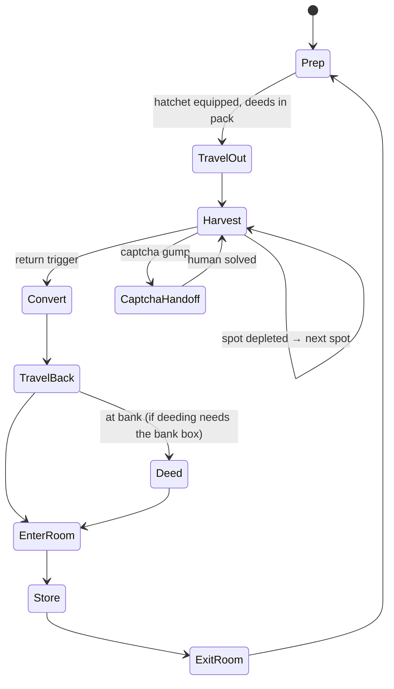

# LUMBER_LOOP.md — first repeatable game loop: chop trees → deed → store in inn room

Status: **PROPOSED 2026-09-29, open decisions in §7.** Builds on Phase 4 (docs/PLAN.md). This loop is
the proposed Phase 4 workload: the planner, the skill library, the rails and the captcha handoff all
get exercised by it.

## 1. Goal and hard constraints

The agent should **learn** the loop, **run** it, and **improve** it over sessions: chop trees, turn the
wood into commodity deeds, walk back to the inn, enter the rental room, and store the deeds in a
secure container. Test Shard only, character TestWorth.

These constraints come from existing docs and aren't optimization targets:
- **Captcha = attended loop.** Lumberjacking triggers a captcha every 5–10 min, and a solved one buys
  10–15 min. Per AGENTS.md rule 7 / ANTICHEAT.md §8.3 and §8.8, the loop runs only while the user is
  present: detect → pause → sound → human solves → resume. Expect ~4–6 handoffs per hour. Auto-solve
  stays out of scope until the §8.8 accuracy bar is met.
- **Pacing is a floor, not a knob.** The optimizer never tightens jitter, proxy walk pacing
  (0.2/0.4 s), break schedule or daily cap (PLAN.md Phase 4).
- **Speech allowlist.** The loop needs one new trigger word near the innkeeper (`room`). Securing a
  container ("I wish to secure this") is one-time human setup, so it stays off the list.
- **Nothing server-visible that a stock client wouldn't send.** Skills use the existing
  `actions.py` builders only.

## 2. Game mechanics (wiki, read 2026-09-29; unverified in-game unless marked)

| Fact | Source | Loop consequence |
|---|---|---|
| Smart Harvest: double-click the equipped hatchet → auto-harvests every nearby tree with wood left | [Lumberjacking](https://wiki.uooutlands.com/Lumberjacking) | Harvest = one dclick per spot, then wait for depletion. No per-tree targeting. **Conflict:** [Smart Harvest](https://wiki.uooutlands.com/Smart_Harvest) says tools other than pickaxes need a self-target → verify on the wire |
| Lumberjacking is blocked in town regions, except Shelter Island while Young | Lumberjacking | Choose harvest spots outside the town region, or use Shelter Island if TestWorth is Young |
| 60 s harvest lockout after recall / moongate / hike / teleport / rope | [Harvesting](https://wiki.uooutlands.com/Harvesting) | Walk, don't recall. Leaving the room teleports you → [INFERENCE] probably triggers the lockout. Walking to the trees usually covers it |
| Captcha: 5–10 min cadence; 3 fails = 6 h harvest block; closing it cancels the harvest; the same captcha persists across relog | [Captcha](https://wiki.uooutlands.com/Captcha) | Handoff state; the loop never closes or answers a captcha |
| Log/board weight 0.025 st | Harvesting | Weight isn't binding until thousands of logs; the trip trigger is the deed quantum or the break schedule, not weight |
| Double-click logs with a hatchet in the pack → boards | Harvesting, Lumberjacking | Conversion step; can run in the field |
| Blank commodity deed: 5 gp at a banker; double-click the deed, target the resource | [Commodities](https://wiki.uooutlands.com/Commodities) | Needs gold + the target-cursor flow (S2C `0x6C` → `actions.target_object`) |
| Commodity table lists **boards** (5 000 regular / 2 500 colored per deed), not logs | Commodities | "Log deeds" probably means board deeds → verify. Unknown: partial stacks allowed? Must the resource sit in the bank box (the RunUO rule, [INFERENCE] for Outlands)? |
| Rental room: say `rent`/`room`/`house` near an Innkeeper (or use context menu "Rent") → room gump → Enter Room. Exit: dclick the front door → Exit to Town → **random room at the inn** | [Rental Room System](https://wiki.uooutlands.com/Rental_Room_System) | Two gump flows to learn. After exiting, the start position varies, so plan from the live position |
| No recall/gate into a room; no access within 2 min of PvP | Rental Room System | Walking return is the only way in |
| Floor items decay after 1 h unless locked down; secure containers don't decay | Rental Room System | Deeds go into a secure container (one-time human setup) |
| Commodities aren't blessed and can be looted | Commodities | Carrying deeds is a risk; store them promptly |

## 3. The loop as a state machine

Any state can be pre-empted by a proxy-enforced pause, break or kill (Phase 4 rails), or by a failure
(HP loss, movement stall, unknown gump). A failure goes to the LLM planner (§5).

## 4. Learn

The existing pattern is that knowledge is mined from captures and persisted as data, like
`nav.py build` → `walkmem.json`. The loop follows it:

1. **Learning by demonstration (first).** The user plays one full loop by hand through the proxy,
   which already captures everything. An offline miner (`harness/loop_mine.py`) extracts it into
   `harness/data/loops/lumber.json`:
   - serials: hatchet, innkeeper, door, secure container
   - gump ids and button ids: room menu, door menu, captcha
   - the message ids for chop success, "not enough wood", failure and captcha
   - the deed flow as a packet sequence (dclick deed → S2C `0x6C` cursor → C2S target on the stack)
   - the route (walk memory)
   Replay tests assert that the miner reproduces the file from the capture. This settles the §2
   unknowns with evidence instead of guesses.
2. **World memory (online).** `harness/data/harvestmem.json`, keyed by the standing tile of each
   Smart Harvest spot:
   - trees in reach (from statics + tiledata, read-only from the install dir; Phase 4 decision)
   - per-attempt yield
   - depletion time
   - estimated regrowth (time from depletion until the spot yields again)
   Blocked moves keep feeding walk memory as today.
3. **Episode log.** Every cycle appends one row to `harness/data/episodes/lumber.jsonl`:
   - time spent in each state
   - boards gained
   - steps, denies and reanchors
   - captchas, with human solve latency
   - failures and their type
   The optimizer and the reflection step read this log and nothing else.

## 5. Perform

- **Skills** (deterministic Python controllers generalised from `errand_bank.py`; each skill has
  preconditions, a success check against world-model evidence, a timeout and a typed failure):
  `goto`, `smart_harvest(spot)`, `convert_logs`, `buy_blank_deeds`, `make_deed`, `enter_room`,
  `store_in_container`, `exit_room`.
- **Routine runner:** executes §3 from `lumber.json` with no LLM call in the steady state, so every
  cycle costs 0 API calls.
- **LLM planner (Phase 4)** is called in three cases:
  - at start, to turn the natural-language objective into routine parameters
  - on a typed failure the routine can't handle: unknown gump, deny storm, unexpected message, HP loss
  - after a session, for reflection (§6)

  It picks skills only (PLAN.md decision). LLM-authored skill code stays deferred.
- **Rails:** captcha → pause + sound; visualizer pause/kill; breaks and daily cap. The runner
  schedules the return so a forced break starts inside the room, which is safe and looks natural.

## 6. Optimize

Objective: **boards per agent-active hour**, subject to §1.

| Knob | Method |
|---|---|
| Which spot next | Bandit (Thompson sampling) over harvest-memory spots. Reward = yield ÷ (travel + harvest time); a spot is eligible only once its regrowth estimate has passed |
| Spot order within a trip | Greedy nearest-eligible, with random tie-breaks among near-equal options |
| Return trigger | Deed quantum (5 000 boards, or the smaller verified quantum), capped by time to the next forced break |
| Where to convert/deed | Pick from measured episode times once §2 is verified (field vs. room vs. bank) |
| Route | A* over map data plus learned denies. Sample among near-optimal paths so trips don't repeat tile for tile |

Loop between sessions:
- `harness/loop_report.py` computes metrics from the episode log.
- The LLM reflection reads the report and proposes a diff to `lumber.json` parameters.
- Spot statistics update automatically within bounds. Structural changes (new states, different
  deed location) need user approval (§7 decision 3).

Anti-pattern guard: optimizing toward one identical path and cadence is itself a behavioral
signature (ANTICHEAT.md §8.3). Variation is required, not an inefficiency to remove.

## 7. Open decisions (user)

1. **Venue:** Shelter Island (if TestWorth is Young, in-town harvesting is allowed and the inn is
   close) vs. a mainland town with forest outside the guard zone. Proposal: Shelter Island if eligible.
2. **Deed flow:** depends on the §2 verification. Either stash boards in the room and deed once
   ≥ 5 000 have accumulated, or deed per trip if partial stacks are allowed.
3. **Optimizer autonomy:** proposal: spot and threshold statistics update automatically within
   bounds; structural routine changes are user-approved per session.
4. **Demonstration run:** needs ~1 manual loop by the user through the proxy, plus one-time setup:
   - rent a room
   - place and secure a container
   - equip a hatchet
   - have gold for blank deeds
   - have enough Lumberjacking skill (a Test Shard template sets 60)

## 8. Prerequisites (current repo gaps)

1. **Cliloc messages aren't parsed.** `world/parsers.py` `_PROC_S2C` has no `0xC1`/`0xCC`, so harvest
   outcomes are invisible. Add them, plus a read-only `Cliloc.enu` lookup.
2. **Captcha detection.** The `CAPTCHA_GUMP_ID` value is unknown; get it from the demonstration
   capture (0xB0/0xDD gump id + layout).
3. ~~Pause/kill/break proxy flag + budget file~~ **built** (commit 2ffb29a: the proxy-enforced agent
   gate, `harness/agent_gate.py`). The routine runner has to honor gate refusals as a typed
   `paused` failure and resume cleanly.
4. **Map/statics/tiledata reader** (Phase 4 decision, not built). Needed for tree positions and for
   pathing beyond walk memory.
5. **Live validation of target / lift / drop.** Builders exist (`actions.target_object`, `lift`,
   `drop`). HANDOFF lists speech, dclick, gumps, spells and item queries as proven live, not these.
6. Add `room` to the speech allowlist.

## 9. Milestones

| # | Deliverable | Done when |
|---|---|---|
| M0 | Demonstration capture + `loop_mine.py` + `lumber.json` | §2 unknowns answered with capture evidence; miner replay test green |
| M1 | Perception: cliloc parsing, captcha gump detection, harvest events | Replay of the demonstration yields every harvest outcome and the captcha as events |
| M2 | Skills, each offline-tested (simulated world like `test_errand.py`), then live one at a time, attended | Each skill passes live on the Test Shard |
| M3 | Routine runner, full loop | 1 cycle unattended except captcha handoffs; then N cycles across a forced break |
| M4 | Harvest memory, episode log, report | Report reproduces from the logs; regrowth estimates exist for visited spots |
| M5 | Bandit + return trigger + reflection | Boards/active-hour improves over a baseline session on the same venue without violating §1 |
| M6 | LLM planner composes and repairs the routine | Phase 4 done criterion: NL objective → loop run, with the captcha handoff demonstrated |
