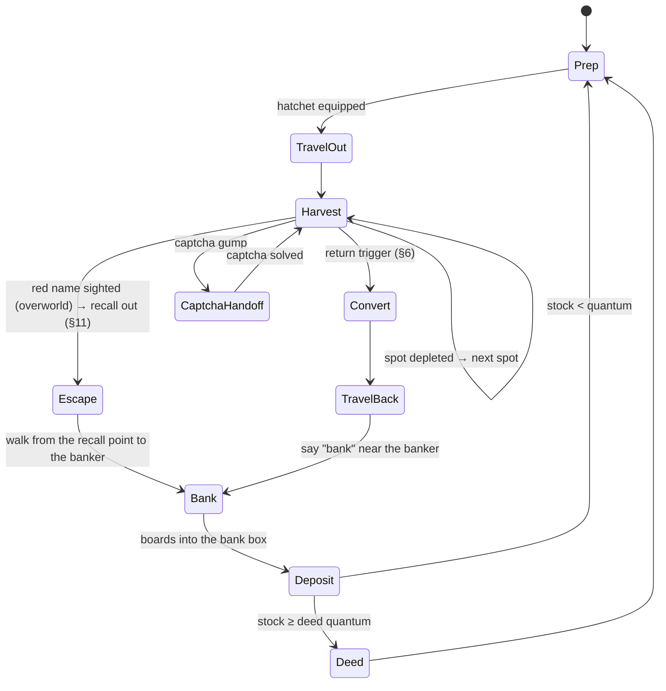

# LUMBER_LOOP.md — first repeatable game loop: chop trees → boards → bank (→ deed later)

Status (2026-10-02): **self-optimizing (§6, "Built 2026-10-02").** `ctl lumber plan` picks the spot
(Thompson sampling over spots learned from every trip), the trip size (death, sent-home and theft risk vs. walking
overhead) and the hatchet; the runner takes `--spot`. Boards go into the bank box; the rental room
is out of the loop (user decision, §12.5). The room-storage version ran live on 2026-09-29 (3 trips,
50 boards, captcha solved and resumed; run 3, §13); the bank version ran live off Shelter on
2026-10-02 (Horseshoe Bay, Corpse Creek, Terran).
- M0: the user's demonstration run (`logs/session_20260929_204225`) is mined into
  `harness/data/loops/lumber.json` and pinned by `harness/test_loop_demo.py`; findings are in §12.
- Runner: `harness/loop_lumber.py`, proven offline by `test_loop_lumber.py`. Optimizer:
  `harness/lumber_opt.py`, proven offline by `harness/test_lumber_opt.py`.

Builds on Phase 4 (docs/PLAN.md). This loop is the Phase 4 workload: the planner, the skill
library, the rails and the captcha handling all get exercised by it.

## 1. Goal and hard constraints

The agent should **learn** the loop, **run** it, and **improve** it over sessions:
- chop trees
- convert the logs to boards
- walk to the banker and open the bank box
- bank the boards (commodity deeds later)

Character: a fresh Young character on Shelter Island (TestWorth until 2026-10-01). Venue: Shelter
Island first, the regular overworld later (§7).

These constraints come from existing docs and aren't optimization targets:
- **Captcha = human-solved by default, auto-solve by toggle (user decision 2026-10-01).** Lumberjacking triggers a captcha every 5–10 min, and a solved one
  buys 10–15 min. In captcha mode `human` the runner pauses and beeps until the solve shows in the client.
  The viz header's `captcha [human|auto]` toggle switches to `auto`: `harness/captcha.py` reads the digits from the gump
  layout's tilepic dot clusters (ANTICHEAT.md §8.8/§8.13), margin-gated, with the human wait as the fallback.
  Expect ~4–6 captchas per hour (derived from the wiki cadence).
- **Pacing is a floor, not a knob.** The optimizer never tightens jitter, proxy walk pacing
  (0.2/0.4 s), break schedule or daily cap (PLAN.md Phase 4).
- **Speech allowlist.** The loop's one trigger word is `bank` near the banker (since 2026-10-01;
  before that `room` near the innkeeper).
- **Nothing server-visible that a stock client wouldn't send.** Skills use the existing
  `actions.py` builders only.
- **Never renounce Young status (Shelter phase).** Leaving Shelter Island by moongate, hike, recall
  or gate first asks the player to confirm renouncing Young status, and that is permanent
  ([Shelter Island](https://wiki.uooutlands.com/Shelter_Island)). The agent never uses travel on
  Shelter. Moving to the overworld is a user action. Moongates are walkable and only ask; they
  don't move you (user, 2026-10-01). In session 20261001_191355 a route step onto a player-cast
  moongate on Shelter opened the prompt (gump `0xE2544541`); nothing replied, the run walked on
  and stayed Young, and the prompt stayed up in the client. **Since 2026-10-01 the Mover closes
  the gump of any moongate a route only passes over** (stock `0xB1` button 0 after a reaction
  pause, `agent_link.Mover.close_gate_gumps`), so the runner neither aborts nor leaves it open;
  closing is never a renounce. (Earlier text here said the loop aborts on that gump; it never
  did.) Details: docs/NOTES.md "Shelter Island"; test: `test_loop_lumber.py` (gates by the town
  door), `harness/test_mover.py`.

## 2. Game mechanics (wiki, read 2026-09-29; unverified in-game unless marked)

| Fact | Source | Loop consequence |
|---|---|---|
| Smart Harvest: double-click the equipped hatchet → auto-harvests every nearby tree with wood left | [Lumberjacking](https://wiki.uooutlands.com/Lumberjacking) | Harvest = one dclick per spot, then wait for depletion. No per-tree targeting. **Conflict:** [Smart Harvest](https://wiki.uooutlands.com/Smart_Harvest) says tools other than pickaxes need a self-target → verify on the wire |
| Harvesting on Shelter Island needs Young status. Harvest chance there is 50 % of normal, and skills cap at 80 | [Shelter Island](https://wiki.uooutlands.com/Shelter_Island) | Shelter yield is half the overworld's, so the r measured there doesn't transfer (§6). Lumberjacking is otherwise blocked in town regions |
| No hostile player actions on Shelter Island. Bank and vendors need Young status | Shelter Island | PK hazard on Shelter = 0 (§6). Bank and banker purchases work only while Young |
| **TestWorth is Young (capture evidence, 2026-09-29).** The client received the Young-only login gump "Welcome to Shelter Island" (`0xC16E0192`) in sessions 163420 and 202723 | Shelter Island + `loop_mine.py timeline 20260929_163420` | Venue decision holds |
| 60 s harvest lockout after recall / moongate / hike / teleport / rope | [Harvesting](https://wiki.uooutlands.com/Harvesting) | Walk, don't recall (Shelter: never recall, §1). Leaving the room teleports you → [INFERENCE] probably triggers the lockout; the demo checks it |
| **Stationary Harvest Penalty** (patch 2025-01-25): after a recall, or after 5 min standing still, harvesting fails until you walk 5 steps | docs/research/THREATS.md §7 T4; measured 2026-10-03 (docs/HUNT_LOOP.md "Stationary Penalty"): 301-315 s after the last step; at once after login and most teleports (recalls, moongates and the like 23/28, leaving a rental room 21/22) | Built 2026-10-03 (`stationary.py`): before each chop the runner walks it off (5 + 1 steps out and back to the stand tile) and repositions 2-4 steps after ~3-4 min without a step. Before that no chop had hit it (1 662 attempts), but the 60 s lockout after a recall is waited out where we land, and a speech hold or captcha at one tree can pass 5 min |
| Captcha: 5–10 min cadence; 3 fails = 6 h harvest block; closing it cancels the harvest; the same captcha persists across relog | [Captcha](https://wiki.uooutlands.com/Captcha) | Human-solved by default, auto-solved from the layout when toggled (§1); the runner never closes a captcha, and in auto it answers with the stock 0xB1 |
| Log/board weight 0.025 st | Harvesting | Weight isn't binding until thousands; the return trigger is risk/overhead (§6) |
| Double-click logs with a hatchet in the pack → boards (**user-confirmed: deeds need boards**) | Harvesting, Lumberjacking | Conversion is a loop step; can run in the field |
| Blank commodity deed: 5 gp at a banker; double-click the deed, target the resource | [Commodities](https://wiki.uooutlands.com/Commodities) | Needs gold + the target-cursor flow (S2C `0x6C` → `actions.target_object`) |
| 5 000 regular boards (2 500 colored) per commodity deed | Commodities | Unknown: partial stacks allowed? Must the boards sit in the bank box (RunUO rule, [INFERENCE] for Outlands)? The demo tests it |
| Rental room: say `rent`/`room`/`house` near an Innkeeper (or context menu "Rent") → room gump → Enter Room. Exit: dclick the front door → Exit to Town → **random room at the inn** | [Rental Room System](https://wiki.uooutlands.com/Rental_Room_System) | Two gump flows to learn. After exiting, the start position varies, so plan from the live position. Renting on Shelter while Young keeps Young |
| No recall/gate into a room; no access within 2 min of PvP | Rental Room System | Walking return is the only way in |
| Floor items decay after 1 h unless locked down; secure containers don't decay | Rental Room System | Boards and deeds go into a secure container (one-time human setup) |
| Commodities aren't blessed and can be looted | Commodities | Whatever is carried is at risk; §6 prices that |
| **Test Shard: all houses and inn rooms are cleared every 24 h at midnight UTC** | [Test Shard](https://wiki.uooutlands.com/Test_Shard) | Room contents are ephemeral on the Test Shard. The loop needs a "room missing → re-rent + re-secure" path, or stored goods are treated as a daily scratch pad. Test Shard state also re-mirrors from live saves occasionally |
| Renting costs gold (small room 5 000 gp/week, from the bank box); the first character on an account gets a 10 000 gp Rental Room Credit Deed | Rental Room System | TestWorth has 0 gold (2026-09-29). Renting works only if it holds a credit deed; otherwise gold comes first |
| NPC vendors on Shelter didn't buy what TestWorth offered ("You have nothing I would be interested in", sessions 141253/164548). The wiki's earning advice for resources is selling to players (~9–10 gp per board) | captures + [New Player Guide](https://wiki.uooutlands.com/New_Player_Guide) | No NPC gold sink for boards; boards are the stored product, not an income source |
| Test Shard resource stockpiles are in North Prevalia and Corpse Creek | Test Shard | Off-island: reaching them renounces Young, so they're out of reach during the Shelter phase |
| Colored hatchets give a stacking **Tool Bonus** to harvest success chance: Exceptional +0.04, Mastercrafted +0.04, Dull Copper +0.02, Shadow Iron +0.04, Copper +0.06, Bronze +0.08, Gold +0.10, Agapite +0.12, Verite +0.14, Valorite +0.16, Avarite +0.18 (Iron base 0; all bonuses stack). Success chance per log color = ((skill − offset) / 80) × (1 + Tool Bonus) for colored woods, (skill / 100) × (1 + Tool Bonus) for regular | [Lumberjacking](https://wiki.uooutlands.com/Lumberjacking) | A colored hatchet raises `r` without any behavior change; at Lumberjacking 60 an Iron hatchet gives 60 % regular success, a Valorite one ~70 %. What TestWorth's hatchet is made of is unknown — check next session |
| Colored hatchets also last longer: Iron 500 base uses, +125 per tier (Exceptional/Mastercrafted +250 each, up to Avarite +1125) | Lumberjacking | The runner needs a "tool broken → equip/craft another" path eventually; with 500 uses at ~9.5 s per attempt one hatchet covers ~1.3 h of chopping |

## 3. The loop as a state machine

The trip threshold and the deed quantum are decoupled. Boards go into the bank box every trip; a
deed is made once the bank stock reaches the quantum (deeds aren't built yet, §12.4).

Any state can be pre-empted by a proxy-enforced pause, break or kill (agent gate), or by a failure
(HP loss, movement stall, unknown gump). A failure goes to the LLM planner (§5).

## 4. Learn

Knowledge about the loop's mechanics is mined from captures into curated files (lumber.json).
What the loop learns while playing goes into the harness memory store (docs/MEMORY.md; gitignored
runtime data, AGENTS.md Rule 0):

1. **Learning by demonstration (first).** The user plays one full loop by hand through the proxy,
   which already captures everything (§10). `harness/loop_mine.py timeline <TAG>` (**built**)
   replays the capture through the proxy's own SessionTap and prints what the player did and what
   the server answered:
   - dclicks, lifts, drops, target cursors and responses
   - gumps with reply-button and text-entry ids, context menus, vendor lists, purchases
   - cliloc messages rendered from Cliloc.enu
   - amount changes in the backpack, bank box and opened containers
   - every entity acted on
   - the packet ids still unparsed

   From that evidence, `harness/data/loops/lumber.json` is written. It holds:
   - serials: hatchet, innkeeper, door, secure container
   - gump ids and button ids: room menu, door menu, captcha
   - cliloc numbers for chop success, "not enough wood", failure and captcha
   - the deed and conversion flows
   - the route

   A replay test pins those facts to the capture. Extracting them automatically before seeing a
   demo would mean guessing at their shape; after the demo they're read off the timeline.
2. **World memory (online):** the store's `harvest_nodes` and `harvest_attempts` tables, keyed by
   facet and tree tile:
   - trees in reach (from statics + tiledata, read-only from the install dir; Phase 4 decision)
   - per-attempt yield
   - depletion time
   - estimated regrowth (time from depletion until the spot yields again)
   Walk evidence (`walk_moves`, with facet and z) is recorded by the proxy from every confirmed
   move and deny.
3. **Episode log:** every cycle appends one row to the store's `episodes` table:
   - time spent in each state
   - boards gained
   - steps, denies and reanchors
   - captchas, with solve latency
   - hostile sightings, deaths, losses
   - failures and their type
   The optimizer and the reflection step read this log and nothing else.

## 5. Perform

- **Skills** (deterministic Python controllers generalised from `errand_bank.py`; each skill has
  preconditions, a success check against world-model evidence, a timeout and a typed failure):
  `goto`, `smart_harvest(spot)`, `convert_logs`, `buy_blank_deeds`, `make_deed`, `enter_room`,
  `store_in_container`, `take_from_container`, `exit_room`.
- **Routine runner:** executes §3 from `lumber.json` with no LLM call in the steady state, so every
  cycle costs 0 API calls.
- **LLM planner (Phase 4)** is called in three cases:
  - at start, to turn the natural-language objective into routine parameters
  - on a typed failure the routine can't handle: unknown gump, deny storm, unexpected message, HP loss
  - after a session, for reflection (§6)

  It picks skills only (PLAN.md decision). LLM-authored skill code stays deferred.
- **Rails:**
  - captcha → the human by default (pause + sound); auto-solve when the viz toggle says so (margin-gated; fallback: pause + sound)
  - visualizer pause/kill
  - breaks and daily cap
  - never renounce Young (§1)
  - forced breaks: the runner itself still doesn't read the gate. But since 2026-10-01 a due break waits up to 10 min and wakes the overseer (`break_due` juncture), which can stop the run, get home and `ctl break` (docs/OVERSEER.md). Without an overseer the break starts when the grace runs out; `Mover.step` then waits it out for up to ~200 s and aborts the run where the character stands (ANTICHEAT.md §10 A9)
  - speech hold (2026-10-01): a character speaking near the agent holds the run until the overseer's all-clear (`speech_guard.py`; docs/OVERSEER.md `speech_nearby`); a speaker with staff hints also raises `gm_suspected` and the repeating staff alarm (`alerts.py`), and the run stays held until that's acked. Laya judges each line (`triage.py`, `--triage-url`, empty = off): a likely attendance check is a staff hint; nothing is ever skipped because of it (PLAN.md "Laya speech triage")

## 6. Optimize

Objective: **boards banked per agent-active hour, net of expected losses**, subject to §1.

### Return trigger: carried-value risk vs. trip overhead (user decision 2026-09-29)

Carrying more goods means a bigger loss if a PK kills you. Going home more often costs overhead. And
recall-hopping isn't free, because each recall or teleport adds a 60 s harvest lockout. Model per
trip, with the quantities measured from the episode log:

- `r`: boards per minute while harvesting (includes conversion, captcha pauses, spot moves)
- `T`: round-trip overhead in minutes (walk back, room in/out, walk out, and any 60 s lockout after
  a recall or the room exit)
- `h`: hazard of losing the carried goods, per minute in the field (PK encounters × P(death))

If a trip returns at `Q` boards, the carried load grows linearly, so the expected loss per trip is
about `h·Q²/(2r)`, plus `h·Q·T_back` on the way home. Cost per banked board:

$$c(Q) = \frac{rT}{Q} + \frac{hQ}{2r} + h\,T_{back} \quad\Rightarrow\quad Q^* = r\sqrt{2T/h}$$

This first-order rule is now the small-hazard limit of the renewal-reward model built on 2026-10-03
("Trip size" below), which drops the Q/2 approximation and the `h·Q/r > 1` breakdown of long trips.

- **Shelter Island: `h = 0`** (no hostile player actions, wiki). `Q*` is unbounded, so the trip ends
  on the next forced break (so the break is spent in the room), the weight cap or the session end.
  Shelter trips are where `r` and `T` get measured. Shelter halves harvest chance, so its `r` does
  not carry over to the overworld.
- **Overworld (later): `h` is learned from our own data.** The episode log records exposure
  (minutes in the field per region) and hazard events (red/grey player sightings, attacks,
  deaths, goods lost). `h` per region comes from a Gamma-Poisson estimate: a user-set prior
  (e.g. "PK-heavy forest"), then `α + k` events over `β + minutes` exposed. It sharpens as sessions
  accumulate and could later split by time of day. `Q*` recomputes each trip. Deaths are rare, so
  early on the prior dominates; sighting counts carry information much sooner than deaths.
- **Red name → recall out immediately (user decision 2026-09-29; design deferred, see §11).** In the
  overworld, a sighted murderer (red, notoriety 6) or an unfriendly grey player ends the trip at
  once: recall home, not walk. The 60 s harvest lockout is irrelevant at that point. On Shelter it's
  not needed (no hostile player actions).
- **Recall as a knob (overworld, later):** a routine recall home cuts `T_back` but adds a 60 s
  lockout on the way back out. The model takes it when `T` drops.

### Built 2026-10-02: the self-optimizing lumber job (user request: exploit/explore spots for gold/hour)

Logs/hour stands in for gold/hour until colored-wood prices exist (user, 2026-10-02). Code:
`harness/lumber_opt.py` (model), `ctl lumber …` (docs/OVERSEER.md), `harness/test_lumber_opt.py`.
Decision and rejected alternatives: docs/PLAN.md "Self-optimizing lumber".

**Spots.** A spot = a tree area plus the bank its trips end at (`area`, `banker`, `pvp`,
`requires_young`, `hazard_prior`, `travel`, `travel_min`). Seeds: `harness/data/lumber_spots.json`
(Shelter, Horseshoe Bay, Corpse Creek, Terran; they replace the per-venue `loops/lumber_*.json`).
The store's `lumber_spots` table holds the spots the overseer adds and the candidates `ctl lumber
discover` proposes from the map (tree-dense windows 30–110 tiles from each bank marker, or since
2026-10-03 up to 200 tiles from each Witcher rune with a walk of at most 300 tiles from its landing;
not next to a learned guard point, not overlapping a known spot; each discovery replaces its own
unreviewed candidates), and overrides a seed's status. Only `active` spots are planned; a candidate
becomes active when the overseer approves it. Tree density doesn't enter the chopping rate (live
2026-10-03: it didn't predict logs per field hour across the 7 spots with trips); it enters as the
grove's **capacity** (below), which bounds the trip.

**Evidence.** Every trip writes an episode row, aborted ones too (§13), with `spot`, `outcome`/`why`,
the phases, `walk_out_s` (start to first chop), `chop_s` (attempts and the pauses between them,
speech holds excluded), `tree_walk_s`, `skill`, the `hatchet` (material by hue, tool bonus, uses),
`mounted`, `buffs` (names as `status.buffs` shows them: the title, else the cliloc rendered, e.g.
"Magic Reflection"; rows before 2026-10-03 22:40 hold the raw cliloc numbers such as '1044416'),
`carried_end` and `dry` (the candidate trees ran out); since 2026-10-03 also the
travel legs, the lockout waited, the supplies used, the skill at the end and the players seen (the
full list and what's still missing: "What the optimizer learns from" below). Hostile-player sightings
are the `pk_seen` job events inside a trip; deaths are the proxy's `death` events, blamed on a spot
when they fall in a trip there or within 30 min after it (the Terran PK killed us 11 s after the
runner stopped) and near its area, or, with no trip row around them, inside its area. Rows written
before 2026-10-02 count too: their walk out is
taken equal to the walk to the bank, chops cost 9.5 s each, and they aren't skill-rescaled. Field
time excludes the travel lockout waited at the first tree (`lockout_s`: overhead, like the recall
itself), and a trip whose walk out never ended (`walk_out_s` null: the recall failed, the walk to the
library gave up) has no field time, so a travel failure doesn't count as a 0-log hour of the place.

**Model** (per spot; trips weighted by recency, half-life 14 days, so changes in competition, PKs or
patches show up within weeks):
- field rate λ (logs per field hour, walking between trees and interruptions included): Gamma
  posterior, quasi-Poisson with dispersion φ (Pearson over trips, ≥ 8 since logs come ~7.6 per
  success; 14 on the data of 2026-10-02). Prior = the spread of the measured spots' rates
  (empirical Bayes, CV ≥ 0.35): an unvisited spot is "a spot like the others", explored but not
  trusted.
- **Growing skill and better tools:** each trip's chopping time is rescaled by p_then/p_now, where
  p = Σ_wood tree-colour chance × min(1, (skill − offset)/divisor × (1 + tool bonus)) (wiki
  formulas in `woods.json`, colours above our skill counted as regular wood [INFERENCE]). Walking
  isn't rescaled. So data measured at 69 skill is credited with what the spot yields at today's
  skill, and spots don't need re-exploring as Lumberjacking rises. The formula gives 0.69 at 69.1
  skill; Terran measured 44/63 = 0.70. Harvest Aspect isn't modelled explicitly (its buffs are
  recorded): its double yield shows up through the recency weighting.
- overhead T (walk out + convert + walk to the bank + store): Normal posterior, prior from the
  bank-to-area distance.
- **hazards (rewritten 2026-10-03, user decisions):** three competing hazards per field hour, each a
  Gamma posterior per spot over recency-weighted field hours, shrunk to a pooled rate:
  - **death h_D** (PK or creature): prior mean = the spot's hostile-player sightings per field hour
    (Gamma, prior `hazard_prior`, 2 h strong) × P(death | sighting) (Beta(1, 3), pooled; only PK
    deaths update it) + the pooled creature-death rate (prior 0.01/h worth 20 field hours
    [INFERENCE]); that prior counts 10 field hours against the spot's own deaths. A death is a PK
    death when the runner's `death` job event says `cause: pk`, or a sighting fell in the 5 min
    before it; else a creature death.
  - **sent home h_S**: trips a threat ended without killing us: the row's `why` starts `threat:`
    (recall escape, guard flight, a creature or damage stop), or a `recall`/`guard_flight` job event
    falls in the trip, or the row's `creature.recalled` (the CreatureRun field, when present). A
    trip followed by a death within 30 min counts as a death, not as sent home. Pooled prior 0.5/h
    worth 2 h [INFERENCE]; a spot's prior counts 2 field hours.
  - **theft h_T**: `theft` job events, plus `theft_suspected` junctures with no such event within
    10 s, inside a trip. Rare, so pooled heavily: prior 0.02/h worth 20 h [INFERENCE], and a spot's
    prior counts 20 field hours. The share of the load one theft takes, f, has a Beta(1, 1) prior
    (0.5 [INFERENCE]: logs merge into one stack per wood, so one grab can take them all) and learns
    from each theft: wood taken / carried (the event's `carried` when recorded, else the trip's
    `carried_end` + taken, a lower bound [INFERENCE]); a theft of no wood counts 0.
- **trip size (rewritten 2026-10-03):** each trip is one renewal-reward cycle. Chopping Q logs
  takes t_f = Q/λ field hours; during it the three hazards compete (h = h_D + h_S), the load grows
  at λ, and a theft takes f of it, so the expected load is C(t) = λ(1 − e^{−kt})/k with k = h_T·f:

  $$B(Q) = e^{-h t_f} C(t_f) + h_S\int_0^{t_f} e^{-ht} C(t)\,dt, \qquad
  E[\text{time}] = T + \int_0^{t_f} e^{-ht}dt + R\,P_D, \qquad P_D = h_D\int_0^{t_f} e^{-ht}dt$$

  A death banks nothing (the carried logs are lost) and costs R = 20 min of recovery [INFERENCE];
  a trip sent home ends at τ and banks what it carries (the cycle just ends early); a theft lets
  the trip run on. Net rate = (B − supplies − G·P_D) / E[time], in logs at the board price, where
  G = **every unblessed item we carry at full replacement price**: all hatchets worn or packed (a
  newbied/blessed one, by its name, stays), reagents at `reagent:<name>`; the rune tome is blessed;
  nothing is lost when Young (the "(young)" name label or `--young`; Hackworth isn't). Without a
  live character the newest trip row's hatchet stands in. All integrals are closed form
  (`trip_terms`), so P_D ≤ 1 and the rate stays defined for any Q. Q* maximises it over 200…10 000
  logs (user decision; a log-spaced grid, then a golden-section refine to 10 logs), capped by what
  we can still carry: (weight_max − weight) / 0.025 st per log (the status packet's max includes
  Camping's bonus [INFERENCE]). No stint cap any more: the run is `--trips` = stint / trip (≥ 1),
  `--timeout` = max(30 min, 2 × trips × (Q/λ + T) + 10 min), so it scales with the trip. Being sent
  home alone never shrinks Q (nothing is lost); deaths, thefts and the gear at risk do.
- **grove capacity (2026-10-03, user):** the runner lists a spot's trees once per trip (its seed
  trees plus the map's tree statics in the area square, minus trees depleted or unreachable within
  the regrowth window) and ends the trip `dry` when they're all chopped. So a trip at a spot holds
  at most `grove_logs` = trees available now × yielding share × logs per tree:
  - logs per tree: pooled over every completed cycle in `harvest_attempts` (successes up to
    `depleted`): 19.3 over 470 cycles, 17.7–20.2 per spot, so one pooled number;
  - yielding share: per spot, Beta posterior of the tree tiles tried that ever gave logs, prior the
    pooled share (0.67 on 2026-10-03) worth 10 tiles. It's what varies: 0.85 at Horseshoe Bay and
    Terran, 0.46 at witcher_282 (statics that aren't choppable, other players' chopping). Checked
    against the dry trips: Horseshoe Bay 40 × 0.85 × 19.9 ≈ 677 (dry at 605 and 613), witcher_282
    138 × 0.46 × 19.3 ≈ 1225 (400 + 800 in two trips 16 min apart).

  Q* is capped at `grove_logs`; when that binds (`grove_bound`), the run is that one trip (the spot
  is then out until its trees regrow), so the trip's overhead and the travel to the spot buy only
  those logs, and the runner gets `--trips 1` with the uncapped Q* as its quota, so it chops until
  the trees really run out instead of stopping at the estimate. Thompson draws include the yielding
  share, so an untried dense grove beats an untried sparse one more often. With a recall to the
  hub before every trip the effect on Witcher spots is a few percent (2–4 min overhead per
  30–60 min trip); on small walking spots it's larger (Corpse Creek, 34 trees: ~570 logs per trip
  with every tree back, fewer while the last trip's trees regrow, against a hazard-optimal Q* of ~1000).
- **choice:** Thompson sampling: one posterior draw per eligible spot (λ, T, sightings, P(death |
  sighting), h_D, h_S, h_T), the best wins; a spot other than the one we stand at pays `travel_min`
  out of the run (a stint, or one trip when that's longer). `plan` reports P(best) per spot from
  2 000 draws (the draws search every other grid point), `mode: explore` when the pick isn't the
  best by posterior mean, and the runner command (`--spot`, `--trips`, `--logs-per-trip` Q*,
  `--regrow-min`, `--timeout`, `--hatchet`). Per spot it reports `deaths_per_h`, `sent_home_per_h`,
  `thefts_per_h`, `p_death_trip` and `loss_logs_trip` (logs lost to death and thieves plus the gear
  in logs, per trip of Q*); per plan the pooled rates, `theft_fraction`, `gear_at_risk` and
  `capacity_logs` (what we can still carry); per spot `trees`, `trees_out`, `yield_share`,
  `grove_logs`, `grove_bound`; per pick `expected_banked_trip`, `p_death_trip`, `p_sent_home_trip`,
  `grove_logs`, `grove_bound`.
- **eligibility:** `active` status; Young-only spots only for a Young character (`--young` or the
  self label); 30 min after a death or a trip cut short with a hostile player in sight there; after
  a `dry` trip until the trees regrow; **unworkable** for 7 days after 2 trips in a row that got
  nothing for a reason that is the place's (no reachable tree, harvesting answered with something
  the runner doesn't know, e.g. a town region), then one more try (since 2026-10-03).
- **failed trips are evidence (since 2026-10-03):** such a trip counts at least 0.25 field hours with
  its 0 logs, so a spot that can't be worked loses its optimistic prior instead of looking untried
  forever. Trips stopped by monsters or players aren't the place's fault in this sense; their time
  already counts.
- **travel (since 2026-10-03):** the gap between the last trip at one spot and the first at another
  (under an hour) is a sample of the move; a spot's travel is its `travel_min` prior averaged with
  them. Standing within 60 tiles of the rune library is the hub (`here: hub:cambria`): every spot it
  reaches costs no travel, because walking to the library is part of each trip.
- **regrowth:** pairs (depleted, later attempt on the same tree) from `harvest_attempts`; an
  isotonic fit of P(regrown | gap); the estimate is where it reaches 0.6. On the data of 2026-10-02
  (137 pairs): 0/14 regrown at 15–30 min, 7/50 at 30–45, 12/25 at 45–60, 41/45 later → 65 min. The
  old 20-min window sent the runner to depleted trees (docs/NOTES.md).
- **hatchet:** for every owned hatchet (worn or packed; material by hue, quality by clicked name)
  and every buyable one with a known price (iron 25 gp at NPCs; `ctl lumber price hatchet:<material>
  <gp>` for the rest), the net logs/hour at the picked spot: λ rescaled to its tool bonus, minus wear
  (one use per success; uses 500 + tier bonus, `harness/data/hatchets.json`), in logs at the
  ordinary board price (9.5 gp, or `board:ordinary` from the price table). Every carried hatchet is
  lost on death whichever one is used (G above), so owned ones compete on tool bonus vs. wear, and a
  bought one adds its full price to G (worth it where nobody can kill us, not where they can).
  Unknown price → not used, and a break-even price is reported (the highest price at which it still
  beats the best priced option). `use` = pass `--hatchet <material>`; `buy` = a better one we don't
  own.

**On the live store (a read-only snapshot, `now` = last trip + 10 min = 1791068770 ≈ 2026-10-03
23:06 UTC, no live character, seed 1).** 28 lumber trip rows, 12 counted sightings, 3 proxy deaths
(1 blamed on a spot: Terran, a PK death, Bastet sighted 11 s before), 4 `recall` job events, 0
thefts. Pooled: P(death | sighting) 0.198, creature deaths 0.0088/h, sent home 1.45/h (6
threat-ended trips: witcher_291 4, witcher_280 2), thefts 0.0175/h (the prior), f 0.5 (the prior);
gear at risk 25 gp (the last trip row's iron hatchet). Q* (net logs/h), old model → new:
witcher_282 1 000 (1 197) → 1 620 (1 177), horseshoe_bay 1 500 (1 213) → 1 820 (1 186),
terran_wilds 1 500 (1 184) → 1 270 (1 076), corpse_creek 1 000 (1 111) → 960 (1 083), witcher_291
750 (995) → 1 030 (913), witcher_280 750 (788) → 1 020 (732), shelter_island 500 (590) → 1 080
(583; Young-only, not eligible). The old sizes sat on the 60-min stint cap (λ·1 h, rounded down to
the grid) or on coarse grid steps. The new net rates are lower mostly because the threat stops
(h_S 1.0–3.0/h) end trips early and every new trip pays its overhead again; P(death) per trip of Q*
is 3–9 %.

**Anti-pattern guard:** optimizing toward one identical path and cadence is itself a behavioral
signature (ANTICHEAT.md §8.3). Thompson sampling varies the spot from stint to stint, and the runner's
human noise varies the rest. Variation is required, not an inefficiency to remove.

**Spots reached by recall (built 2026-10-03, docs/research/WORLD_LOCATIONS.md).** A spot may carry
`access {"method": "witcher", "rune": N, "library": "cambria"}` (out by the library tome's rune) and
`home {"method": "recall"}` (home by our book's default rune, then walk to its banker). `ctl lumber
discover --from witcher` proposes them near the ~360 Witcher runes, so the whole map is in reach,
not only the band around banks. Their overhead prior adds the walk from the bank to the library, two
recalls and the 60 s lockout.

### What the optimizer learns from (audit 2026-10-03/04)

User request: check that the loop records everything the optimizer needs to keep improving for
weeks, and record what's missing. Counts are from the live store (`harness/data/harness.db`, opened
read-only, 2026-10-03 ~16:00, Hackworth on Witcher spots): 21 lumber trip rows (2 with the
2026-10-02 fields), lumber job events `travel` 4, `recall` 1, `pk_seen` 10, `flee` 13,
`speech_hold` 33 / `speech_clear` 19, proxy `death` events 3. "Added" = recorded since this change
(runner restart needed); the trip row is the `episodes` row (loop `lumber`).

| Decision | Inputs it needs | Where it's recorded (live count, sample) | Status |
|---|---|---|---|
| Spot choice: field rate λ | logs, field time, chop time, skill + tool bonus at the time, recency | trip row `logs`, `phases_s` (21), `walk_out_s`/`chop_s`/`tree_walk_s` (2), `skill` (2, 69.1), `hatchet.tool_bonus` (2) | had. Field time now excludes the travel lockout (`lockout_s`) and trips whose walk out never ended (added) |
| Spot choice: overhead T and travel | walk out, convert, to bank, store; travel between spots; the recall legs | trip row `phases_s`, `walk_out_s`; travel between spots learned from trip gaps; recall legs in `travel` job events (4; out leg sample: `charge`, 2.25 s, 38 charges) | had for walking spots. **Added:** each leg's `s` (walk to the library + casts), `walk_s`, `tries` (every cast: method, failure, seconds), `trip`, `spot`, `book`, `witcher_rune` (the 4 old events store the tome's *row* index in `rune`: the rune id was overwritten; the name "291 - …" still says it), failed walks/recalls as events (`ok: false`); trip row `travel` + `travel_s` |
| Travel lockout | seconds waited at the first tree after a recall | was in field time (6 "recently traveled" lines in the store, 9-48 s) | **added** `lockout_s`; counted as overhead |
| Failed trips as evidence | outcome, why, logs 0, place vs. travel vs. threat | trip row `outcome`/`why` (2; "to the rune library: exceeded 250 moves", "threat: red Lord Rasta Brazil …") | had; travel failures now carry no field time |
| Hazard per spot | sightings in trips, exposure (field time), deaths and their cause, trips a threat ended, thefts | `pk_seen` job events (10), field time, proxy `death` events (3; attributed by time/place), the runner's `death` job events (cause), trip `why` `threat: …` (6 by 2026-10-03), `recall` (4) / `guard_flight` job events, `theft` job events + `theft_suspected` junctures (0) | had; since 2026-10-03 tracked reds too (`source: tracking`), counted only within the react range and once per red per run (`counted`, §13 "Tracking reds"); hunt coverage per trip in the row's `tracking`. Since 2026-10-03 three hazards (death, sent home, theft; "hazards" above); the row's `creature.recalled` counts when present. Gap: a theft event's `carried` (the load when it happened) isn't recorded yet, so f learns from a lower bound |
| Death cost | carried logs, every unblessed item carried at its price, Young, recovery time | `carried_end` (2), `hatchet.newbied`, the pack's hatchets and reagents (state port), prices table (6 rows: 5 reagents at 3 gp, `recall_charge` 200 gp) | since 2026-10-03 the carried load (a dying trip banks nothing) and every hatchet + reagent at full price; nothing when Young; recovery 20 min is still [INFERENCE] (no resurrection timing per death recorded) |
| PK escapes | recall/guard flight in a trip, which spot | `recall` job event (1: Cambria rune, 47 charges, 2.24 s) / `guard_flight` (0) | had; `trip`, `spot`, `book` **added** to the `recall` event and an `escape` leg in the trip row's `travel`; since 2026-10-03 they are the sent-home hazard h_S |
| Trip size Q* | λ, T, the three hazards, gear at risk, weight room | the above; `world.self.weight` and `stats.weight_max` (state port) | renewal-reward model since 2026-10-03 (200…10 000 logs, capped by weight, no stint cap) |
| Regrowth window | depleted then retried trees | `harvest_attempts` 1 819 (success 708 / 5 386 logs, fail 628, depleted 451, unreachable 28, not_tree 10), `harvest_nodes` 345 | had (not per spot; fitted 65 min on 137 pairs) |
| Tree depletion, place failures | depleted/unreachable trees, "no harvestable tree" trips | `harvest_nodes` (317 depleted, 11 unreachable, 10 not a tree), trip `why`, `dry` | had |
| Crowding | other players at the spot | not recorded (only hostile ones as `pk_seen`) | **added** trip row `players_seen` (distinct players in view) + `players` (names, ≤ 10). Players named like creatures count as players: 'a stinky mongbat' and 'a wet mongbat' at the HB bank (2026-10-03 21:43, session 20261003_213125) were human bodies (0x190) with the player flag 0x20, notoriety 1, a backpack and a mount, hits 100/90 and no "(tame)" line: not pets |
| Skill growth over weeks | Lumberjacking per trip | trip row `skill` at the start (2); no skill-gain messages in the store (0 "has increased by"; the server sends skill packets only) | **added** `skill_end`, `skill_gain` |
| Harvest Aspect | tier/XP of the Harvest aspect | **not observable passively**: no buff, cliloc or speech carries it; only the `[aspect` gump (Aspect Mastery, gump id 0x907FC735) shows "Harvest" "Tier 0" (30 opens, newest 2026-09-28, a test character) | gap: needs the overseer to open `[aspect` on the Harvest page now and then and a parser for that gump; the recency weighting absorbs its effect meanwhile |
| Hatchet choice and wear | material, quality, tool bonus, uses left, price | trip row `hatchet` (2; `uses` is the table's total, not what's left); uses left only from a click: 4 "(N uses remaining)" labels (500 → 477, 2026-09-30); prices table 0 rows | **added** `hatchet_uses_seen` {n, t}: the newest label of that hatchet in the store (passive; nothing clicks it). Wear per trip = `successes` (one use per success, measured). Prices still need `ctl lumber price` |
| Supplies per trip and their gold | library/own charges, recall casts, reagents, mana | not recorded | **added** trip row `supplies` {library_charges, own_charges, recall_casts, reagents_used} (reagents = pack count at the start minus the end; a charge counts when its recall landed [INFERENCE: RunUO takes it in the spell's effect]); per leg `mana_used`, `reagents_used`, `charges` (shown before the cast). `lumber_opt` prices them with `reagent:<name>` and `recall_charge` from the prices table and subtracts the per-trip cost (in logs at the board price) from the spot's net value; unpriced units cost 0 and are reported |
| Witcher library tomes | charges per public tome over time | `travel` out events carry `charges` (38, 37, 36: tome 0x546ACD06) | **added** the tome serial (`book`); the Jobs page lists every book with its charges over time |
| Captcha / speech-hold time lost | count and seconds | trip row `captchas`/`captcha_wait_s` (10 rows), `speech_holds`/`speech_wait_s` (4), `speech_clear` events with `waited_s` | had |
| Stationary penalty | clears, repositions, time | trip row `stationary_clears` (1 row), `buff_update` "Stationary Penalty" events (733) | had; **added** `stationary_s` |
| Weight cutoff | weight carried at the end | `world.self.weight`, max in `world.self.stats.weight_max` (status packet type ≥ 5, `world/parsers.py`) | **added** `weight_end`; the planner caps Q by (weight_max − weight) / 0.025 st |
| Bank deposit | boards stored | trip row `stored` (18; counted when the stack left the pack for the open box) | had |
| Colored wood mix → gold/hour | logs by wood, board prices | trip row `woods` (13 rows; ordinary 2 015, dullwood 43, copperwood 5), prices `board:<wood>` (0 rows) | gap: prices. The objective stays logs/hour until `ctl lumber price board:<wood>` rows exist (ECONOMY §6) |

Not recorded on purpose: per-trip mana regeneration (meaningless between legs), every step of the
walks (the proxy's `walk_moves` already has them).

**Not built (data or decisions missing):** gold/hour with per-wood prices (needs colored-board
prices: record them with `ctl lumber price board:<wood> <gp>`; the objective then becomes value per
hour, ECONOMY §6), our own marked runes at good spots (needs a Mark capture), hiking to Atlas POIs,
time-of-day hazard, per-spot regrowth, the Harvest Aspect tier (above).

## 7. Decisions (user, 2026-09-29)

1. **Venue:** start on Shelter Island (TestWorth is Young, confirmed by capture, §2). The regular
   overworld comes later and is a user-initiated move, because leaving Shelter renounces Young.
2. **Deed/return:** logs must be converted to boards for commodity deeds. The return trigger is the
   §6 risk/overhead trade-off (PK loss vs. trip overhead, including the 60 s post-recall/teleport
   harvest lockout). Boards bank in the room every trip; deeds are made at the quantum.
3. **Optimizer autonomy:** as proposed. Spot and trigger statistics update automatically within
   bounds; structural routine changes are user-approved per session. Grow later.
4. **Setup + demonstration:** the user does it once the tooling is in place (§10).

## 8. Prerequisites

1. ~~Cliloc messages aren't parsed~~ **done:**
   - S2C `0xC1`/`0xCC` → `cliloc` event (number + args)
   - `harness/uo/cliloc.py` renders from Cliloc.enu, read-only; 107 922 entries (e.g. 500498
     "You put some logs into your backpack.", 500493 "There's not enough wood here to harvest.")
   - also parsed now: vendor buy list/purchase (`0x74`/`0x3B`), context menus (`0xBF` 0x13/0x14/0x15),
     text commands (`0x12`), lift/drop/equip (`0x07`/`0x08`/`0x13`)
   - C2S `0x6C` and `0xB1` corrected to the Outlands layouts
2. ~~Captcha detection~~ **known from the demo (§12.2):** real captcha = gump id `0x00000001` with
   text entry 2 and submit button 594. Decoy "Captcha" gumps open on every attempt and must never
   be answered. The runner's detection trigger keys on the gump id + entry + button, never on text.
3. ~~Pause/kill/break proxy flag + budget file~~ **built** (commit 2ffb29a: the proxy-enforced agent
   gate, `harness/agent_gate.py`). The routine runner has to honor gate refusals as a typed
   `paused` failure and resume cleanly.
4. **Map/statics/tiledata reader** (Phase 4 decision, not built). Outlands ships its own formats:
   `facet0N.mul`, `art.uoo`, `artdata.uoo`, not `map0.mul`/`artLegacyMUL.uop`. The reader has to
   handle them. Needed for tree positions and pathing beyond walk memory; not needed for the demo.
5. **Live validation of target / lift / drop.** Builders exist (`actions.target_object`, `lift`,
   `drop`). HANDOFF lists speech, dclick, gumps, spells and item queries as proven live, not these.
   The demonstration capture provides the stock-client reference packets to compare against.
6. Add `room` to the speech allowlist (built with the agent runtime; not needed for the demo).

## 9. Milestones

| # | Deliverable | Done when |
|---|---|---|
| M0 ✅ | Demonstration capture (`20260929_204225`) + `loop_mine.py timeline` + `lumber.json` | Done 2026-09-29: §12; `test_loop_demo.py` pins the facts. Still open: Smart Harvest self-target, deed from a 5 000 backpack stack |
| M1 (runner-level) | Perception: cliloc parsing, captcha gump detection (gump id + entry + button; decoys ignored), harvest outcomes | Built into `loop_lumber.py`; offline-proven (§13). A reusable perception layer comes with M6 |
| M2 | Skills: goto with door opening, harvest attempt, convert, enter room, store, exit room; offline in `test_loop_lumber.py`, then live, attended | Offline ✅; live ✅ (attempt 2c, 2026-09-29) |
| M3 | Routine runner, full loop (no deeds) | Offline ✅ (2 trips); live ✅ run 3: 3 trips, 50 boards, live captcha handoff (§13) |
| M4 ✅ | Harvest memory, episode log, report | Done 2026-10-02: every trip (aborted ones too) is an episode row; `ctl lumber plan` reports λ, T, hazard and the regrowth estimate per spot |
| M5 (built) | Bandit + return trigger | Built 2026-10-02 (§6): Thompson sampling over spots, Q* from hazard and overhead, hatchet choice. Done when boards/active-hour improves over a baseline on the same character without violating §1 (weeks of runs) |
| M6 | LLM planner composes and repairs the routine | Phase 4 done criterion: NL objective → loop run, with captcha handling demonstrated |

## 10. Demonstration runbook (user)

**Setup (one-time, by hand, can be done through the proxy):**
1. Start the chain as in HANDOFF.md "Operate": proxy (restart it so the live state port has the new
   parsers), divert NAT, launch the game.
2. Check Young: single-click yourself; the label shows `(Young)`.
3. Rent a room: say `rent` (or `room`) near the Shelter innkeeper, click Rent Room three times.
   Enter, drop a container on the floor, say "I wish to secure this" and target it. Exit.
4. Equip a hatchet. Carry some gold for blank commodity deeds (5 gp each).
5. Note TestWorth's Lumberjacking skill; if it's low, a Test Shard template can set 60.

**Demonstration (one continuous session through the proxy, ~20–30 min so a captcha shows up):**
1. If you have gold: at the banker, buy a few blank commodity deeds, the way you normally would.
   With 0 gold, skip this step and step 6; the rest of the demo doesn't depend on them.
2. Walk to trees where harvesting works. Double-click the hatchet (if a target cursor appears, target
   yourself). Harvest until the spot is empty, move to another spot, keep going.
3. When the captcha appears, solve it normally.
4. Convert logs to boards (double-click the logs).
5. Walk to the inn, say `room`, Enter Room.
6. Try a deed: double-click a blank deed and target the boards in your backpack, even though it's
   fewer than 5 000; the message tells us whether partial stacks or the backpack are allowed. If
   it's refused, try with the boards in the bank box on a later trip.
7. Put the boards (and any deed) into the secure container.
8. Exit via the door (Exit to Town). Walk out and double-click the hatchet straight away. A lockout
   message confirms the teleport lockout.
9. Tell me the session tag (`logs/session_<tag>.*`). I run `python harness/loop_mine.py timeline
   <tag>`, write `lumber.json`, and pin the facts in a replay test.

Nothing in the harness injects during the demonstration; the proxy only relays and records.

## 11. Deferred: come back to these before the overworld (noted 2026-09-29)

**Update 2026-09-29 (night):** the overworld brief is planned in `docs/ROADMAP.md`, with research
in `docs/research/` (ECONOMY, TRAVEL_DEATH, THREATS). The threat classifier, pack ledger and
overseer bus are built (`harness/threats.py`, `harness/ledger.py`, `harness/ctl.py`); the escape,
death-recovery and restock actions wait for demo captures (ROADMAP "Demos").

1. **Hazard learning pipeline.** Episode-log schema for exposure and hazard events per region;
   the Gamma-Poisson `h` estimator; the report showing `h` and its uncertainty per region; how the
   user sets priors.
2. **Red-name escape by recall.** Needs Magery (or recall scrolls), reagents and a rune/runebook
   marked home: town/inn, since recall into the rental room is impossible. Open questions:
   - cast time vs. how fast a PK closes in
   - interruption by damage
   - fallback when fizzled or out of reagents: run, drop the harvest, or hide
   - escape latency budget from sighting to cast
   The agent cast path exists (`actions.cast_spell` + target, proven live); the rune target flow
   isn't captured yet.
3. **Detection range: do we need Tracking?** The world model only knows mobiles the server sends
   (0x20/0x77/0x78 with notoriety), so detection range = the server's update range. That's about
   18 tiles for UO servers ([INFERENCE] for Outlands; measure from captures as the distance at
   which mobiles first appear). The Tracking skill may reveal players beyond that range. To check:
   Outlands Tracking mechanics (range, what it reports, cooldown, whether its result arrives as a
   gump/cliloc the world model can read), and whether the earlier warning is worth the skill
   points. Hidden/stealthed PKs are invisible either way.

## 12. Demonstration findings (session 20260929_204225, user-played)

Source: `python harness/loop_mine.py timeline 20260929_204225`. Every fact below is pinned by
`harness/test_loop_demo.py`.

### 12.1 Mechanics verified in-game
- **Harvesting = one attempt per use.**
  - Double-click the equipped hatchet → cliloc 1010018 "What do you want to use this item on?" plus
    a location cursor (type 1).
  - Target the tree (a static: 0x0CE0 at (1898, 2622, 10)).
  - The result arrives about 4.1 s later: fail cliloc 500495, success plain text "You chop some
    logs and put them in your backpack." (+5 and +7 logs).
  - Nothing auto-repeated, because the demo targeted trees, not the character. Whether targeting
    yourself starts Smart Harvest is still **untested**.
  - Yield on Shelter at Lumberjacking 60.2: 2 successes in 12 attempts, 12 logs, one attempt about
    every 9.5 s by hand, so about 6 logs/min. [INFERENCE from a small sample]
- **Conversion:**
  - Double-click the hatchet, target the log stack → "You shape the logs into boards."
  - The ratio is **1 log → 1 board**. Logs of one kind stack, so a trip needs one conversion per
    stack.
- **Weight: logs and boards weigh the same.** The status weight moved +1 for +5 logs, 0 on 5 logs →
  5 boards, +1 for +7 logs, and −1 when the 7 logs merged into the 5-board stack. That matches
  0.025 st each with the server rounding each stack up to whole stones. Max weight is 570 st, so
  weight never limits a trip.
  → **Convert once per trip, just before storing.** Converting during harvesting gains nothing: same
  weight, same loss if killed, same number of actions.
- **Deed:** double-click the blank commodity → "What resource to you wish to create a commodity
  for?" → target the boards → "Commodity for that item must be of at least 5000." (12 boards in the
  backpack). So the quantum is confirmed. Whether a backpack stack is acceptable at 5 000 is still
  open, because the quantity check fired first.
- **Travel lockout confirmed:**
  - "You exit the rental room." at 13:17.7
  - "…must wait 19 seconds…" at 13:59.2
  - 41.5 s + 19 s = 60 s from the room exit
- **Banker purchase:** context menu index 1 (Buy, 3006103) on Len → buy list "Blank Commodity 5gp,
  Vendor Rental Contract 100gp". Backpack gold is used (21 → 16). With 0 gold the answer is cliloc
  500191.
- **Rental room:**
  - Context menu "Rent" (index 1) on Jayne the innkeeper, or saying `room` from 11 tiles away,
    opens gump `0x8EAEFBDB`. Button 4 three times rents (paid with 5 000 rental credits), then
    button 4 enters.
  - Inside you land at (39, 65, 1). The door `0x45757DCB` opens the same gump; button 4 exits to
    (1932, 2589).
  - Securing: drop the container on the floor, say "I wish to secure this", target it →
    "Secures Used: 1 / 2".
  - Drops into a container use x = y = 0x7FFFFFFF (client auto-position).

### 12.2 Captcha: the real gump and decoys (see ANTICHEAT.md §8.13)
- **Real captcha:**
  - It appeared on the **first** harvest attempt, not after 5–10 min.
  - gump id `0x00000001`: `textentrylimited` id 2 (max 3 chars) and one reply button, 594.
  - The digits are drawn as `tilepic` dot glyphs (graphics 572 and 6255) at layout coordinates.
  - The human answered `326` with button 594 → "Captcha successful."
  - No further real captcha appeared in the ~12 min that followed. Most of that time was spent
    elsewhere, not harvesting.
- **Decoys:** every harvest attempt also opens a gump with the same words ("Captcha", "Type the
  Value", "Click when complete"):
  - a random gump id each time (≥ 10 distinct)
  - `nomove/noclose/nodispose`
  - **no buttons**
  - all text as `croppedtext` at negative, offscreen coordinates
  - `xmfhtmlgump` with nonexistent cliloc numbers

  A human never sees or answers them. A bot matching on text would answer them. The detection
  trigger is therefore gump id + text entry + submit button, and the agent never replies to any
  gump without a reply button.

### 12.3 Consequences for the loop
- The §3 Harvest state is: dclick hatchet → target the next tree tile → wait for the result
  message, repeated per tree until the depleted cliloc (500488/500493), then the next tree. Trees
  come from the demo now, and from the map reader later.
- Conversion happens once per trip, before Store.
- After the room exit, the 60 s lockout overlaps the walk out. The loop waits only for the rest.
- `r` on Shelter (~6 logs/min by hand) makes the 5 000 quantum ≈ 14 h of harvesting. [INFERENCE]

### 12.4 Decided (user, 2026-09-29): prove the loop first, no deeds
The Test Shard clears rooms daily at 00:00 UTC (§2), and the agent runs ≤ 8 h/day, so room stock
won't reach a deed at the demo rate. Decision: first prove the agent runs the loop minus deed
creation on Shelter, with the room as daily scratch storage. Efficiency (and with it where the
stock lives and whether to raise skill first) comes after the proof.

### 12.5 Decided (user, 2026-10-01): bank the boards, no rental room
The runner no longer enters a rental room: each trip ends at the banker and drops the boards into
the bank box. The loop still runs on Shelter Island, with a fresh character. Why this is simpler:
- no room to rent, so the 5 000 gp rent and the daily Test Shard room wipe drop out
- no secure container to set up by hand
- no teleport out of a room, so no 60 s harvest lockout per trip
- any town with a banker works, so the Horseshoe Bay blocker (§13, the room exits to the town it
  was rented in) is gone.

Constraint: the Shelter bank serves only Young characters (§2). A fresh character is Young.
The room knowledge stays in lumber.json (pinned by `test_loop_demo.py`), but the runner doesn't use it.

## 13. Runner (`harness/loop_lumber.py`, built 2026-09-29)

Shared plumbing moved to `harness/agent_link.py`: `Link` (control + state ports, gate-aware
`act()`) and `Mover` (walking, learned blocks, doors). `errand_bank.py` uses it too.

- **Trip** (since 2026-10-01, user decision §12.5: bank the boards):
  1. Harvest the spot's trees (nearest first; trees depleted in the last `--regrow-min` are skipped).
  2. Convert every log stack.
  3. Walk to within `--bank-range` (4) of where the spot's banker (`banker` in the spot, e.g. Len
     `0x000001EA` on Shelter) stands now. Fall back to the spot's banker position (a bank marker when
     the serial is unknown), then on that floor (`same_floor`).
  4. Say `bank` and wait for the server's `0x24` on the layer-0x1D item
     (`agent_link.bank_opened`, shared with `errand_bank.py`). If it doesn't open, abort.
  5. Without taking a step (moving closes a bank box in RunUO `[INFERENCE for Outlands]`),
     lift each board stack and drop it into the bank box (auto-position, as `ctl act drop`).

  Like a player, the runner opens the backpack before targeting logs in it, whenever the server
  hasn't opened it this session (ANTICHEAT.md §10, closed containers). It never double-clicks
  the bank box. The speech opens it.

  A run ends at the bank. The trip phases are `harvest`, `convert`, `to_bank` (walk + open),
  `store`. The intents are `to_tree`, `chop`, `convert`, `to_bank`, `open_bank`, `store`,
  `trip_done`, plus `escape` and `break_due` (below).
- **Hatchet (since 2026-10-01):** a worn hatchet, else the shallowest one in the backpack or in a
  bag in it at any depth (`hatchet()`, `pack_depth`); one in the bank box doesn't count. Before
  each use, the containers on the way that the server hasn't opened yet are opened outermost
  first (`containers_to_open` + `Link.open_containers`, the closed-containers rule). Only items the
  world model knows are found: a bag the server never listed has to be opened once in the client.
  **In hand while chopping (2026-10-03, session 20261003_213125):** every spell cast (Magic
  Reflection at the bank, a recall) moves the hatchet from the hand to the pack (`0x1D` + `0x25`),
  and the double-click on a packed hatchet makes the server equip it (`0x1D` + `0x2E` layer 2)
  before the target cursor comes, so the runner never equips it itself and chopping works either
  way. The trip row's `hatchet.worn` is whether it was in hand when the last chop's cursor came
  (`row_hatchet`), `worn_at_start` the reading at the trip start; a trip that never chopped keeps
  the start reading. Trip 1 of 2026-10-03 read `worn: False` at 21:43:43 (the 21:43:17 Magic
  Reflection cast had packed it) though it was in hand from the first chop at 21:44:39 to the end.
- **Monsters fighting someone else (since 2026-10-01, knowledge #89):** runs had stopped for 'a
  great hart' and 'an eagle' in war mode 8 tiles away that were fighting other players and never
  touched Hackworth. `threats.assess` now rates a creature whose only aggression evidence is war
  mode `watch` while its latest 0x2F swing (`world.swings`) is at someone else, no older than 10 s,
  it hasn't swung at us in that window and it isn't within its strike range of us. Swinging at us,
  a stale fight or melee range keeps `flee` (threats.py docstring).
- **Escape instead of abort for monsters (since 2026-10-01):** a `flee`-level creature, or one
  swinging at us (0x2F, defender = self), posts the urgent `threat` juncture as before with
  `data.action = "escape"`, and the runner walks away from it: to a tile 2 beyond its reach
  (`ESCAPE_MARGIN`; the reach is its flee radius, or for a ranged creature the 12-tile spell range
  if that is more, since 2026-10-03: "Running from a creature" below), preferring tiles walked
  before within 60° of straight away, else straight away or 45° to either side. Then it carries on
  with the next tree out of the reach of every creature it escaped from this trip, around where it
  is and where it was (an escape in the convert or bank phase repeats that phase). It stops
  instead (`data.action = "abort"`, or `recall` far from home) when the creature is still in flee
  range (a ranged one: within its reach) right after the escape ("it kept coming"), after 3
  escapes in a trip (`ESCAPES_PER_TRIP`), during a speech hold, on damage when the rule below
  says so (until 2026-10-03: on any damage), and, as before, at once for a hostile
  player/red/grey/orange in flee range or a non-creature swinging at us.
- **Running from a creature (since 2026-10-03; `creature_hit`, `hit_verdict`,
  `threats.hit_attackers`):** live 2026-10-03 at witcher_291 a gazer (body 22) at 6 tiles got the
  melee-sized escape (flee radius 8 + 2: we stopped 11 tiles from it), and 4 s later it hit us
  from 12 tiles. Since 3316e5b any damage recalled home, so a 2-minute trip (library walk, charge,
  lockout) ended for one creature that walking further away would have shaken off.
  - **Spells on us count as damage (2026-10-03, `threats.spell_on_us`, threats.py "Spells on
    us"):** at witcher_280 (22:17:32) a gazer larva (body 778, war mode, 10 tiles, 'watch' at ETA
    3.6 s) cast at Hackworth; Magic Reflection took it, so no hits were lost, and the runner
    reacted only to its next spell's −14 at 22:17:35.9, 7.75 s after first sight. Now a spell landing
    on us is a hit like a hits drop: a lightning or fixed 0xC0 effect on us with a graphic that isn't
    our own cast's, a heal or a buff, a moving effect at us (its source is the caster), or the
    server's "Magic reflect removed." / "You absorb their spell." / "Spell siphon active.".
    Across the 2026-09-30..10-03 captures every such signal (93) came with an attack: 89 with a
    hits drop within 3 s, the 4 others two spells that cost no hits (this one, an explosion). Sounds aren't
    used (they carry a position, not a target), and the Spell Siphon debuff arrives with its line,
    no earlier. `swung_at_us` collects them (`spelled`; a named caster also counts as swinging at
    us), and `creature_hit` runs as for damage, 0 hits lost: one creature at healthy hits is a run
    (at witcher_280: at 22:17:32.1 instead of the recall at 22:17:35.9). The effect needs a proxy
    restart (world model `effect` event); the server's lines work on the running proxy.
  - **Damage** is a hits drop (Outlands sends no 0x2F at us and no 0x0B; docs/NOTES.md) or a
    spell on us. Who did it is inferred from the creatures in view: those swinging or casting at
    us or adjacent (melee), plus known-ranged ones within their reach; with nothing adjacent, the
    hit came from afar, so every candidate within its reach, at least
    `threats.CREATURE_SPELL_RANGE` = 12 tiles (user decision 2026-10-03: "spell range is 12
    tiles"), counts and the hit is ranged; but when a hostile one is within reach, creatures of
    unknown aggression that aren't known to be ranged aren't blamed (juncture 222: the war-mode
    larva at 10 plus a calm cougar at 8 made "2 creatures attacking" and a recall). Candidates are
    hostile creatures and creatures of unknown aggression; never pets or passive bodies
    (threats.py; a calm creature's reason reads "passive creature (default)"). With
    no candidate within its reach, a creature we walked away from this trip that is still in view
    is taken to outrange it (a sole attacker's distance is then learned as its body's reach).
  - **Run** when a single creature could have hit us, no hostile player is in view, hits are at or
    above `--creature-recall-at` (0.6) of max, the hit didn't come within `--creature-rehit-s`
    (10 s) of arriving from the last walk-away, and escapes are left (3 per trip, shared with the
    flee-range escapes; never during a speech hold). The runner posts `threat` with
    `data.action = "escape"` and `data.hit`, walks beyond the attacker's zone (`zone_r`: max(flee
    radius, reach) + 2, so 14 tiles from a ranged one, 10 from a melee one), then chops on at a tree
    outside the zone (around the creature and around where it was, for the rest of the trip).
    The damage so far is acknowledged (`threats.Watch.acknowledge`); only new drops count after.
    A hit while still walking away, at healthy hits, walks on (`walk_on`). Line of sight isn't
    used: the map reader has no LOS test yet, so distance alone takes us out of reach.
  - **Home instead** (`monster_stop`: recall when more than 60 tiles from the banker with a book
    ready, else stop in place; no log conversion either way) on: hits below the threshold, two or
    more possible attackers, damage with nothing in view to blame, a hostile player in view, damage
    within 10 s of arriving from a walk-away ("still taking damage … after the walk-away"), no
    escapes left, a speech hold. "It kept coming" and the conversion rules are unchanged.
  - **Reach** (`threats.creature_reach`): melee 1; ranged 12 for `threats.RANGED_BODIES` (the
    gazer, 22) and for every body that hit us as the only candidate from beyond melee range
    (`travel_guard.learn_hit`, also from the store's `monster_hit` rows at start, so the next run
    knows it). A learned distance only raises a body's reach above 12, never lowers it. A sole
    attacker's body also counts as aggressive from then on. [INFERENCE] The attribution is a
    guess when several creatures are around or the damage had another source (poison, an unseen
    player): such hits then wrongly teach a body as ranged; hits shared between candidates
    teach nothing.
  - **Trees near known-aggressive creatures wait** (`next_tree`/`tree_guards`): a hostile creature
    in view (learned body, war mode, notoriety 6; not pets, not passive bodies, so no walking away
    from sheep or a tamer's pets) makes every tree within its zone ineligible while it is in view,
    so the runner picks one away from it instead of chopping next to it until it attacks. The trees
    stay in the trip's list and come back when it leaves; when every tree left is guarded the
    harvest ends (`creature_blocked`, not `dry`) and the trip banks.
  - **Recorded:** a `monster_hit` job event per damage episode (`body`, `name`, `serial`,
    `distance`, `hits_lost`, `trip`, `spot`, `hits`/`hits_max`, `spells` (spells on us in it),
    `attackers` (count) and `attacker_serials`, `ranged`, `reach`, `aggression`, `escapes`,
    `walking`, `since_run_s`, `action` run/walk_on/recall/stop, `why`); the `threat` /
    `pk_escape` junctures' and recall/guard-flight events' `attackers` = those swinging or casting
    at us plus the ones the hit was blamed on (until 2026-10-03 the 0x2F swingers only, always []
    on Outlands); the trip row's `creature` = {`escapes`, `hits_lost`,
    `recalled` (a creature sent us home by recall), `why` (what ended the trip, null when none
    did), `runs`, `hits`, `avoided_trees`}; a recall job event's `cause` (`creature` / `player`).
    The dashboard (`jobs.lumber_plan`) shows creature recalls per spot apart from PK escapes
    (older recall rows: `jobs.recall_cause`). lumber_opt reads none of this yet: the hazard is the
    PK model, and a creature's cost already shows in the field rate and overhead of the trips it
    cut short; another change owns the model.
  - **Test:** `test_loop_lumber.py` scenarios `gazer_run` (a gazer casts once from 10 tiles: run
    to beyond 12, chop on at the far tree, bank), `gazer_rehit` (it outranges the walk-away and
    hits again: recall home, no conversion), `gazer_reflect` (its first spell lands on Magic
    Reflection, no hits lost: run at that spell, bank) and `wary` (a war-mode creature 2 tiles from
    the nearest tree: the farther tree first, the near one once it has gone); `unit_hit_verdict`;
    `unit_capture_*` on the 2026-10-03 packets (the witcher_280 larva, juncture 222, trip 1's
    hatchet, buffs and named players); `harness/test_threats.py` (attribution, acknowledgement,
    spells), `harness/test_travel_guard.py` (learning from `monster_hit`).
- **Recall escape on players (since 2026-10-02, docs/PLAN.md "Red sighting"; `harness/escape.py`):**
  - **Readiness:** off Shelter the runner starts only with a runebook or rune tome in the pack
    that has a default rune and either a charge or a castable Recall (mana plus reagents or a
    spellstone). It reads the book once at the start (`prepare_recall`). `--recall off` runs
    without it.
  - **Trigger:** a red anywhere in view (no ETA test), a hostile player in flee range, a
    non-creature swinging at us, or a player named in "… is attacking you!".
  - **Action:** the runner recalls at once, with no pause and before any bookkeeping. It
    double-clicks the book and presses the default rune's charge button, else the Recall spell
    (tome: its detail page's Cast Recall), spell after "no charges".
  - **Retries (since 2026-10-03, docs/research/SPELL_INTERRUPTS.md):** it recasts until the
    recall lands, the character dies, the spell can't be cast (heat of battle, no reagents or
    mana, unmarked, blocked) or 20 s after the first press (`escape.ESCAPE_BUDGET_S`); there is
    no cast limit. After a disturbed cast it waits exactly the server's disturb recovery,
    max(0.2, 1 − √(elapsed/2.0)) s + 0.05 s (`escape.disturb_recovery`, fits all 30 live
    retries), so no try is wasted on "not yet recovered"; "not yet recovered" waits 0.25 s,
    "frozen" 0.5 s, and neither counts as a cast. Before, a 3-cast limit with instant retries
    gave up at Nusero (2026-10-03 18:04) after try 2 hit 502644, 4.4 s before Bastet's first
    melee hit; the job event's `tries` now carry `cast_s` (how far each cast got) and `wait_s`.
  - **After landing:** the `threat` juncture (`action: recall`), an urgent `pk_escape` juncture
    and a `recall` job event, then the run stops without converting.
  - **Guard flight when the recall fails (since 2026-10-02, docs/PLAN.md "Guard flight";
    `harness/guards.py`):** a failed escape, or no book (`--recall off`), off Shelter: the runner
    runs (`Mover.walk_to(..., goal_fn=nav.any_of(goals), urgent=True)`: no pauses, sidesteps or
    reading waits; a walk at stamina ≤ 1 like the stock client) to the nearest learned guard
    point or bank marker within 250 tiles, avoiding ones nearer the attacker. It stops on the
    server's 500112 or on arrival. There it says "guards" if a hostile player is within 12
    tiles, posts a `guard_flight` job event and an urgent `pk_escape` (`method: guards`) and
    stops. Nothing in range, no route or a blocked way: it stops in place with `why: recall
    failed …` / `no recall book`, as before. During the flight only death and the 500112 count:
    no timeout, HP, creature or speech checks.
  - **Live check (TestWorth, Test Shard):** the runner's path with a fake red, 2.11 s from press
    to arrival. `test_escape.py` pins the gump parsing on the captured layouts.
- **Blind waits: every wait watches (since 2026-10-03; `LumberLoop.pause` / `wait_for` /
  `drop_cursor`):**
  - **The death that showed it (Hackworth, Terran wilds, 2026-10-03, store events):** the runner
    double-clicked the hatchet at 19:07:54.467 and the cursor came at 54.519. Bastet (red,
    mounted) came into view by 54.696 (the client's on-sight queries; "Now tracking: Bastet (10
    spaces)" 55.731). The runner still answered the chop cursor at 56.611, after a 2.1 s human
    `aim` pause. Only then did it read the state: tome double-click at 57.195, Kal Ort Por at
    57.356, **2.5 s after sight**. "Bastet is attacking you!" came at 56.689, and his first hit
    broke the cast. Cause: `Human.wait` was a plain `time.sleep`, and `Link.wait` (the wait for
    the cursor, the logs, the conversion, the bank box) reads state without the threat checks.
    The runner was blind in every human pause (aim, use, read, between, captcha, find, menu,
    walking pauses) and every result wait. Only `self.state()` (the attempt loop, the Mover's
    per-step guard) ran `check_threats`.
  - **Now:** `Human` spends every pause through `Human.sleep(seconds, kind)` (plain sleep by
    default; the step cadence stays a plain sleep, and the Mover's guard runs after every step).
    The runner passes `pause`, which reads the state and runs `look` (the main tick's ledger +
    `check_threats` with tracking, `escape=False` in a speech hold) every `LOOK_EVERY_S` (0.2 s)
    and once more at the end, right before the action it delays. A threat raises out of the
    pause at once, and the log says `the <kind> pause cut short X s into its Y s`. The result
    waits use `wait_for` (`link.wait` with `look` on every read): the hatchet's cursor, the
    chop's logs, the conversion, the tome in view, the bank box, a deposit. The travel-lockout
    wait, the captcha polls and the speech hold's 1 s polls (threats every 0.2 s now, not 1 s)
    use `pause` too. The exception is the drag pause (`BLIND_PAUSES`): nothing may come between
    a lift and its drop. The start-of-run tracking pass runs under `guarded`, since its pauses
    can now raise a creature escape.
  - **A cursor up when a threat fires:** `recall_out`, `flee_to_guards` and `post_threat`
    (escape walks and stops) first cancel any target cursor that is up (the chop's, the log
    target's, any other) with the client's Esc: `0x6C` cancel echoing the cursor, as
    `loop_hunt.cancel` does. The proxy then clears the client's copy (`target_cancel_client`).
    So the book's double-click never goes out under our own cursor, and no chop target is
    answered after the threat. If the hatchet was double-clicked but its cursor hasn't come
    yet, the runner waits up to `TOOL_CURSOR_WAIT_S` (0.5 s) for it and then cancels it.
  - **Measured:** the `recall` job event carries `react_s`: first sight → the escape's first
    packet (the book's double-click). First sight is the proxy's packet time (`seen_t`) of the
    threat (or of a swinger) on the first state read that showed it, or the first swing at us.
    It is null for a tracking hit beyond the view. The event also carries `cursor_cancelled`.
    Simulated (`test_loop_lumber.py red_aim`: a red 0.3 s after the chop's cursor, inside a
    0.96 s aim pause, `--human normal`; 3 runs): from the red's 0x20, the cancel went out
    0.001–0.20 s later and the runebook double-click 1 ms after the cancel, depending on where in
    the 0.2 s read cycle the red lands. `react_s` matched (0.0–0.2). The old runner answered the
    chop cursor and double-clicked the book 0.91 s after sight, and the scenario fails against it.
- **Tracking reds (since 2026-10-03, user order: "while lumbering, always be tracking reds";
  `harness/tracking.py`, shared with `ctl act track`):**
  - **Measured first (live store read-only, 2026-10-03 ~16:30: 940 k events, 57 sessions
    09-28 → 10-03, buff 173 add/remove, the hunt's System lines, quest arrows, deaths, travel):**
    - Hunting murderers ran 39 min (session 20261002_153718, 17:33 → session end) and 82 min
      (20261002_183845, 18:40 → 20:01, Terran/Corpse Creek, the Bastet death inside it), both
      started by `ctl act track reds`. Nothing has hunted since 2026-10-03: every session that day
      logged in with the buff removed and no Begin, so today's Witcher runs had no tracking.
    - **What ends Hunting: only Stop and relog.** At every login (4 sessions) the server sends buff
      173 three times and then removes it (`0xFF` sub 9), with no "You stop hunting." line. The
      mode survives the relog: the first mode click after it answered "criminal players", the one
      after murderer players. **Not** ending it: a runebook recall (17:47:44, into Terran: the buff
      is re-sent, nothing removed), a second teleport-like re-send 20 s later, death and
      resurrection (19:43:29 / 19:45:07: the buff re-sent at both, never removed), Lumberjacking
      (154 and 470 attempts while hunting), time (82 min unbroken). Moongates and Camping weren't
      seen while hunting. "You must wait a few moments to use another skill." (500118) occurs once
      in the whole store, after a category click, never from chopping.
    - **Hits:** 17 arrows, all on Shelter on 2026-10-01 (passive/innocent hunts): players 3–9
      spaces, creatures 5–20 (the llama 20, out of view). A target in range is re-hit every
      5.0–5.8 s; the llama 43 s and 9 min apart.
    - **No murderer hit was ever recorded.** 121 min of murderer hunts off Shelter gave no "Now
      tracking" line and no arrow, though a red stood in view during one: Bastet (notoriety 6, 18
      tiles, Corpse Creek, 11 s before he killed us). The store has 10 `pk_seen` (2 reds, 8 greys);
      the other red, Lord Rasta Brazil (2026-10-03 15:34), came while nothing hunted. Why the
      Bastet hunt found nothing is open [INFERENCE: Tracking 60's chance or range, or the lawless
      region]. So the escape below is untested against a live red hit, and in-view sighting stays
      the main trigger.
  - **Keep it on:** the runner hunts murderer players the whole run: at the start (before the
    first walk or recall), after the travel out and home, and before each chop whenever the
    hunt is off or on another mode. On/off comes from "You begin/stop hunting." (our serial) and
    buff 173 add/remove on self (a relog drops only the buff); the mode from the System's "You
    will now hunt …". The clicks are `ctl act track reds`'s (`tracking.hunt`): UseSkill 38 only
    without the open gump, the mode arrows the short way, Begin, at the human's pace. At most one
    try per `--track-retry-s` (30); a 500118 waits for the next try. With Tracking 0 in the skill
    list, or a gump that never opens, the runner logs "tracking unavailable" once, records it and
    lumbers on. `--track off` disables all of it.
  - **React to hits:** a hit while hunting murderer players (the world model keeps the mode at
    hit time) is a red, possibly out of view. Its distance is Chebyshev from us to the arrow's x/y
    (the "(N spaces to target)" line when there's no arrow). Within `--track-react-range` (80,
    user decision 2026-10-03; it was 40 until Bastet's third kill: tracked at 55 tiles at 19:07:50,
    logged only, striking 5.5 s later mounted) at a pvp spot while out at it (after the travel
    out, until home), it is the red escape above: `recall_out` with why `tracking: <name> N spaces`,
    the guard flight if that fails, then stop. Each new hit is checked, so a red first found far
    that comes within range triggers then. A red already recalled from never triggers again in the
    run, and hits from before the runner started (an arrow left up) are ignored.
  - **Sightings:** every red the hunt finds is a `pk_seen` job event with `source: tracking`,
    `serial`, `name`, arrow `x`/`y`/`z`, `distance`, `spaces`, `mode`, `in_range`, `react`,
    `react_range` and `counted`: once when first found and once more when it first comes within
    range. In-view sightings now carry `source: view` and `counted` too. **Hazard: only counted
    sightings feed `lumber_opt`** (`store_inputs`): within the react range, and once per serial per
    run across view and tracking. Farther hits weigh 0, not a lower weight: at high skill the hunt
    finds reds sitting in their houses far away, and any weight would keep charging a spot near a
    red's house for every trip forever, while the house is no danger at 80+ tiles. A red that
    walks into range does count. The Jobs page still counts every `pk_seen`.
  - **Recorded:** a `tracking` job event per try (`where`, `ok`, `clicks`, `error`, `skill`,
    `trip`; `unavailable` when there is no skill) and the trip row's `tracking`: `on_s`, `off_s`,
    `on_frac` (time hunting murderers / trip time), `hits`, `murderer_hits`, `attempts`
    (+ `unavailable`).
  - **Test:** `test_loop_lumber.py` "tracking reds": the library trip against the captured gump,
    buff and arrow packets. Hunting starts before the tome; the recall out stops it (simulated,
    since live recalls don't) and it comes back with one Begin; a red 60 tiles off mid-chop is
    logged only, then at 30 tiles the runner recalls home. There are no other tracking clicks.
- **Carried wood is boards (since 2026-10-01):** an abort during the harvest converts the log
  stacks in the pack before the runner exits, unless stopping at once is safer: a player/red threat,
  a non-creature attacker, a creature stop (below), death, a captcha that wasn't solved (a server
  restriction), a closed agent gate (kill, budget), an open `gm_suspected` juncture or a speech
  hold. The conversion ignores the timeout, HP and creature checks; a player or death still
  interrupts it. A process kill converts nothing.
- **A creature stop recalls home first (since 2026-10-03):** damage the run rule above doesn't
  cover (since 2026-10-03; before, any damage), a creature that kept
  coming after the walk-away escape, too many escapes, or a creature during a speech hold ends the
  run without converting (`monster_stop`), and when the runner is more than `HOME_NEAR` (60) tiles
  from the banker with a recall book ready, it recalls home first (`recall_out`, the same retries) and
  posts an urgent `threat` juncture "Recalled away from …" (a player escape posts `pk_escape`).
  Live 2026-10-03 at witcher_291 the old path converted logs for 12 s under attack (85 → 40 hits)
  and then exited in the field; the overseer's own recall landed at 15/100. The logs stay logs in
  the pack. Test: `test_loop_lumber.py` scenario `library_chased`.
- **Break due (since 2026-10-01):** when the state port's `gate.break_due_at` is set (agent gate
  `break_due`, docs/OVERSEER.md), the runner stops harvesting at the next attempt, converts, walks
  to the bank, stores, logs `break due: banked after trip N`, marks the episode row `break_due`
  and exits 0, so the overseer can `ctl break` there. Logs and boards weigh ~0.025 stone each
  (knowledge #88), so there is no weight trigger.

  Until 2026-10-01 the trip ended in the rental room instead: say `room` to the innkeeper,
  press Enter, store in the secure container, and exit by the door at the start of the next
  trip. The live runs below used that version.
- **Harvest attempt:**
  - dclick the hatchet, wait for the cursor, pause for "aim" time, send `target_xyz` at the
    tree's (x, y, z, static graphic), wait for the outcome.
  - Outcomes: success text (gain measured from the backpack count), fail 500495, depleted
    500488/500493, not-a-tree 500489 (abort: bad knowledge), lockout text (wait the stated
    seconds), or none (≤ 3, then abort).
  - A server-reported travel lockout (after a moongate, say) is waited out.
- **Captcha:**
  - The trigger is the gump with lumber.json's id plus text entry 2 and button 594. Decoys never
    match.
  - The runner beeps (`winsound`, every 30 s) and waits up to 10 min for the human to answer in
    the client and for "Captcha successful.". Then it resumes the same attempt.
  - Apart from the captcha answer in mode `auto`, the runner sends no gump reply.
- **Walking (since 2026-09-29, after live attempt 1):** `Mover` plans in 3D on the real map
  (`harness/pathfind.py`, the client's walkability rules) whenever the facet has geometry. In the
  rental room (blank facet 3) it falls back to walk memory.
- **Spot (since 2026-10-02, §6):** `--spot ID` (required) picks a spot from
  `harness/data/lumber_spots.json` plus the store's `lumber_spots` rows
  (`lumber_opt.load_spots`); a disabled or unknown spot aborts at once. Its banker, area, seed
  trees and `pvp` flag are merged over `loops/lumber.json`, which keeps the demonstration's texts,
  captcha shape and conversion. `pvp: false` (Shelter) skips the recall readiness and the guard
  flight. The per-venue `loops/lumber_*.json` files are gone.
- **Trees:** candidates are the spot's seed trees plus every tree static in its area, all of them
  by default (`--max-trees 0`; it was 8 per trip, which capped a trip at ~180 logs). Trees depleted
  within `--regrow-min` are skipped: 45 min by default, and `ctl lumber plan` passes the estimate
  from harvest memory (65 min on 2026-10-02; the old default of 20 sent the runner to trees that
  were still empty). **The next tree is chosen from where the character stands** (`next_tree`,
  since 2026-10-02): the shortest planned walk among the 6 nearest by straight line, ×1.0–1.15
  noise. Before, the list was walked in its start-order: in the Terran pass (live 2026-10-02) that
  sent the runner 80–90 steps round a ridge between trees on both sides of the road while trees
  3–6 steps away waited. On those 16 trees the old order walked 673 steps, the new choice 148
  (throwaway replay on the real map). A tree without a route is skipped for the regrowth window. A
  tree the server rejects (500489) is remembered as not a tree. **O'hii trees (0x0C9E) are never
  candidates (since 2026-10-03):** `uomap.find_trees` skips `UoMap.UNCHOPPABLE_TREES`, because all
  9 tried answered 500489 (harvest memory: 9/9 not_tree, 0 successes) and the 10-03 captcha came
  on a chop of one (1524,3039); docs/NOTES.md, traffic audit of the 2026-10-02/03 captures.
- **Hatchet choice (since 2026-10-02):** `--hatchet copper` (or `copper+exceptional`) uses only a
  hatchet of that material (by hue, `harness/data/hatchets.json`) and quality (by its clicked
  name); none such aborts the start. Without it: worn, else the shallowest in the pack.
- **Recall travel (since 2026-10-03, §6 "Spots reached by recall"):** with a Witcher `access`, the
  harvest starts (unless we already stand in the area) by walking to the library tome that holds the
  rune (within its 2-tile use range; we wait until the world model has the tome, since it re-enters
  view only when we're near), then `escape.escape(tome, rune=N)`: a shared charge, else our spell,
  up to 2 casts. With `home: recall`, the bank phase starts with a recall on the PK-escape book's
  default rune (skipped within 60 tiles of the banker), then walks to the banker. Both legs are
  `travel` job events (`leg` out/home, the recall result). A recall that can't be made aborts the
  trip. The offline proof is `test_loop_lumber.py` scenario `library` (two trips out and home,
  the captured tome and runebook layouts).
- **Routes around monsters (since 2026-10-03, `harness/travel_guard.py`):** creatures escaped from
  this trip become Mover danger zones (routes bend around them), every escape is a `monster_seen`
  job event, bodies seen hostile (or that hit us alone, `monster_hit`) count as aggressive from
  then on, and tiles around sightings of the last 30 days cost more to walk through.
- **Episode row for every trip (since 2026-10-02):** written in a `finally`, so a trip that aborts
  (threat, escape that kept coming, unknown outcomes, no trees) still leaves `outcome: aborted` and
  `why`, with the phases it got through. Leaving those out flattered exactly the spots where trips
  get cut short: of the 2026-10-02 Terran and Corpse Creek runs only the trips that banked were
  recorded. A process kill (`ctl stop` terminates the task) still writes nothing. Fields: §6
  "Evidence".
- **Chop outcomes:** success is the ordinary text or any coloured wood ("You chop some dullwood
  logs and put them in your backpack.", `COLORED_CHOP`, since 2026-10-02). Before, dullwood counted
  as an unknown outcome, and the unknown counter never reset, so four dullwood chops spread over a
  30-min Terran trip aborted it. The abort now needs more than 3 unknowns **in a row**.
- **A trip ends when its candidate trees run out**, whatever `--logs-per-trip` says, and the end
  of a trip is convert + bank; the row is marked `dry`, and the planner keeps the spot out until its
  trees regrow. A 12-radius area (33 trees) ran dry in 11 min (Terran, 2026-10-02). The list is
  fixed at the trip's start (depleted trees come back after `--regrow-min`).
- **Doors** (tiledata Door flag, or classic door art 0x0675–0x06F4: the demo's inn doors
  0x06A5/0x06AD/0x06ED/0x06EF and the room door 0x06E5): opened ahead, like the client's auto-open.
  When a step or turn leaves the character facing a door on the next tile, the Mover sends the
  stock `12 0005 58 00` (the client's Auto Open Doors must be off: re-anchored every step, it would
  send a second request and shut the door again). A step a door still denies gets one more request
  after a reaction time. Routes never cut diagonally past a door. Plain walls never trigger a
  request.
- **Guards:** overall timeout, HP loss, movement stall, the agent gate (pause/break → wait;
  kill/budget → abort; break_due → finish the trip at the bank, above), threats (escape or stop,
  above), and the speech hold (a character speaking nearby → send nothing until the
  overseer acks the `speech_nearby` juncture; the pause doesn't count against the timeout).
- **Human texture (user request 2026-09-29; `harness/humanize.py`, used by every runner via
  `Mover` and `Human`):**
  - Seeded `Human` profiles: `normal` (default) and `off` (deterministic tests).
  - Reaction delays are lognormal per action kind, not uniform. Measured medians and p90s: aim
    0.95 s (p90 1.55), menu 1.3 s (p90 2.15), between attempts 2.2 s (p90 3.6).
  - A 12 %/h fatigue drift lengthens delays over a session.
  - Steps at the stock client's held-key cadence: 200 ms (run) / 400 ms (walk) after the
    previous send plus 3–15 ms jitter (`Human.step_gap`), never under the proxy's floor. Until
    2026-09-30 steps were lognormal around 0.30 s after each confirm (~0.40 s on the wire, none at
    200–220 ms), which a held key never produces (ANTICHEAT.md §10 A8).
  - Routes:
    - per-plan route noise (×1–1.45) per 6×6-tile map cell, so whole areas get cheaper or dearer
      and routes vary between plans while staying straight; zig-zag stretches are regrouped into
      two straight runs (`nav.straighten`). Shelter routes: ~20 % heading changes (human 21 %;
      per-step noise gave 37 %)
    - routes always run, like the client's Always Run (until 2026-10-01, 7 % were walked)
    - per-step micro-pauses (2.5 %) and rare 3–9 s look-around pauses (0.4 %)
    - 1.2 % chance per step of a sidestep onto a known-walkable tile, then a replan
    - doors are opened like the client's auto-open: right after the turn or step that faces a
      door on the next tile, before stepping into it; routes never cut diagonally past a door
    - every step is re-checked against the objects the world model has right then (an object
      that arrived after the plan triggers a replan, not a step into it)
    - the first version also missed turns on purpose and ran into a known obstacle (a server
      deny). Removed 2026-09-30: the stock client never sends a step its own map check refuses
      (ANTICHEAT.md §8.14, §10 A5)
  - Hands:
    - 2.5 % of tool uses hesitate: the cursor is cancelled with the stock Esc packet and the
      hatchet used again
    - 5 % chance at a task boundary of an idle fidget: open the backpack, or look at a nearby
      mobile with the stock `09` + `34` sequence
  - Randomness (tree order, waits) comes from the same seeded RNG.
  - Everything added is stock-client traffic or waiting; the agent only ever gets slower or
    less direct.
  - Per-session counters appear in each episode row (`human_session`).
  - `test_loop_lumber.py` now runs the `normal` profile (seed 11, delays ×0.25) and still
    passes every check. In that run: 1 sidestep, 4 fidgets, 3 pauses. Hesitation wasn't drawn;
    the code path is simple and uses the decompile-grounded `actions.target_cancel`.
    `test_errand.py` uses `--human off`. A throwaway run that forced `hesitate_p` = 0.5 still
    completed both trips, with 15 hesitations. `harness/test_mover.py` checks on a fake grid
    that a known wall at a turn gets no step into it, and that a closed door gets exactly one
    open-door request, sent from the tile before it while facing it, with no deny at the door.
- **Data:** the harness memory store (docs/MEMORY.md):
  - `harvest_nodes` and `harvest_attempts`: per tree, attempts/successes/yield/depleted/
    unreachable/not-a-tree, and every attempt
  - `episodes` (loop `lumber`): one row per trip with phase durations, steps, blocks, doors,
    captchas and human wait, attempts, successes, logs, stored, escapes, break_due

Offline proof, `test_loop_lumber.py`: the real proxy plus a simulated Shelter server with the
demo's packet shapes and texts, and a "human" that answers the captcha through the client
connection. It runs 2 trips and checks:
- one real captcha, answered only by the human
- 16 decoys, none answered
- the only agent gump replies are 2 room enters and 2 exits
- all 18 logs end up as boards in the box
- the dry tree is tried once per trip
- open-door requests only happen when a door blocks the move (none at plain walls)
- the post-exit lockout is waited out, with no lockout message provoked
- the only speech is `room`
- two episode rows

Since 2026-10-01 the same file runs two more simulated sessions, each behind its own proxy, and
a unit check of `hatchet()` (worn first, then the shallowest bag; never the bank box). The
simulated banker now comes into view within 18 tiles and leaves it beyond 24, since the world
model prunes mobiles out of view.
- **skirmish:** the hatchet is in a bag in the backpack (backpack, then bag, opened before the
  first use). A war-mode great hart 4 tiles from the tree trades 0x2F swings with a player and is
  no threat (a passive body in war mode, threats.py). A creature then swings at the agent: `escape` juncture, a walk beyond its flee
  radius, harvesting resumes at the far tree out of its reach. There the creature comes back and
  follows step for step: a second `escape`, then `abort` ("it kept coming"), and the 6 carried
  logs stay logs: a creature still coming stops at once (since 2026-10-03; code 1).
- **break:** a pre-written agent gate file makes the break due after 4 s of agent activity; the
  harvest stops early, the 5 carried and the new logs are converted and banked, `break due:
  banked`, exit 0, one episode row with `break_due`.
- **gazer_run / gazer_rehit / wary** (since 2026-10-03, "Running from a creature" above): a gazer
  that casts from 10 tiles once (run beyond 12, chop on at the far tree, bank, exit 0), the same
  gazer outranging the walk-away (hit again within 10 s of arriving: recall home, no conversion,
  exit 1), and a war-mode creature by the nearest tree (the farther tree first, no escape).
  `python test_loop_lumber.py gazer_run wary` runs named scenarios alone.
- **gazer_reflect** (since 2026-10-03, "Spells on us count as damage" above): the gazer's first
  spell lands on Magic Reflection ("Magic reflect removed." + 0xC0 0x37B9, no 0xA1): a
  `monster_hit` with `spells` and 0 hits lost, a run at that spell, the `threat` juncture's
  `attackers` naming the gazer, the trip banks. `unit_capture_*` replay the captured packets of
  2026-10-03 through the world model (no simulator).

**Live proof, run by the user or the agent while the user is at the client:**
`python harness/loop_lumber.py --trips 1`. Only two trees are known (§12.1). A depleted tree is
skipped for 20 min, so a trip may end with fewer logs; the loop still completes.

**Live attempt 1 (2026-09-29 21:23, user at the client): aborted during the walk out; map data is required.**
- Worked:
  - The runner started inside the room and walked to the door.
  - It dclicked the door, checked the menu (rented) and pressed Exit → "You exit the rental
    room."
- Failed:
  - The exit put TestWorth in a random inn room **upstairs**: (1938, 2584, **z 20**). The
    demo's exit was (1932, 2589, z 20), also upstairs.
  - Walk memory is 2D and knows the ground floor at those x,y, so A* kept routing through
    upstairs walls.
  - 21 blocked moves (2 door openings among them), then `ABORTED: too many blocked moves`.
    TestWorth was left at (1937, 2583, 20).
  - The 40 blocked moves it learned upstairs would poison ground-floor routes, so that
    walkmem.json change was reverted.
- **User directive:** the harness needs the full x/y/z Outlands map, like the client has, for
  its own pathfinding and to find trees to harvest. Map-data reverse engineering is under way
  (docs/MAP.md, `harness/uomap.py`). Next come a 3D walkability model and a port of ClassicUO's
  Pathfinder, replacing 2D walk memory as the planner. Walk memory stays as evidence.

**Live attempt 2 (2026-09-29 22:10, user at the client; proxy with `--memory-db`): aborted at planning, nothing sent.**
- Start: (1937, 2583, z 20), upstairs in the inn, facet 0. The 3D map planner routes from here to
  the ground floor; that part of attempt 1 is solved.
- Failed:
  - Within 0.8 s, all 8 candidate trees were declared "unreachable", then `ABORTED: to the
    innkeeper: no route`. No walk, click or speech reached the server.
  - Cause: NPCs (Dusty, Giles) stood in the one-tile upstairs hallway, and `Mover.plan` treated
    tiles occupied by mobiles as walls. Reproduced offline from the live state: routes exist with
    the mobiles ignored, and none exist with them as walls.
  - The false "unreachable" rows written to the memory store were deleted.
- **User fact:** in UOO you shove through mobiles when you have enough stamina.
- **Fix (`agent_link.Mover`):**
  - A mobile's tile costs `MOBILE_COST_X` (4×) a step, so the walker goes around when that's cheap
    and shoves otherwise.
  - A shove the server denies makes that tile a wall for `SHOVE_RETRY_S` (15 s). It is not
    learned as a wall, and the log records the stamina at the moment of the denial.
  - A route cut only by such tiles is waited out, for up to `MOBILE_WAIT_S` (90 s).
  - A route cut by walls still reports `no route`.
  - Tests: `harness/test_mover.py` covers shoving through, going around, a denied shove followed
    by a wait, a denied shove where the NPC never moves, and a walled-off goal.
- Open: UOO's shove threshold and its stamina cost. RunUO needs full stamina and costs 10
  `[INFERENCE]`. The denial logs will tell.

**Live attempt 2b (22:17, after the shove fix): harvest and convert proven live; aborted at room entry.**
- Worked:
  - The agent walked out of the upstairs inn room on the 3D planner: 3 stock open-door requests
    and 1 learned block.
  - It chopped 2 trees: 8 + 5 logs, then depleted (500493), then 9 more.
  - It correctly skipped 2 trees that walls cut off.
  - It converted 29 logs to boards, walked 47 steps to the innkeeper with a sidestep and a bump,
    and said `room`.
  - The menu opened with button 7 (rented) present.
- Failed: after Enter (button 4), the server said "That vendor is too far away from you."
  - The agent stood at (1945, 2594), within `--inn-radius` 2 of the demo's stand tile
    (1943, 2596), which is 13 tiles from Jayne at (1932, 2595, 21).
  - Speech opened the menu from 13 tiles, and the demo worked from 11, so the buttons' vendor
    range is 11–12 tiles `[INFERENCE: exact bound]`.
  - Fix: `enter_room` walks to within `--inn-range` (4) of the innkeeper's **current** world-model
    position. The demo stand tile is removed from lumber.json, and the too-far text is recorded
    there. The simulator now rejects Enter beyond 12 tiles, and its innkeeper knowledge position
    is 14 tiles stale, so a runner that walked to the knowledge position fails the e2e.
- **Captcha submit id is random** (ANTICHEAT.md §8.13 update): this captcha's submit button was
  843, not 594. The detector keyed on 594 and missed it, and the user solved it unprompted. The
  detector now keys on gump id 1 + entry 2 + any reply button besides Guide 1.
- State left: TestWorth at (1945, 2594, 0) with the boards in the backpack. The next run
  harvests first, then stores everything.

**Live attempt 2c (22:27, after both fixes): ✅ full loop, 1 trip, exit 0.**
- From (1945, 2594), the agent walked 47 steps to tree (1925, 2580). On the way it hit known
  obstacles twice and sidestepped twice. It paused 10 times, 26 s in total, plus one idle look
  at a mobile.
- It harvested 17 logs (+10, +7) in 7 attempts and converted them to boards.
- It walked 56 steps to the innkeeper, opening 1 door, and arrived at (1936, 2595), 4 tiles
  from Jayne.
- `room` → Enter → "You enter the rental room." → stored 46 boards (17 new + 29 from 2b) in the
  secure container → door menu → Exit.
- Trip phases: harvest 108.8 s, convert 4.1 s, to room 58.2 s, store 1.8 s, exit 6.1 s. There
  were 108 steps and 0 blocked moves.
- No captcha this trip: a solved captcha suppresses the next one for 10–15 min (wiki), and the
  last one was solved at 22:18.
- Memory store afterwards:
  - `harvest_nodes`: 5 trees. One is depleted; two are unreachable, and those two are genuinely
    cut off by walls.
  - `harvest_attempts`: 17. `episodes`: 1.
  - Live walk evidence: facet 0 grew to 949 tiles and 1462 edges.

**Live run 3 (2026-09-29 22:47–22:56, `--trips 3`, user at the client): ✅ 3 trips, 50 boards
stored in 8 min 25 s, exit 0.**
- **The captcha handoff works live with the fixed detector.** A captcha appeared on trip 1's
  first chop. The runner detected it (submit id random, ANTICHEAT.md §8.13), beeped, and showed
  "Waiting for you to solve the captcha" in the viz. The user solved it in 10 s and the runner
  resumed. No captcha came up in trips 2 and 3 (the 10–15 min suppression).
- Per trip: 18/16/16 logs → boards, 12/7/5 attempts, 2 successes each.
  - Trip 1 started upstairs at (1938, 2584, 20): 118 steps, 3 doors, 5 bumps.
  - Trips 2 and 3 chose trees just west of the inn: (1924, 2591) and (1924, 2588), 5–6 tiles
    from the inn's west door. Each took 59–60 steps, and to_room took only 5–6 s.
  - The 60 s post-exit travel lockout was waited out for 22–25 s once the agent reached the tree,
    most of it already spent walking.
- Phase times:
  - harvest 170/127/104 s (it dominates)
  - convert 3–7 s
  - to_room 52/5/6 s
  - store about 2 s
  - exit about 6 s
- Human texture over the run: 8 bumps into known obstacles, 2 hesitations, 2 fidgets, 1 sidestep,
  1 walked route, 5 pauses. Doors: 9 stock open-door requests, 3 learned blocks in total.
- **Baseline for §6:** about 355 boards per agent-active hour on Shelter, near-inn trees, 15 logs
  per trip. The memory store now holds 4 episodes and per-tree yields, for example
  (1932, 2574) 18 logs from 12 attempts and (1924, 2588) 16 from 5.
- The viz Agent panel showed the live intent and history throughout. It ended on "Finished: 3
  trip(s)" with 30 history entries.

**Finding after run 3 (user, watching the client): the agent chopped from a cave under the
trees.** Trips 2 and 3 stood at (1925, 2592) and (1925, 2589) at **z −20**, on `cave floor`
statics in a cellar/cave level under the inn and the forest west of it. From there they chopped
the walnut and cedar at **z 5** on the surface above, and trip 2 also said `room` to Jayne (z 21)
from the cave. The server accepted all of it (its range checks look 2D `[INFERENCE]`). A player
in that cave can't see or click a tree on the surface, so it's an inhuman signal.
- **Cause 1:** tree and NPC goals were 2D (`within((x, y), r)`). On the real map, the cheapest
  tile "adjacent" to both trees, from the room exit and from upstairs, is the cave tile below
  (`test_pathfind.py` reproduces this).
- **Cause 2:** walk confirms carry no z, so the proxy's `movement.pos` z changes only on server
  re-anchors. Planning started from a stale z, which is why the step log shows 20 → −20 in one
  "step".
- **Fix:**
  - Goals can carry `z_ok`, which `pathfind.plan` and `Mover`'s arrival check honour.
  - Trees use `agent_link.reach_z(tree_z, tile height)`: the 16-high body must overlap the tree
    vertically.
  - The innkeeper and banker use `same_floor(npc_z)` (±22).
  - `Mover` tracks its own z after every confirmed step with the client's walk rules
    (`Walk.can_walk`). It plans from that z, and a server re-anchor overrides it.
  - On the real map, both trees are now reached at z 5 beside them via the inn's door; the
    route is longer (66–76 steps). From the cave, the innkeeper goal ends on the ground floor
    (z 1).
- **Confirmed live (run 4, 23:05, 1 trip, exit 0; user watching the client: "we didn't chop trees
  from inside a cave this time").**
  - The agent left the inn by its south door and walked around outside (via (1943, 2598)) to the
    trees west of the inn: 68 steps planned, where the height-blind route into the cave was 53.
  - It chopped (1924, 2588), (1924, 2591) and (1923, 2594) at z 5/5/4 from (1924, 2589),
    (1925, 2590) and (1924, 2593). Each of those tiles has standing heights −20 and 5.
  - The server sent no self-z anchor while it was chopping, so the surface z rests on the
    planner plus the user's observation.
  - 22 logs → 22 boards stored in 2 min 47 s: 5 doors, 1 block, 1 bump.

**First overworld runs (2026-09-30, Horseshoe Bay, run by the overseer with the user watching):**
- Setup: a temporary copy of lumber.json (`--loop`) with innkeeper Devi (1980,2199,z20), tree
  area centre (2108,2258) radius 22, just past the town's south-east guard edge. No trees stand
  near the inn or the moongate.
- Three trips: 22, 63 and 147 boards stored (the last included 5 copperwood, the first
  non-ordinary wood). Lumberjacking was 61 for the first two; the user had it set to 100 in the
  Test Shard player editor before the third. At 100, 9 of 9 chops succeeded, 5–10 logs each.
- Two trips aborted on passive wildlife (a walrus, a goat). Fixed in `threats.py`: unknown
  creatures count as threats only in war mode (NOTES.md).
- ~~**Open, blocks multi-trip runs from Horseshoe Bay:** the rental room always exits to the town
  it was rented in.~~ **Gone with §12.5 (2026-10-01):** trips end at a banker, so there's no
  room to exit.
- **Open:** the runner has no venue settings other than the whole `--loop` file (banker, tree
  area), so every non-Shelter spot needs its own copy. A committed file per venue, or CLI
  overrides, would fix that.
- **Shelter run 2026-10-01 aborted on a battle trainer** (juncture 44): Beaman the battle
  trainer (gray, war mode) was assessed 62 ms before his click label arrived and read as a grey
  player. Fixed in `threats.py`: a 1 s label grace for unlabeled humans (NOTES.md).
