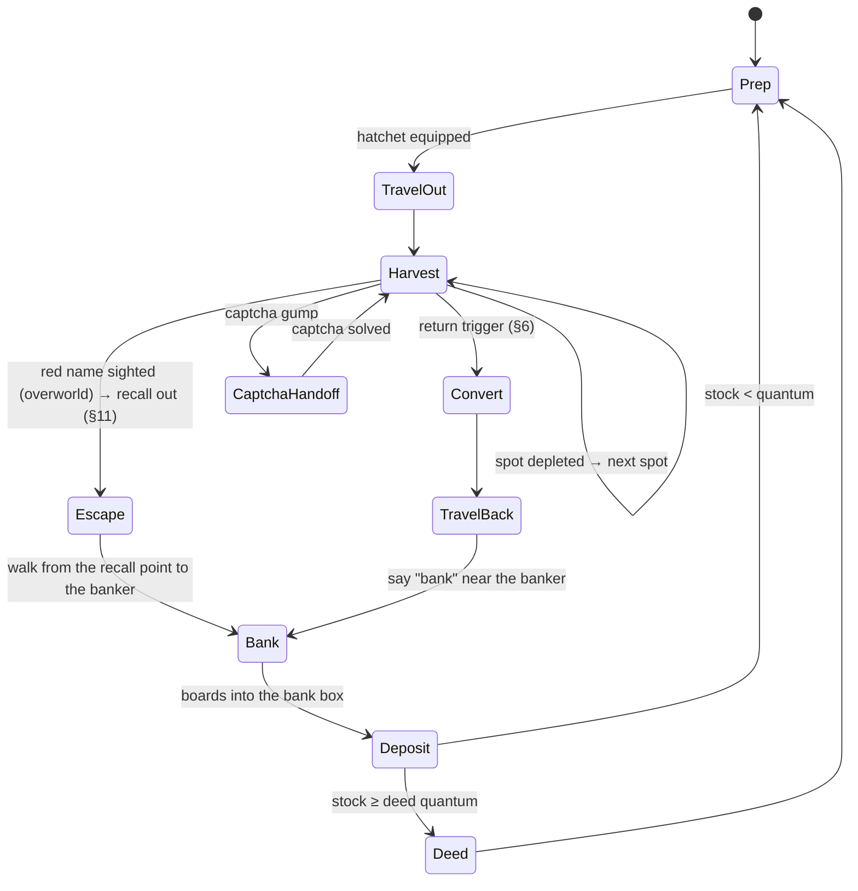

# LUMBER_LOOP.md — first repeatable game loop: chop trees → boards → bank (→ deed later)

Status (2026-10-01): **boards go into the bank box; the rental room is out of the loop (user
decision, §12.5).** Runs on Shelter Island with a fresh Young character. The room-storage version
ran live on 2026-09-29 (3 trips, 50 boards, captcha solved and resumed; run 3, §13).
- M0: the user's demonstration run (`logs/session_20260929_204225`) is mined into
  `harness/data/loops/lumber.json` and pinned by `harness/test_loop_demo.py`; findings are in §12.
- Current goal (user decisions, §12.4, §12.5): run the loop minus deed creation on Shelter,
  banking the boards each trip, then optimize.
- Runner: `harness/loop_lumber.py`, proven offline by `test_loop_lumber.py`; the bank version is
  not yet run live.

Builds on Phase 4 (docs/PLAN.md). This loop is the Phase 4 workload: the planner, the skill
library, the rails and the captcha handling all get exercised by it.

## 1. Goal and hard constraints

The agent should **learn** the loop, **run** it, and **improve** it over sessions:
- chop trees
- convert the logs to boards
- walk to the banker and open the bank box
- bank the boards (commodity deeds later)

Character: a fresh Young character on Shelter Island (TestWorth until 2026-10-01). Venue: Shelter
Island first, the regular overworld later (§7).

These constraints come from existing docs and aren't optimization targets:
- **Captcha = human-solved by default, auto-solve by toggle (user decision 2026-10-01).** Lumberjacking triggers a captcha every 5–10 min, and a solved one
  buys 10–15 min. In captcha mode `human` the runner pauses and beeps until the solve shows in the client.
  The viz header's `captcha [human|auto]` toggle switches to `auto`: `harness/captcha.py` reads the digits from the gump
  layout's tilepic dot clusters (ANTICHEAT.md §8.8/§8.13), margin-gated, with the human wait as the fallback.
  Expect ~4–6 captchas per hour (derived from the wiki cadence).
- **Pacing is a floor, not a knob.** The optimizer never tightens jitter, proxy walk pacing
  (0.2/0.4 s), break schedule or daily cap (PLAN.md Phase 4).
- **Speech allowlist.** The loop's one trigger word is `bank` near the banker (since 2026-10-01;
  before that `room` near the innkeeper).
- **Nothing server-visible that a stock client wouldn't send.** Skills use the existing
  `actions.py` builders only.
- **Never renounce Young status (Shelter phase).** Leaving Shelter Island by moongate, hike, recall
  or gate first asks the player to confirm renouncing Young status, and that is permanent
  ([Shelter Island](https://wiki.uooutlands.com/Shelter_Island)). The agent never uses travel on
  Shelter. Moving to the overworld is a user action. Moongates are walkable and only ask; they
  don't move you (user, 2026-10-01). In session 20261001_191355 a route step onto a player-cast
  moongate on Shelter opened the prompt (gump `0xE2544541`); nothing replied, the run walked on
  and stayed Young, and the prompt stayed up in the client. **Since 2026-10-01 the Mover closes
  the gump of any moongate a route only passes over** (stock `0xB1` button 0 after a reaction
  pause, `agent_link.Mover.close_gate_gumps`), so the runner neither aborts nor leaves it open;
  closing is never a renounce. (Earlier text here said the loop aborts on that gump; it never
  did.) Details: docs/NOTES.md "Shelter Island"; test: `test_loop_lumber.py` (gates by the town
  door), `harness/test_mover.py`.

## 2. Game mechanics (wiki, read 2026-09-29; unverified in-game unless marked)

| Fact | Source | Loop consequence |
|---|---|---|
| Smart Harvest: double-click the equipped hatchet → auto-harvests every nearby tree with wood left | [Lumberjacking](https://wiki.uooutlands.com/Lumberjacking) | Harvest = one dclick per spot, then wait for depletion. No per-tree targeting. **Conflict:** [Smart Harvest](https://wiki.uooutlands.com/Smart_Harvest) says tools other than pickaxes need a self-target → verify on the wire |
| Harvesting on Shelter Island needs Young status. Harvest chance there is 50 % of normal, and skills cap at 80 | [Shelter Island](https://wiki.uooutlands.com/Shelter_Island) | Shelter yield is half the overworld's, so the r measured there doesn't transfer (§6). Lumberjacking is otherwise blocked in town regions |
| No hostile player actions on Shelter Island. Bank and vendors need Young status | Shelter Island | PK hazard on Shelter = 0 (§6). Bank and banker purchases work only while Young |
| **TestWorth is Young (capture evidence, 2026-09-29).** The client received the Young-only login gump "Welcome to Shelter Island" (`0xC16E0192`) in sessions 163420 and 202723 | Shelter Island + `loop_mine.py timeline 20260929_163420` | Venue decision holds |
| 60 s harvest lockout after recall / moongate / hike / teleport / rope | [Harvesting](https://wiki.uooutlands.com/Harvesting) | Walk, don't recall (Shelter: never recall, §1). Leaving the room teleports you → [INFERENCE] probably triggers the lockout; the demo checks it |
| **Stationary Harvest Penalty** (patch 2025-01-25): after a recall, or after 5 min standing still, harvesting fails until you walk 5 steps | docs/research/THREATS.md §7 T4 | The Shelter loop moves between trees, but a long visit to one tree can pass 5 min. It needs a "walk 5 steps every < 5 min" rule (not built yet) |
| Captcha: 5–10 min cadence; 3 fails = 6 h harvest block; closing it cancels the harvest; the same captcha persists across relog | [Captcha](https://wiki.uooutlands.com/Captcha) | Human-solved by default, auto-solved from the layout when toggled (§1); the runner never closes a captcha, and in auto it answers with the stock 0xB1 |
| Log/board weight 0.025 st | Harvesting | Weight isn't binding until thousands; the return trigger is risk/overhead (§6) |
| Double-click logs with a hatchet in the pack → boards (**user-confirmed: deeds need boards**) | Harvesting, Lumberjacking | Conversion is a loop step; can run in the field |
| Blank commodity deed: 5 gp at a banker; double-click the deed, target the resource | [Commodities](https://wiki.uooutlands.com/Commodities) | Needs gold + the target-cursor flow (S2C `0x6C` → `actions.target_object`) |
| 5 000 regular boards (2 500 colored) per commodity deed | Commodities | Unknown: partial stacks allowed? Must the boards sit in the bank box (RunUO rule, [INFERENCE] for Outlands)? The demo tests it |
| Rental room: say `rent`/`room`/`house` near an Innkeeper (or context menu "Rent") → room gump → Enter Room. Exit: dclick the front door → Exit to Town → **random room at the inn** | [Rental Room System](https://wiki.uooutlands.com/Rental_Room_System) | Two gump flows to learn. After exiting, the start position varies, so plan from the live position. Renting on Shelter while Young keeps Young |
| No recall/gate into a room; no access within 2 min of PvP | Rental Room System | Walking return is the only way in |
| Floor items decay after 1 h unless locked down; secure containers don't decay | Rental Room System | Boards and deeds go into a secure container (one-time human setup) |
| Commodities aren't blessed and can be looted | Commodities | Whatever is carried is at risk; §6 prices that |
| **Test Shard: all houses and inn rooms are cleared every 24 h at midnight UTC** | [Test Shard](https://wiki.uooutlands.com/Test_Shard) | Room contents are ephemeral on the Test Shard. The loop needs a "room missing → re-rent + re-secure" path, or stored goods are treated as a daily scratch pad. Test Shard state also re-mirrors from live saves occasionally |
| Renting costs gold (small room 5 000 gp/week, from the bank box); the first character on an account gets a 10 000 gp Rental Room Credit Deed | Rental Room System | TestWorth has 0 gold (2026-09-29). Renting works only if it holds a credit deed; otherwise gold comes first |
| NPC vendors on Shelter didn't buy what TestWorth offered ("You have nothing I would be interested in", sessions 141253/164548). The wiki's earning advice for resources is selling to players (~9–10 gp per board) | captures + [New Player Guide](https://wiki.uooutlands.com/New_Player_Guide) | No NPC gold sink for boards; boards are the stored product, not an income source |
| Test Shard resource stockpiles are in North Prevalia and Corpse Creek | Test Shard | Off-island: reaching them renounces Young, so they're out of reach during the Shelter phase |
| Colored hatchets give a stacking **Tool Bonus** to harvest success chance: Exceptional +0.04, Mastercrafted +0.04, Dull Copper +0.02, Shadow Iron +0.04, Copper +0.06, Bronze +0.08, Gold +0.10, Agapite +0.12, Verite +0.14, Valorite +0.16, Avarite +0.18 (Iron base 0; all bonuses stack). Success chance per log color = ((skill − offset) / 80) × (1 + Tool Bonus) for colored woods, (skill / 100) × (1 + Tool Bonus) for regular | [Lumberjacking](https://wiki.uooutlands.com/Lumberjacking) | A colored hatchet raises `r` without any behavior change; at Lumberjacking 60 an Iron hatchet gives 60 % regular success, a Valorite one ~70 %. What TestWorth's hatchet is made of is unknown — check next session |
| Colored hatchets also last longer: Iron 500 base uses, +125 per tier (Exceptional/Mastercrafted +250 each, up to Avarite +1125) | Lumberjacking | The runner needs a "tool broken → equip/craft another" path eventually; with 500 uses at ~9.5 s per attempt one hatchet covers ~1.3 h of chopping |

## 3. The loop as a state machine

The trip threshold and the deed quantum are decoupled. Boards go into the bank box every trip; a
deed is made once the bank stock reaches the quantum (deeds aren't built yet, §12.4).

Any state can be pre-empted by a proxy-enforced pause, break or kill (agent gate), or by a failure
(HP loss, movement stall, unknown gump). A failure goes to the LLM planner (§5).

## 4. Learn

Knowledge about the loop's mechanics is mined from captures into curated files (lumber.json).
What the loop learns while playing goes into the harness memory store (docs/MEMORY.md; gitignored
runtime data, AGENTS.md Rule 0):

1. **Learning by demonstration (first).** The user plays one full loop by hand through the proxy,
   which already captures everything (§10). `harness/loop_mine.py timeline <TAG>` (**built**)
   replays the capture through the proxy's own SessionTap and prints what the player did and what
   the server answered:
   - dclicks, lifts, drops, target cursors and responses
   - gumps with reply-button and text-entry ids, context menus, vendor lists, purchases
   - cliloc messages rendered from Cliloc.enu
   - amount changes in the backpack, bank box and opened containers
   - every entity acted on
   - the packet ids still unparsed

   From that evidence, `harness/data/loops/lumber.json` is written. It holds:
   - serials: hatchet, innkeeper, door, secure container
   - gump ids and button ids: room menu, door menu, captcha
   - cliloc numbers for chop success, "not enough wood", failure and captcha
   - the deed and conversion flows
   - the route

   A replay test pins those facts to the capture. Extracting them automatically before seeing a
   demo would mean guessing at their shape; after the demo they're read off the timeline.
2. **World memory (online):** the store's `harvest_nodes` and `harvest_attempts` tables, keyed by
   facet and tree tile:
   - trees in reach (from statics + tiledata, read-only from the install dir; Phase 4 decision)
   - per-attempt yield
   - depletion time
   - estimated regrowth (time from depletion until the spot yields again)
   Walk evidence (`walk_moves`, with facet and z) is recorded by the proxy from every confirmed
   move and deny.
3. **Episode log:** every cycle appends one row to the store's `episodes` table:
   - time spent in each state
   - boards gained
   - steps, denies and reanchors
   - captchas, with solve latency
   - hostile sightings, deaths, losses
   - failures and their type
   The optimizer and the reflection step read this log and nothing else.

## 5. Perform

- **Skills** (deterministic Python controllers generalised from `errand_bank.py`; each skill has
  preconditions, a success check against world-model evidence, a timeout and a typed failure):
  `goto`, `smart_harvest(spot)`, `convert_logs`, `buy_blank_deeds`, `make_deed`, `enter_room`,
  `store_in_container`, `take_from_container`, `exit_room`.
- **Routine runner:** executes §3 from `lumber.json` with no LLM call in the steady state, so every
  cycle costs 0 API calls.
- **LLM planner (Phase 4)** is called in three cases:
  - at start, to turn the natural-language objective into routine parameters
  - on a typed failure the routine can't handle: unknown gump, deny storm, unexpected message, HP loss
  - after a session, for reflection (§6)

  It picks skills only (PLAN.md decision). LLM-authored skill code stays deferred.
- **Rails:**
  - captcha → the human by default (pause + sound); auto-solve when the viz toggle says so (margin-gated; fallback: pause + sound)
  - visualizer pause/kill
  - breaks and daily cap
  - never renounce Young (§1)
  - forced breaks: the runner itself still doesn't read the gate. But since 2026-10-01 a due break waits up to 10 min and wakes the overseer (`break_due` juncture), which can stop the run, get home and `ctl break` (docs/OVERSEER.md). Without an overseer the break starts when the grace runs out; `Mover.step` then waits it out for up to ~200 s and aborts the run where the character stands (ANTICHEAT.md §10 A9)
  - speech hold (2026-10-01): a character speaking near the agent holds the run until the overseer's all-clear (`speech_guard.py`; docs/OVERSEER.md `speech_nearby`); a speaker with staff hints also raises `gm_suspected` and the repeating staff alarm (`alerts.py`), and the run stays held until that's acked. Laya judges each line (`triage.py`, `--triage-url`, empty = off): a likely attendance check is a staff hint; nothing is ever skipped because of it (PLAN.md "Laya speech triage")

## 6. Optimize

Objective: **boards banked per agent-active hour, net of expected losses**, subject to §1.

### Return trigger: carried-value risk vs. trip overhead (user decision 2026-09-29)

Carrying more goods means a bigger loss if a PK kills you. Going home more often costs overhead. And
recall-hopping isn't free, because each recall or teleport adds a 60 s harvest lockout. Model per
trip, with the quantities measured from the episode log:

- `r`: boards per minute while harvesting (includes conversion, captcha pauses, spot moves)
- `T`: round-trip overhead in minutes (walk back, room in/out, walk out, and any 60 s lockout after
  a recall or the room exit)
- `h`: hazard of losing the carried goods, per minute in the field (PK encounters × P(death))

If a trip returns at `Q` boards, the carried load grows linearly, so the expected loss per trip is
about `h·Q²/(2r)`, plus `h·Q·T_back` on the way home. Cost per banked board:

$$c(Q) = \frac{rT}{Q} + \frac{hQ}{2r} + h\,T_{back} \quad\Rightarrow\quad Q^* = r\sqrt{2T/h}$$

- **Shelter Island: `h = 0`** (no hostile player actions, wiki). `Q*` is unbounded, so the trip ends
  on the next forced break (so the break is spent in the room), the weight cap or the session end.
  Shelter trips are where `r` and `T` get measured. Shelter halves harvest chance, so its `r` does
  not carry over to the overworld.
- **Overworld (later): `h` is learned from our own data.** The episode log records exposure
  (minutes in the field per region) and hazard events (red/grey player sightings, attacks,
  deaths, goods lost). `h` per region comes from a Gamma-Poisson estimate: a user-set prior
  (e.g. "PK-heavy forest"), then `α + k` events over `β + minutes` exposed. It sharpens as sessions
  accumulate and could later split by time of day. `Q*` recomputes each trip. Deaths are rare, so
  early on the prior dominates; sighting counts carry information much sooner than deaths.
- **Red name → recall out immediately (user decision 2026-09-29; design deferred, see §11).** In the
  overworld, a sighted murderer (red, notoriety 6) or an unfriendly grey player ends the trip at
  once: recall home, not walk. The 60 s harvest lockout is irrelevant at that point. On Shelter it's
  not needed (no hostile player actions).
- **Recall as a knob (overworld, later):** a routine recall home cuts `T_back` but adds a 60 s
  lockout on the way back out. The model takes it when `T` drops.

### Other knobs

| Knob | Method |
|---|---|
| Which spot next | Bandit (Thompson sampling) over harvest-memory spots. Reward = yield ÷ (travel + harvest time); a spot is eligible only once its regrowth estimate has passed |
| Spot order within a trip | Greedy nearest-eligible, with random tie-breaks among near-equal options |
| Where to convert/deed | Pick from measured episode times once §2 is verified (field vs. room vs. bank) |
| Route | A* over map data plus learned denies. Sample among near-optimal paths so trips don't repeat tile for tile |

Loop between sessions:
- `harness/loop_report.py` computes metrics from the episode log.
- The LLM reflection reads the report and proposes a diff to `lumber.json` parameters.
- Spot statistics and the return-trigger estimates (`r`, `T`, `h`) update automatically within bounds.
  Structural changes (new states, deed location, venue) need user approval.

Anti-pattern guard: optimizing toward one identical path and cadence is itself a behavioral
signature (ANTICHEAT.md §8.3). Variation is required, not an inefficiency to remove.

## 7. Decisions (user, 2026-09-29)

1. **Venue:** start on Shelter Island (TestWorth is Young, confirmed by capture, §2). The regular
   overworld comes later and is a user-initiated move, because leaving Shelter renounces Young.
2. **Deed/return:** logs must be converted to boards for commodity deeds. The return trigger is the
   §6 risk/overhead trade-off (PK loss vs. trip overhead, including the 60 s post-recall/teleport
   harvest lockout). Boards bank in the room every trip; deeds are made at the quantum.
3. **Optimizer autonomy:** as proposed. Spot and trigger statistics update automatically within
   bounds; structural routine changes are user-approved per session. Grow later.
4. **Setup + demonstration:** the user does it once the tooling is in place (§10).

## 8. Prerequisites

1. ~~Cliloc messages aren't parsed~~ **done:**
   - S2C `0xC1`/`0xCC` → `cliloc` event (number + args)
   - `harness/uo/cliloc.py` renders from Cliloc.enu, read-only; 107 922 entries (e.g. 500498
     "You put some logs into your backpack.", 500493 "There's not enough wood here to harvest.")
   - also parsed now: vendor buy list/purchase (`0x74`/`0x3B`), context menus (`0xBF` 0x13/0x14/0x15),
     text commands (`0x12`), lift/drop/equip (`0x07`/`0x08`/`0x13`)
   - C2S `0x6C` and `0xB1` corrected to the Outlands layouts
2. ~~Captcha detection~~ **known from the demo (§12.2):** real captcha = gump id `0x00000001` with
   text entry 2 and submit button 594. Decoy "Captcha" gumps open on every attempt and must never
   be answered. The runner's detection trigger keys on the gump id + entry + button, never on text.
3. ~~Pause/kill/break proxy flag + budget file~~ **built** (commit 2ffb29a: the proxy-enforced agent
   gate, `harness/agent_gate.py`). The routine runner has to honor gate refusals as a typed
   `paused` failure and resume cleanly.
4. **Map/statics/tiledata reader** (Phase 4 decision, not built). Outlands ships its own formats:
   `facet0N.mul`, `art.uoo`, `artdata.uoo`, not `map0.mul`/`artLegacyMUL.uop`. The reader has to
   handle them. Needed for tree positions and pathing beyond walk memory; not needed for the demo.
5. **Live validation of target / lift / drop.** Builders exist (`actions.target_object`, `lift`,
   `drop`). HANDOFF lists speech, dclick, gumps, spells and item queries as proven live, not these.
   The demonstration capture provides the stock-client reference packets to compare against.
6. Add `room` to the speech allowlist (built with the agent runtime; not needed for the demo).

## 9. Milestones

| # | Deliverable | Done when |
|---|---|---|
| M0 ✅ | Demonstration capture (`20260929_204225`) + `loop_mine.py timeline` + `lumber.json` | Done 2026-09-29: §12; `test_loop_demo.py` pins the facts. Still open: Smart Harvest self-target, deed from a 5 000 backpack stack |
| M1 (runner-level) | Perception: cliloc parsing, captcha gump detection (gump id + entry + button; decoys ignored), harvest outcomes | Built into `loop_lumber.py`; offline-proven (§13). A reusable perception layer comes with M6 |
| M2 | Skills: goto with door opening, harvest attempt, convert, enter room, store, exit room; offline in `test_loop_lumber.py`, then live, attended | Offline ✅; live ✅ (attempt 2c, 2026-09-29) |
| M3 | Routine runner, full loop (no deeds) | Offline ✅ (2 trips); live ✅ run 3: 3 trips, 50 boards, live captcha handoff (§13) |
| M4 | Harvest memory, episode log, report | Report reproduces from the logs; `r`, `T` and regrowth estimates exist |
| M5 | Bandit + return trigger + reflection | Boards/active-hour improves over a baseline session on the same venue without violating §1 |
| M6 | LLM planner composes and repairs the routine | Phase 4 done criterion: NL objective → loop run, with captcha handling demonstrated |

## 10. Demonstration runbook (user)

**Setup (one-time, by hand, can be done through the proxy):**
1. Start the chain as in HANDOFF.md "Operate": proxy (restart it so the live state port has the new
   parsers), divert NAT, launch the game.
2. Check Young: single-click yourself; the label shows `(Young)`.
3. Rent a room: say `rent` (or `room`) near the Shelter innkeeper, click Rent Room three times.
   Enter, drop a container on the floor, say "I wish to secure this" and target it. Exit.
4. Equip a hatchet. Carry some gold for blank commodity deeds (5 gp each).
5. Note TestWorth's Lumberjacking skill; if it's low, a Test Shard template can set 60.

**Demonstration (one continuous session through the proxy, ~20–30 min so a captcha shows up):**
1. If you have gold: at the banker, buy a few blank commodity deeds, the way you normally would.
   With 0 gold, skip this step and step 6; the rest of the demo doesn't depend on them.
2. Walk to trees where harvesting works. Double-click the hatchet (if a target cursor appears, target
   yourself). Harvest until the spot is empty, move to another spot, keep going.
3. When the captcha appears, solve it normally.
4. Convert logs to boards (double-click the logs).
5. Walk to the inn, say `room`, Enter Room.
6. Try a deed: double-click a blank deed and target the boards in your backpack, even though it's
   fewer than 5 000; the message tells us whether partial stacks or the backpack are allowed. If
   it's refused, try with the boards in the bank box on a later trip.
7. Put the boards (and any deed) into the secure container.
8. Exit via the door (Exit to Town). Walk out and double-click the hatchet straight away. A lockout
   message confirms the teleport lockout.
9. Tell me the session tag (`logs/session_<tag>.*`). I run `python harness/loop_mine.py timeline
   <tag>`, write `lumber.json`, and pin the facts in a replay test.

Nothing in the harness injects during the demonstration; the proxy only relays and records.

## 11. Deferred: come back to these before the overworld (noted 2026-09-29)

**Update 2026-09-29 (night):** the overworld brief is planned in `docs/ROADMAP.md`, with research
in `docs/research/` (ECONOMY, TRAVEL_DEATH, THREATS). The threat classifier, pack ledger and
overseer bus are built (`harness/threats.py`, `harness/ledger.py`, `harness/ctl.py`); the escape,
death-recovery and restock actions wait for demo captures (ROADMAP "Demos").

1. **Hazard learning pipeline.** Episode-log schema for exposure and hazard events per region;
   the Gamma-Poisson `h` estimator; the report showing `h` and its uncertainty per region; how the
   user sets priors.
2. **Red-name escape by recall.** Needs Magery (or recall scrolls), reagents and a rune/runebook
   marked home: town/inn, since recall into the rental room is impossible. Open questions:
   - cast time vs. how fast a PK closes in
   - interruption by damage
   - fallback when fizzled or out of reagents: run, drop the harvest, or hide
   - escape latency budget from sighting to cast
   The agent cast path exists (`actions.cast_spell` + target, proven live); the rune target flow
   isn't captured yet.
3. **Detection range: do we need Tracking?** The world model only knows mobiles the server sends
   (0x20/0x77/0x78 with notoriety), so detection range = the server's update range. That's about
   18 tiles for UO servers ([INFERENCE] for Outlands; measure from captures as the distance at
   which mobiles first appear). The Tracking skill may reveal players beyond that range. To check:
   Outlands Tracking mechanics (range, what it reports, cooldown, whether its result arrives as a
   gump/cliloc the world model can read), and whether the earlier warning is worth the skill
   points. Hidden/stealthed PKs are invisible either way.

## 12. Demonstration findings (session 20260929_204225, user-played)

Source: `python harness/loop_mine.py timeline 20260929_204225`. Every fact below is pinned by
`harness/test_loop_demo.py`.

### 12.1 Mechanics verified in-game
- **Harvesting = one attempt per use.**
  - Double-click the equipped hatchet → cliloc 1010018 "What do you want to use this item on?" plus
    a location cursor (type 1).
  - Target the tree (a static: 0x0CE0 at (1898, 2622, 10)).
  - The result arrives about 4.1 s later: fail cliloc 500495, success plain text "You chop some
    logs and put them in your backpack." (+5 and +7 logs).
  - Nothing auto-repeated, because the demo targeted trees, not the character. Whether targeting
    yourself starts Smart Harvest is still **untested**.
  - Yield on Shelter at Lumberjacking 60.2: 2 successes in 12 attempts, 12 logs, one attempt about
    every 9.5 s by hand, so about 6 logs/min. [INFERENCE from a small sample]
- **Conversion:**
  - Double-click the hatchet, target the log stack → "You shape the logs into boards."
  - The ratio is **1 log → 1 board**. Logs of one kind stack, so a trip needs one conversion per
    stack.
- **Weight: logs and boards weigh the same.** The status weight moved +1 for +5 logs, 0 on 5 logs →
  5 boards, +1 for +7 logs, and −1 when the 7 logs merged into the 5-board stack. That matches
  0.025 st each with the server rounding each stack up to whole stones. Max weight is 570 st, so
  weight never limits a trip.
  → **Convert once per trip, just before storing.** Converting during harvesting gains nothing: same
  weight, same loss if killed, same number of actions.
- **Deed:** double-click the blank commodity → "What resource to you wish to create a commodity
  for?" → target the boards → "Commodity for that item must be of at least 5000." (12 boards in the
  backpack). So the quantum is confirmed. Whether a backpack stack is acceptable at 5 000 is still
  open, because the quantity check fired first.
- **Travel lockout confirmed:**
  - "You exit the rental room." at 13:17.7
  - "…must wait 19 seconds…" at 13:59.2
  - 41.5 s + 19 s = 60 s from the room exit
- **Banker purchase:** context menu index 1 (Buy, 3006103) on Len → buy list "Blank Commodity 5gp,
  Vendor Rental Contract 100gp". Backpack gold is used (21 → 16). With 0 gold the answer is cliloc
  500191.
- **Rental room:**
  - Context menu "Rent" (index 1) on Jayne the innkeeper, or saying `room` from 11 tiles away,
    opens gump `0x8EAEFBDB`. Button 4 three times rents (paid with 5 000 rental credits), then
    button 4 enters.
  - Inside you land at (39, 65, 1). The door `0x45757DCB` opens the same gump; button 4 exits to
    (1932, 2589).
  - Securing: drop the container on the floor, say "I wish to secure this", target it →
    "Secures Used: 1 / 2".
  - Drops into a container use x = y = 0x7FFFFFFF (client auto-position).

### 12.2 Captcha: the real gump and decoys (see ANTICHEAT.md §8.13)
- **Real captcha:**
  - It appeared on the **first** harvest attempt, not after 5–10 min.
  - gump id `0x00000001`: `textentrylimited` id 2 (max 3 chars) and one reply button, 594.
  - The digits are drawn as `tilepic` dot glyphs (graphics 572 and 6255) at layout coordinates.
  - The human answered `326` with button 594 → "Captcha successful."
  - No further real captcha appeared in the ~12 min that followed. Most of that time was spent
    elsewhere, not harvesting.
- **Decoys:** every harvest attempt also opens a gump with the same words ("Captcha", "Type the
  Value", "Click when complete"):
  - a random gump id each time (≥ 10 distinct)
  - `nomove/noclose/nodispose`
  - **no buttons**
  - all text as `croppedtext` at negative, offscreen coordinates
  - `xmfhtmlgump` with nonexistent cliloc numbers

  A human never sees or answers them. A bot matching on text would answer them. The detection
  trigger is therefore gump id + text entry + submit button, and the agent never replies to any
  gump without a reply button.

### 12.3 Consequences for the loop
- The §3 Harvest state is: dclick hatchet → target the next tree tile → wait for the result
  message, repeated per tree until the depleted cliloc (500488/500493), then the next tree. Trees
  come from the demo now, and from the map reader later.
- Conversion happens once per trip, before Store.
- After the room exit, the 60 s lockout overlaps the walk out. The loop waits only for the rest.
- `r` on Shelter (~6 logs/min by hand) makes the 5 000 quantum ≈ 14 h of harvesting. [INFERENCE]

### 12.4 Decided (user, 2026-09-29): prove the loop first, no deeds
The Test Shard clears rooms daily at 00:00 UTC (§2), and the agent runs ≤ 8 h/day, so room stock
won't reach a deed at the demo rate. Decision: first prove the agent runs the loop minus deed
creation on Shelter, with the room as daily scratch storage. Efficiency (and with it where the
stock lives and whether to raise skill first) comes after the proof.

### 12.5 Decided (user, 2026-10-01): bank the boards, no rental room
The runner no longer enters a rental room: each trip ends at the banker and drops the boards into
the bank box. The loop still runs on Shelter Island, with a fresh character. Why this is simpler:
- no room to rent, so the 5 000 gp rent and the daily Test Shard room wipe drop out
- no secure container to set up by hand
- no teleport out of a room, so no 60 s harvest lockout per trip
- any town with a banker works, so the Horseshoe Bay blocker (§13, the room exits to the town it
  was rented in) is gone.

Constraint: the Shelter bank serves only Young characters (§2). A fresh character is Young.
The room knowledge stays in lumber.json (pinned by `test_loop_demo.py`), but the runner doesn't use it.

## 13. Runner (`harness/loop_lumber.py`, built 2026-09-29)

Shared plumbing moved to `harness/agent_link.py`: `Link` (control + state ports, gate-aware
`act()`) and `Mover` (walking, learned blocks, doors). `errand_bank.py` uses it too.

- **Trip** (since 2026-10-01, user decision §12.5: bank the boards):
  1. Harvest the known trees (shuffled; trees depleted in the last `--regrow-min` are skipped).
  2. Convert every log stack.
  3. Walk to within `--bank-range` (4) of where the banker (lumber.json `npcs.banker`, Len,
     `0x000001EA`) stands now. Fall back to his demo position, then on his floor
     (`same_floor`).
  4. Say `bank` and wait for the server's `0x24` on the layer-0x1D item
     (`agent_link.bank_opened`, shared with `errand_bank.py`). If it doesn't open, abort.
  5. Without taking a step (moving closes a bank box in RunUO `[INFERENCE for Outlands]`),
     lift each board stack and drop it into the bank box (auto-position, as `ctl act drop`).

  Like a player, the runner opens the backpack before targeting logs in it, whenever the server
  hasn't opened it this session (ANTICHEAT.md §10, closed containers). It never double-clicks
  the bank box. The speech opens it.

  A run ends at the bank. The trip phases are `harvest`, `convert`, `to_bank` (walk + open),
  `store`. The intents are `to_tree`, `chop`, `convert`, `to_bank`, `open_bank`, `store`,
  `trip_done`, plus `escape` and `break_due` (below).
- **Hatchet (since 2026-10-01):** a worn hatchet, else the shallowest one in the backpack or in a
  bag in it at any depth (`hatchet()`, `pack_depth`); one in the bank box doesn't count. Before
  each use, the containers on the way that the server hasn't opened yet are opened outermost
  first (`containers_to_open` + `Link.open_containers`, the closed-containers rule). Only items the
  world model knows are found: a bag the server never listed has to be opened once in the client.
- **Monsters fighting someone else (since 2026-10-01, knowledge #89):** runs had stopped for 'a
  great hart' and 'an eagle' in war mode 8 tiles away that were fighting other players and never
  touched Hackworth. `threats.assess` now rates a creature whose only aggression evidence is war
  mode `watch` while its latest 0x2F swing (`world.swings`) is at someone else, no older than 10 s,
  it hasn't swung at us in that window and it isn't within its strike range of us. Swinging at us,
  a stale fight or melee range keeps `flee` (threats.py docstring).
- **Escape instead of abort for monsters (since 2026-10-01):** a `flee`-level creature, or one
  swinging at us (0x2F, defender = self), posts the urgent `threat` juncture as before with
  `data.action = "escape"`, and the runner walks away from it: to a tile 2 beyond its flee radius
  (`ESCAPE_MARGIN`), preferring tiles walked before within 60° of straight away, else straight
  away or 45° to either side. Then it carries on with the next tree out of the reach of every
  creature it escaped from this trip (an escape in the convert or bank phase repeats that phase).
  It stops instead (`data.action = "abort"`) when the creature is still in flee range right after
  the escape ("it kept coming"), after 3 escapes in a trip (`ESCAPES_PER_TRIP`), on damage to us
  (a hit-point drop or a 0x0B on self), during a speech hold, and, as before, at once for a
  hostile player/red/grey/orange in flee range or a non-creature swinging at us.
- **Carried wood is boards (since 2026-10-01):** an abort during the harvest converts the log
  stacks in the pack before the runner exits, unless stopping at once is safer: a player/red threat,
  a non-creature attacker, death, a captcha that wasn't solved (a server restriction), a closed agent
  gate (kill, budget), an open `gm_suspected` juncture or a speech hold. The conversion ignores the
  timeout, HP and creature checks; a player or death still interrupts it. A process kill converts
  nothing.
- **Break due (since 2026-10-01):** when the state port's `gate.break_due_at` is set (agent gate
  `break_due`, docs/OVERSEER.md), the runner stops harvesting at the next attempt, converts, walks
  to the bank, stores, logs `break due: banked after trip N`, marks the episode row `break_due`
  and exits 0, so the overseer can `ctl break` there. Logs and boards weigh ~0.025 stone each
  (knowledge #88), so there is no weight trigger.

  Until 2026-10-01 the trip ended in the rental room instead: say `room` to the innkeeper,
  press Enter, store in the secure container, and exit by the door at the start of the next
  trip. The live runs below used that version.
- **Harvest attempt:**
  - dclick the hatchet, wait for the cursor, pause for "aim" time, send `target_xyz` at the
    tree's (x, y, z, static graphic), wait for the outcome.
  - Outcomes: success text (gain measured from the backpack count), fail 500495, depleted
    500488/500493, not-a-tree 500489 (abort: bad knowledge), lockout text (wait the stated
    seconds), or none (≤ 3, then abort).
  - A server-reported travel lockout (after a moongate, say) is waited out.
- **Captcha:**
  - The trigger is the gump with lumber.json's id plus text entry 2 and button 594. Decoys never
    match.
  - The runner beeps (`winsound`, every 30 s) and waits up to 10 min for the human to answer in
    the client and for "Captcha successful.". Then it resumes the same attempt.
  - Apart from the captcha answer in mode `auto`, the runner sends no gump reply.
- **Walking (since 2026-09-29, after live attempt 1):** `Mover` plans in 3D on the real map
  (`harness/pathfind.py`, the client's walkability rules) whenever the facet has geometry. In the
  rental room (blank facet 3) it falls back to walk memory.
- **Trees:** candidates are the lumber.json seeds plus every tree static in `harvest.area`,
  up to `--max-trees` per trip (nearest to the trip's start, with noise). **The next tree is
  chosen from where the character stands** (`next_tree`, since 2026-10-02): the shortest planned
  walk among the 6 nearest by straight line, ×1.0–1.15 noise. Before, the list was walked in its
  start-order: in the Terran pass (live 2026-10-02) that sent the runner 80–90 steps round a
  ridge between trees on both sides of the road while trees 3–6 steps away waited. On those 16
  trees the old order walked 673 steps, the new choice 148 (throwaway replay on the real map).
  A tree without a route is skipped for the regrowth window. A tree the server rejects (500489)
  is remembered as not a tree.
- **Doors** (tiledata Door flag, or classic door art 0x0675–0x06F4: the demo's inn doors
  0x06A5/0x06AD/0x06ED/0x06EF and the room door 0x06E5): opened ahead, like the client's auto-open.
  When a step or turn leaves the character facing a door on the next tile, the Mover sends the
  stock `12 0005 58 00` (the client's Auto Open Doors must be off: re-anchored every step, it would
  send a second request and shut the door again). A step a door still denies gets one more request
  after a reaction time. Routes never cut diagonally past a door. Plain walls never trigger a
  request.
- **Guards:** overall timeout, HP loss, movement stall, the agent gate (pause/break → wait;
  kill/budget → abort; break_due → finish the trip at the bank, above), threats (escape or stop,
  above), and the speech hold (a character speaking nearby → send nothing until the
  overseer acks the `speech_nearby` juncture; the pause doesn't count against the timeout).
- **Human texture (user request 2026-09-29; `harness/humanize.py`, used by every runner via
  `Mover` and `Human`):**
  - Seeded `Human` profiles: `normal` (default) and `off` (deterministic tests).
  - Reaction delays are lognormal per action kind, not uniform. Measured medians and p90s: aim
    0.95 s (p90 1.55), menu 1.3 s (p90 2.15), between attempts 2.2 s (p90 3.6).
  - A 12 %/h fatigue drift lengthens delays over a session.
  - Steps at the stock client's held-key cadence: 200 ms (run) / 400 ms (walk) after the
    previous send plus 3–15 ms jitter (`Human.step_gap`), never under the proxy's floor. Until
    2026-09-30 steps were lognormal around 0.30 s after each confirm (~0.40 s on the wire, none at
    200–220 ms), which a held key never produces (ANTICHEAT.md §10 A8).
  - Routes:
    - per-plan route noise (×1–1.45) per 6×6-tile map cell, so whole areas get cheaper or dearer
      and routes vary between plans while staying straight; zig-zag stretches are regrouped into
      two straight runs (`nav.straighten`). Shelter routes: ~20 % heading changes (human 21 %;
      per-step noise gave 37 %)
    - routes always run, like the client's Always Run (until 2026-10-01, 7 % were walked)
    - per-step micro-pauses (2.5 %) and rare 3–9 s look-around pauses (0.4 %)
    - 1.2 % chance per step of a sidestep onto a known-walkable tile, then a replan
    - doors are opened like the client's auto-open: right after the turn or step that faces a
      door on the next tile, before stepping into it; routes never cut diagonally past a door
    - every step is re-checked against the objects the world model has right then (an object
      that arrived after the plan triggers a replan, not a step into it)
    - the first version also missed turns on purpose and ran into a known obstacle (a server
      deny). Removed 2026-09-30: the stock client never sends a step its own map check refuses
      (ANTICHEAT.md §8.14, §10 A5)
  - Hands:
    - 2.5 % of tool uses hesitate: the cursor is cancelled with the stock Esc packet and the
      hatchet used again
    - 5 % chance at a task boundary of an idle fidget: open the backpack, or look at a nearby
      mobile with the stock `09` + `34` sequence
  - Randomness (tree order, waits) comes from the same seeded RNG.
  - Everything added is stock-client traffic or waiting; the agent only ever gets slower or
    less direct.
  - Per-session counters appear in each episode row (`human_session`).
  - `test_loop_lumber.py` now runs the `normal` profile (seed 11, delays ×0.25) and still
    passes every check. In that run: 1 sidestep, 4 fidgets, 3 pauses. Hesitation wasn't drawn;
    the code path is simple and uses the decompile-grounded `actions.target_cancel`.
    `test_errand.py` uses `--human off`. A throwaway run that forced `hesitate_p` = 0.5 still
    completed both trips, with 15 hesitations. `harness/test_mover.py` checks on a fake grid
    that a known wall at a turn gets no step into it, and that a closed door gets exactly one
    open-door request, sent from the tile before it while facing it, with no deny at the door.
- **Data:** the harness memory store (docs/MEMORY.md):
  - `harvest_nodes` and `harvest_attempts`: per tree, attempts/successes/yield/depleted/
    unreachable/not-a-tree, and every attempt
  - `episodes` (loop `lumber`): one row per trip with phase durations, steps, blocks, doors,
    captchas and human wait, attempts, successes, logs, stored, escapes, break_due

Offline proof, `test_loop_lumber.py`: the real proxy plus a simulated Shelter server with the
demo's packet shapes and texts, and a "human" that answers the captcha through the client
connection. It runs 2 trips and checks:
- one real captcha, answered only by the human
- 16 decoys, none answered
- the only agent gump replies are 2 room enters and 2 exits
- all 18 logs end up as boards in the box
- the dry tree is tried once per trip
- open-door requests only happen when a door blocks the move (none at plain walls)
- the post-exit lockout is waited out, with no lockout message provoked
- the only speech is `room`
- two episode rows

Since 2026-10-01 the same file runs two more simulated sessions, each behind its own proxy, and
a unit check of `hatchet()` (worn first, then the shallowest bag; never the bank box). The
simulated banker now comes into view within 18 tiles and leaves it beyond 24, since the world
model prunes mobiles out of view.
- **skirmish:** the hatchet is in a bag in the backpack (backpack, then bag, opened before the
  first use). A war-mode great hart 4 tiles from the tree trades 0x2F swings with a player and is
  only watched. A creature then swings at the agent: `escape` juncture, a walk beyond its flee
  radius, harvesting resumes at the far tree out of its reach. There the creature comes back and
  follows step for step: a second `escape`, then `abort` ("it kept coming"), and the 6 carried
  logs are converted before the exit (code 1).
- **break:** a pre-written agent gate file makes the break due after 4 s of agent activity; the
  harvest stops early, the 5 carried and the new logs are converted and banked, `break due:
  banked`, exit 0, one episode row with `break_due`.

**Live proof, run by the user or the agent while the user is at the client:**
`python harness/loop_lumber.py --trips 1`. Only two trees are known (§12.1). A depleted tree is
skipped for 20 min, so a trip may end with fewer logs; the loop still completes.

**Live attempt 1 (2026-09-29 21:23, user at the client): aborted during the walk out; map data is required.**
- Worked:
  - The runner started inside the room and walked to the door.
  - It dclicked the door, checked the menu (rented) and pressed Exit → "You exit the rental
    room."
- Failed:
  - The exit put TestWorth in a random inn room **upstairs**: (1938, 2584, **z 20**). The
    demo's exit was (1932, 2589, z 20), also upstairs.
  - Walk memory is 2D and knows the ground floor at those x,y, so A* kept routing through
    upstairs walls.
  - 21 blocked moves (2 door openings among them), then `ABORTED: too many blocked moves`.
    TestWorth was left at (1937, 2583, 20).
  - The 40 blocked moves it learned upstairs would poison ground-floor routes, so that
    walkmem.json change was reverted.
- **User directive:** the harness needs the full x/y/z Outlands map, like the client has, for
  its own pathfinding and to find trees to harvest. Map-data reverse engineering is under way
  (docs/MAP.md, `harness/uomap.py`). Next come a 3D walkability model and a port of ClassicUO's
  Pathfinder, replacing 2D walk memory as the planner. Walk memory stays as evidence.

**Live attempt 2 (2026-09-29 22:10, user at the client; proxy with `--memory-db`): aborted at planning, nothing sent.**
- Start: (1937, 2583, z 20), upstairs in the inn, facet 0. The 3D map planner routes from here to
  the ground floor; that part of attempt 1 is solved.
- Failed:
  - Within 0.8 s, all 8 candidate trees were declared "unreachable", then `ABORTED: to the
    innkeeper: no route`. No walk, click or speech reached the server.
  - Cause: NPCs (Dusty, Giles) stood in the one-tile upstairs hallway, and `Mover.plan` treated
    tiles occupied by mobiles as walls. Reproduced offline from the live state: routes exist with
    the mobiles ignored, and none exist with them as walls.
  - The false "unreachable" rows written to the memory store were deleted.
- **User fact:** in UOO you shove through mobiles when you have enough stamina.
- **Fix (`agent_link.Mover`):**
  - A mobile's tile costs `MOBILE_COST_X` (4×) a step, so the walker goes around when that's cheap
    and shoves otherwise.
  - A shove the server denies makes that tile a wall for `SHOVE_RETRY_S` (15 s). It is not
    learned as a wall, and the log records the stamina at the moment of the denial.
  - A route cut only by such tiles is waited out, for up to `MOBILE_WAIT_S` (90 s).
  - A route cut by walls still reports `no route`.
  - Tests: `harness/test_mover.py` covers shoving through, going around, a denied shove followed
    by a wait, a denied shove where the NPC never moves, and a walled-off goal.
- Open: UOO's shove threshold and its stamina cost. RunUO needs full stamina and costs 10
  `[INFERENCE]`. The denial logs will tell.

**Live attempt 2b (22:17, after the shove fix): harvest and convert proven live; aborted at room entry.**
- Worked:
  - The agent walked out of the upstairs inn room on the 3D planner: 3 stock open-door requests
    and 1 learned block.
  - It chopped 2 trees: 8 + 5 logs, then depleted (500493), then 9 more.
  - It correctly skipped 2 trees that walls cut off.
  - It converted 29 logs to boards, walked 47 steps to the innkeeper with a sidestep and a bump,
    and said `room`.
  - The menu opened with button 7 (rented) present.
- Failed: after Enter (button 4), the server said "That vendor is too far away from you."
  - The agent stood at (1945, 2594), within `--inn-radius` 2 of the demo's stand tile
    (1943, 2596), which is 13 tiles from Jayne at (1932, 2595, 21).
  - Speech opened the menu from 13 tiles, and the demo worked from 11, so the buttons' vendor
    range is 11–12 tiles `[INFERENCE: exact bound]`.
  - Fix: `enter_room` walks to within `--inn-range` (4) of the innkeeper's **current** world-model
    position. The demo stand tile is removed from lumber.json, and the too-far text is recorded
    there. The simulator now rejects Enter beyond 12 tiles, and its innkeeper knowledge position
    is 14 tiles stale, so a runner that walked to the knowledge position fails the e2e.
- **Captcha submit id is random** (ANTICHEAT.md §8.13 update): this captcha's submit button was
  843, not 594. The detector keyed on 594 and missed it, and the user solved it unprompted. The
  detector now keys on gump id 1 + entry 2 + any reply button besides Guide 1.
- State left: TestWorth at (1945, 2594, 0) with the boards in the backpack. The next run
  harvests first, then stores everything.

**Live attempt 2c (22:27, after both fixes): ✅ full loop, 1 trip, exit 0.**
- From (1945, 2594), the agent walked 47 steps to tree (1925, 2580). On the way it hit known
  obstacles twice and sidestepped twice. It paused 10 times, 26 s in total, plus one idle look
  at a mobile.
- It harvested 17 logs (+10, +7) in 7 attempts and converted them to boards.
- It walked 56 steps to the innkeeper, opening 1 door, and arrived at (1936, 2595), 4 tiles
  from Jayne.
- `room` → Enter → "You enter the rental room." → stored 46 boards (17 new + 29 from 2b) in the
  secure container → door menu → Exit.
- Trip phases: harvest 108.8 s, convert 4.1 s, to room 58.2 s, store 1.8 s, exit 6.1 s. There
  were 108 steps and 0 blocked moves.
- No captcha this trip: a solved captcha suppresses the next one for 10–15 min (wiki), and the
  last one was solved at 22:18.
- Memory store afterwards:
  - `harvest_nodes`: 5 trees. One is depleted; two are unreachable, and those two are genuinely
    cut off by walls.
  - `harvest_attempts`: 17. `episodes`: 1.
  - Live walk evidence: facet 0 grew to 949 tiles and 1462 edges.

**Live run 3 (2026-09-29 22:47–22:56, `--trips 3`, user at the client): ✅ 3 trips, 50 boards
stored in 8 min 25 s, exit 0.**
- **The captcha handoff works live with the fixed detector.** A captcha appeared on trip 1's
  first chop. The runner detected it (submit id random, ANTICHEAT.md §8.13), beeped, and showed
  "Waiting for you to solve the captcha" in the viz. The user solved it in 10 s and the runner
  resumed. No captcha came up in trips 2 and 3 (the 10–15 min suppression).
- Per trip: 18/16/16 logs → boards, 12/7/5 attempts, 2 successes each.
  - Trip 1 started upstairs at (1938, 2584, 20): 118 steps, 3 doors, 5 bumps.
  - Trips 2 and 3 chose trees just west of the inn: (1924, 2591) and (1924, 2588), 5–6 tiles
    from the inn's west door. Each took 59–60 steps, and to_room took only 5–6 s.
  - The 60 s post-exit travel lockout was waited out for 22–25 s once the agent reached the tree,
    most of it already spent walking.
- Phase times:
  - harvest 170/127/104 s (it dominates)
  - convert 3–7 s
  - to_room 52/5/6 s
  - store about 2 s
  - exit about 6 s
- Human texture over the run: 8 bumps into known obstacles, 2 hesitations, 2 fidgets, 1 sidestep,
  1 walked route, 5 pauses. Doors: 9 stock open-door requests, 3 learned blocks in total.
- **Baseline for §6:** about 355 boards per agent-active hour on Shelter, near-inn trees, 15 logs
  per trip. The memory store now holds 4 episodes and per-tree yields, for example
  (1932, 2574) 18 logs from 12 attempts and (1924, 2588) 16 from 5.
- The viz Agent panel showed the live intent and history throughout. It ended on "Finished: 3
  trip(s)" with 30 history entries.

**Finding after run 3 (user, watching the client): the agent chopped from a cave under the
trees.** Trips 2 and 3 stood at (1925, 2592) and (1925, 2589) at **z −20**, on `cave floor`
statics in a cellar/cave level under the inn and the forest west of it. From there they chopped
the walnut and cedar at **z 5** on the surface above, and trip 2 also said `room` to Jayne (z 21)
from the cave. The server accepted all of it (its range checks look 2D `[INFERENCE]`). A player
in that cave can't see or click a tree on the surface, so it's an inhuman signal.
- **Cause 1:** tree and NPC goals were 2D (`within((x, y), r)`). On the real map, the cheapest
  tile "adjacent" to both trees, from the room exit and from upstairs, is the cave tile below
  (`test_pathfind.py` reproduces this).
- **Cause 2:** walk confirms carry no z, so the proxy's `movement.pos` z changes only on server
  re-anchors. Planning started from a stale z, which is why the step log shows 20 → −20 in one
  "step".
- **Fix:**
  - Goals can carry `z_ok`, which `pathfind.plan` and `Mover`'s arrival check honour.
  - Trees use `agent_link.reach_z(tree_z, tile height)`: the 16-high body must overlap the tree
    vertically.
  - The innkeeper and banker use `same_floor(npc_z)` (±22).
  - `Mover` tracks its own z after every confirmed step with the client's walk rules
    (`Walk.can_walk`). It plans from that z, and a server re-anchor overrides it.
  - On the real map, both trees are now reached at z 5 beside them via the inn's door; the
    route is longer (66–76 steps). From the cave, the innkeeper goal ends on the ground floor
    (z 1).
- **Confirmed live (run 4, 23:05, 1 trip, exit 0; user watching the client: "we didn't chop trees
  from inside a cave this time").**
  - The agent left the inn by its south door and walked around outside (via (1943, 2598)) to the
    trees west of the inn: 68 steps planned, where the height-blind route into the cave was 53.
  - It chopped (1924, 2588), (1924, 2591) and (1923, 2594) at z 5/5/4 from (1924, 2589),
    (1925, 2590) and (1924, 2593). Each of those tiles has standing heights −20 and 5.
  - The server sent no self-z anchor while it was chopping, so the surface z rests on the
    planner plus the user's observation.
  - 22 logs → 22 boards stored in 2 min 47 s: 5 doors, 1 block, 1 bump.

**First overworld runs (2026-09-30, Horseshoe Bay, run by the overseer with the user watching):**
- Setup: a temporary copy of lumber.json (`--loop`) with innkeeper Devi (1980,2199,z20), tree
  area centre (2108,2258) radius 22, just past the town's south-east guard edge. No trees stand
  near the inn or the moongate.
- Three trips: 22, 63 and 147 boards stored (the last included 5 copperwood, the first
  non-ordinary wood). Lumberjacking was 61 for the first two; the user had it set to 100 in the
  Test Shard player editor before the third. At 100, 9 of 9 chops succeeded, 5–10 logs each.
- Two trips aborted on passive wildlife (a walrus, a goat). Fixed in `threats.py`: unknown
  creatures count as threats only in war mode (NOTES.md).
- ~~**Open, blocks multi-trip runs from Horseshoe Bay:** the rental room always exits to the town
  it was rented in.~~ **Gone with §12.5 (2026-10-01):** trips end at a banker, so there's no
  room to exit.
- **Open:** the runner has no venue settings other than the whole `--loop` file (banker, tree
  area), so every non-Shelter spot needs its own copy. A committed file per venue, or CLI
  overrides, would fix that.
- **Shelter run 2026-10-01 aborted on a battle trainer** (juncture 44): Beaman the battle
  trainer (gray, war mode) was assessed 62 ms before his click label arrived and read as a grey
  player. Fixed in `threats.py`: a 1 s label grace for unlabeled humans (NOTES.md).
