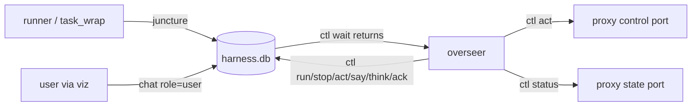

# Overseer

An AI overseer supervises the programmatic tasks (`harness/loop_lumber.py`,
`harness/errand_bank.py`, …) and is woken only at junctures that need judgement. Code:
`harness/ctl.py` (the CLI), `harness/task_wrap.py` (runs one task and reports its end),
`harness/test_ctl.py` (offline proof). The store is `harness/memory.py` (docs/MEMORY.md, schema v2).

## 1. Design, and why

- **Tasks stay programmatic.** Chopping, walking and storing are deterministic runners with their
  own guards (ANTICHEAT.md §8, LUMBER_LOOP.md). An LLM in the inner loop would be slow, costly and
  harder to keep stock-identical. The overseer only decides *what* runs and handles the exceptions.
- **The SQLite store is the bus; there is no daemon.** Runners and `task_wrap.py` post
  `junctures`; the user posts `chat` (role `user`, from the viz); the overseer posts `chat`
  (roles/kinds below) and acks junctures. Every party only needs the DB file, so any of them can
  restart without the others noticing.
- **The first overseer is an omp coding-agent session** (the harness the user already works in),
  driving `ctl.py`. Its "yield" is `ctl wait`: a blocking call the AI runs as a background shell
  job. The job finishing is what wakes the AI.
- **Later:** a standalone API-driven overseer daemon on the same bus. It would call the same
  `ctl.py` commands (or the same tables) with the same prompt (§5), so nothing in the runners, the
  wrapper or the viz changes when the omp session is swapped out.

## 2. `ctl.py` reference

`python harness/ctl.py [--db P] [--state-port 25942] [--control-port 25941] [--log-dir logs/tasks] <cmd>`.
Global options go **before** the command. Every call prints exactly one JSON object on stdout
(usage errors too: `{"ok": false, "error": "usage: …"}`); the exit code is 0 iff `ok` is true.

| Command | Does |
|---|---|
| `status` | Proxy snapshot: `pos` `[x,y,z,dir]`, `facet`, `hits`/`stam`/`mana` as `[cur,max]`, `weight`, `gold`, `gate`, `intent` + the last 5 `intents`, `mobiles` within 18 tiles (serial, name, notoriety + name, hits, distance; nearest first), `backpack.counts` by graphic (nested bags included), `target` cursor, open gumps, plus `tasks` and `open_junctures` from the DB. Proxy unreachable → `ok:false` (DB fields still present). |
| `run <task> [args…]` | Starts a whitelisted task detached: `lumber` → `loop_lumber.py`, `bank` → `errand_bank.py`. `args` pass through; `--control-port/--state-port/--memory` are appended from ctl's options unless given. Refused while a task runs (one character). Returns `task_id`, `pid`, `log`. |
| `stop [task_id]` | Asks the wrapper to terminate the task; it ends with a `task_failed` juncture marked `stopped`. If the wrapper doesn't report within `--grace` (20 s), ctl kills both processes itself and posts the juncture (`source: ctl`, "(forced)"). |
| `wait [--timeout S] [--include-info]` | Blocks (polling ~1 s) until there is an **open** juncture with id > the juncture cursor and severity ≥ `attention` (any severity with `--include-info`), or a `user` chat row with id > the chat cursor. Returns `{"ok":true,"event":<first>,"events":[…up to 20…],"cursors":{…}}` and advances the cursors past what it returned. Timeout (default 1800 s; ≤ 0 = forever) → `{"ok":true,"event":null}`. Events are `{"type":"juncture",id,t,source,kind,severity,summary,data,acked_t}` or `{"type":"chat",id,t,role,kind,text,data}`. |
| `ack <id>` | Closes a juncture (`acked_t`). |
| `junctures [--open] [--after N] [--limit N]` | Lists junctures. |
| `chat [--after N] [--limit N] [--role R]` | Lists chat rows. |
| `say <text>` / `think <text>` / `note-action <text>` | Chat row, role `overseer`, kind `message` / `thought` / `action`. |
| `act <name> [args]` | One stock action through the proxy control port (below). |

### `act`: the only way the overseer touches the game directly

Whitelist, built with the existing `harness/actions.py` builders and framed exactly like
`agent_link.Link.send` (u16be length + packet; reply u16be length + `OK`/`ERR …`):

| Act | Args | Packet |
|---|---|---|
| `walk` | `<dir 0-7> [n=1]` (n ≤ 20), `--run`, `--human normal\|off` | `0x02` per step, paced by `humanize.Human.step_delay` + `after_step`; retries the proxy's pacing gate like `Mover.step`; a new direction first only turns; stops at the first blocked step. |
| `say` | an allowlisted phrase | `0xAD` keyword-encoded like the stock client. |
| `dclick` / `single_click` | `<serial>` (hex `0x…` or decimal) | `0x06` / `0x09` |
| `open_door` | – | `0x12` type `0x58` |
| `target_cancel` | – | `0x6C` cancel for the cursor that is up now (refused if none) |
| `goto` | `<x> <y>` or `<serial>` (mobile or ground item), `--z Z`, `--range R` (default 0 for a tile or item, 2 for a mobile), `--max-moves` (400) | Walks with `agent_link.Mover`: map pathfinding, doors, shoving, human pacing, height-aware. A mobile target means staying within one storey of it; a ground item (e.g. the moongate) means its tile on its level; `--z Z` means arriving within 10 of Z (the hill, not the cave under it). Without `--z`, a tile target takes the cheapest level, which may be a cave under it. Returns `from`, `to`, `steps`, `blocked`, `doors_opened`, or `error` (`no route`, too many blocks). Reports an intent (`goto`) to the viz |
| `menu` | `<serial>` | `0xBF` sub `0x13` context-menu request; waits for the server's menu and returns its entries `{index, text (cliloc rendered), disabled}` |
| `menu_pick` | `<serial> <index>` | `0xBF` sub `0x15` selection, e.g. a vendor's **Buy** entry (the vendor list then shows in `heard`/`journal`). Opening a Buy list sends nothing further: the stock client sends no packet when the shop window is closed without buying (ClassicUO ShopGump.cs:590-610). The window stays open on the user's screen until they close it |
| `gump` | `<serial> <button>` | `0xB1` reply, **guarded**. It refuses: the captcha (gump id 1; always the human's, ANTICHEAT.md §8.8); a gump without reply buttons (the decoy/honeypot shape, §8.13); a button the layout doesn't offer; button 0 on a `noclose` gump; and **anything but button 0 (close) on a gump whose text mentions renouncing** (Young status is the human's decision) |

Every packet act waits ~1.5 s and returns `heard`: the server's replies as a player would read
them (messages with clilocs rendered, gumps with text/buttons/closable, menus, vendor lists).

Refused, and nothing sent: any other name (no raw packets), speech outside the allowlist, any act
while a task runs (no interleaving with a runner), and the gump cases above. Gate refusals
(`ERR agent paused` …) are returned, not waited out. Every act, refused or not, posts a chat row
(role `overseer`, kind `action`) with the result in `data`.

`journal [--n 30]`: the recent world events a player reads (speech, clilocs, gumps, menus, vendor
lists, target cursors, facet changes) from the proxy's event ring, newest last. `status` lists
mobiles with their click `label` (e.g. "Zara the scribe"), open gumps in full (texts, buttons,
closable) and nearby `ground_items` (≤ 12 tiles, named from tiledata, e.g. "blue moongate").

`map [--radius 12] [--to X Y [--z Z] [--range R]]` is how the overseer sees the terrain
(`harness/localmap.py`). It's an ASCII grid, north up, each row prefixed with its y and two
header rows of x digits, with:
- `@` you; `a..z` mobiles (listed with label, dz, and whether you can reach their level)
- `.` reachable at your level; `,` reachable at your level with another level above it (you are
  in a cave, under a roof, or under a hill)
- `+`/`-` reachable higher/lower (stairs and ramps show as runs of these)
- `^`/`v`/`:` standable but not reachable within the view
- `#` nothing to stand on
- `D` doors, `T` trees, `*` ground items (listed)

It also reports `under_cover`, `levels_above_you` and `levels_below_you`. With `--to`, the
planned route is drawn (`o`, goal `X`), with steps and waypoints. Use it when `goto` says `no
route`, when heights confuse you, or before walking somewhere new. The z in `status`/`map` is
right while walking (the proxy computes it per step; docs/NOTES.md).

**Policy:** the user's standing decisions are in `harness/data/policy.json`:
- home town Horseshoe Bay
- death: self-resurrect, no `[TestRes`, no corpse runs
- gold: may spend, daily cap 50 000 gp
- no harvesting mounted

The overseer follows it.

**Speech allowlist.** docs/PLAN.md decides "in-game speech is allowlisted keywords/commands only"
and LUMBER_LOOP.md adds `room`, but no allowlist existed in code. `ctl.SPEECH_ALLOWLIST` is now
the only one: `bank`, `room`, `hello` (matched case-insensitively; the canonical lowercase phrase
is sent). Extending it is a user decision.

### Tasks, logs and the `meta` keys

- `task_wrap.py` runs the task with stdout+stderr in `logs/tasks/<task_id>.log` (gitignored).
  `task_id` = `<task>-<YYYYmmdd-HHMMSS>-<4 hex>`.
- On exit it removes the task from `meta.tasks` **and then** posts the juncture, so a woken
  overseer can `run` the next task at once. `task_done` (exit 0, `info`) or `task_failed`
  (non-zero or stopped, `attention`). Summary: `"<task> finished|failed|stopped by the overseer
  (exit N): <line>"`, where `<line>` is the runner's `ABORTED: …` line, else the exception line
  after a traceback, else the last line. `data`: `{task_id, task, args, exit_code, log, tail
  (last 20 lines)[, stopped]}`. `source` is the task name.
- `meta` keys:

| Key | Value |
|---|---|
| `tasks` | JSON list of `{task_id, task, args, pid, pid_created, child_pid, child_created, started, log}`. `pid` is the wrapper. `*_created` is the OS process creation time, checked so a recycled pid is never taken for (or killed as) our task. An entry whose wrapper is gone is removed by the next `ctl` call and reported once as `task_failed` (`source: ctl`, "ended without a report"). |
| `task_stop` | `{task_id, t}`: stop request the wrapper polls every 0.5 s. |
| `overseer_juncture_cursor`, `overseer_chat_cursor` | `wait` cursors (decimal ids). |
| `overseer_heartbeat` | Epoch seconds as a decimal string (`"1790742202.14"`). Written on every `wait` poll (~1 s) and by `say`, `think`, `note-action`, `act`, `run`, `stop`, `ack`. The viz shows "overseer active" while it is < 90 s old. |

## 3. Juncture vocabulary

`junctures(source, kind, severity, summary, data)`. `wait` wakes on `attention` and `urgent`, and
**always on `task_done`/`task_failed`**, since they answer the overseer's own `run`. In the first
live session (2026-09-30), `task_done` (`info`) didn't wake `wait` and the overseer sat idle after
its trip. Other `info` rows are history (`ctl junctures`, or `wait --include-info`).

| Kind | Severity | Posted by | Meaning / `data` |
|---|---|---|---|
| `task_done` | info | task_wrap | Task exited 0. `{task_id, task, args, exit_code, log, tail}` |
| `task_failed` | attention | task_wrap, ctl | Non-zero exit, stopped (`stopped: true`), or the wrapper vanished. Same data. |
| `trip_done` | info | runner | One loop trip finished (episode row summary). |
| `stuck` | attention | runner | No progress: route blocked, too many replans, stalled movement. `{pos, target, reason}` |
| `captcha` | urgent | runner | Real captcha up (gump id 1, text entry 2). **Human only**: the overseer calls the user and never answers it. |
| `threat` | urgent (PK/red, aggressor) / attention (monster) | runner | Hostile nearby or attacking. `{serial, name, notoriety, dist, hits}` |
| `theft_suspected` | attention | runner | Backpack count dropped without our action, or a snoop message. `{graphic, before, after}` |
| `death` | urgent | runner | Hits 0 / ghost body. `{pos, facet}` |
| `low_supplies` | attention | runner | Tools, reagents or gold below the trip's needs. `{item, have, need}` |
| `gate_closed` | info | runner | Agent gate paused or on a scheduled break (reopens by itself). |
| `server_restriction` | urgent | runner | Server gating text (AGENTS.md rule 4): all automation halts. |

As of 2026-09-29 only `task_done` and `task_failed` are emitted (by `task_wrap.py`/`ctl.py`); the
other kinds are the contract the runners post to once they are wired to the bus. New kinds may be
added; the overseer treats an unknown kind by its severity and summary.

## 4. What the visualizer shows

The viz reads the same tables (built by the viz work, not by `ctl.py`):

- **Chat panel**: `chat` rows in id order. `user` rows are what the user typed; `overseer`
  `message` rows are replies, `thought` rows are the overseer's reasoning, shown distinctly;
  `action` rows are what it did (`ctl act`/`run`/`stop` post these automatically,
  `note-action` for anything else). User input from the viz is a `chat` row with role `user`,
  which wakes `ctl wait`.
- **Junctures**: open vs acked, severity-coloured, with summary and data.
- **Overseer active** indicator: `meta.overseer_heartbeat` younger than 90 s.

## 5. Overseer operating prompt

Paste this (or point the session at this section) to start an overseer.

> You are the **overseer** of the uo-harness agent playing Ultima Online Outlands, **Test
> Shard only**, as TestWorth. Programmatic tasks do the work; you supervise them through
> `python harness/ctl.py …` from `C:/Users/chris/uo-harness` (Python:
> `C:/Users/chris/AppData/Local/Programs/Python/Python313/python.exe`). Read AGENTS.md,
> ANTICHEAT.md §8 and docs/OVERSEER.md first. Never edit code or restart services during a
> shift; never touch the proxy/viz services, the client, or the install dir.
>
> **Loop.**
> 1. `ctl status` and `ctl junctures --open` to orient; `ctl say` a one-line hello.
> 2. Start `ctl wait --timeout 900` as a **background** shell job (shell timeout > 900 s), then
>    stop making tool calls. Its completion wakes you.
> 3. On wake, read `events`. For each: `ctl think` your reading of it (this is the only way the
>    user sees your reasoning), then decide:
>    - `task_done`: check `status` (weight, supplies, hits), then `ctl run` the next task or
>      idle.
>    - `task_failed`, `stuck`: read the tail/log; retry once if the cause is transient,
>      otherwise fix the situation with small `ctl act` steps or call the human.
>    - `threat`, `theft_suspected`, `death`, `low_supplies`: follow the runner's data. When in
>      doubt, stop the task and call the human.
>    - `captcha`, `server_restriction`: **call the human immediately**, stop the task, never try
>      to answer.
>    - user chat: answer with `ctl say`; do what they ask within these rules.
> 4. `ctl ack <id>` every juncture you have handled; `ctl note-action` anything you did outside
>    `ctl`.
> 5. Go back to step 2. A timeout (`event: null`) is a heartbeat: glance at `status`, then wait
>    again.
>
> **Safety.** One task at a time; never `act` while a task runs (ctl refuses anyway). Only the
> `act` whitelist and only allowlisted speech; never free text in game. Gump replies only through
> `act gump`, whose guards you must not try to work around: the captcha is always the human's,
> never reply to button-less gumps, and a renounce-Young prompt may only be closed. Never attack
> anything or anyone: no PvP on the Test Shard, and Heat of Battle blocks recall and the inn room.
> Keep actions few and human-paced. The agent gate (pause, kill, breaks, daily cap) outranks you:
> if it is closed, wait. If anything looks like a GM, a jail, or a server message about
> automation, stop the task and call the human. Follow `harness/data/policy.json`.
>
> **Calling the human.** `ctl say "@user <what, where, what you need>"` and, for urgent cases
> (captcha, death, GM contact, server restriction, repeated failure you can't explain), also
> tell the user in this omp session. Then keep waiting; don't improvise around it.

## 6. Starting an overseer session in omp

1. Make sure the proxy and client are running and logged in (`ctl status` returns `ok:true`),
   and no task is running unless you want the overseer to adopt it.
2. Open omp in `C:/Users/chris/uo-harness` and send: *"Act as the overseer: follow
   docs/OVERSEER.md §5."* (optionally add the goal, e.g. "run lumber trips until 500 boards").
3. Talk to it through the viz chat (or directly in omp). Pause/kill in the viz still stop the
   agent at the proxy regardless of the overseer.
4. To end the shift: tell it to `ctl stop` and stop waiting, or just close the session. A running
   task keeps running and reports to the DB, and a new overseer picks up the open junctures on
   its first `wait`.

## 7. Limits

- **Thinking is only visible if the overseer posts `think`.** The model's own reasoning inside
  omp isn't on the bus.
- The overseer is asleep between wakes. Reaction time is poll (~1 s) + model turn latency, so
  the runners' own guards must handle anything that can't wait tens of seconds (HP loss, stalls,
  captcha handoff sound).
- `wait` returns at most 20 events per wake. `info` junctures skipped by a plain `wait` are
  passed by the cursor (still listed by `ctl junctures`).
- The omp session's context grows with every wake. Long shifts need a fresh session; the DB
  (open junctures, cursors, chat) carries the state across.
- `stop` terminates the runner process: it doesn't get to clear its viz intent or finish a
  trip, and items mid-move stay where they were.
- `status` is one snapshot; notoriety names are the RunUO constants (1 innocent … 7
  invulnerable) `[INFERENCE: not in the local ClassicUO tree]`.
