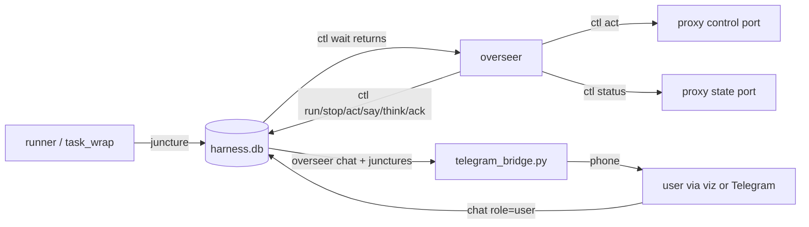

# Overseer

An AI overseer supervises the programmatic tasks (`harness/loop_lumber.py`,
`harness/errand_bank.py`, …) and is woken only at junctures that need judgement. Code:
`harness/ctl.py` (the CLI), `harness/task_wrap.py` (runs one task and reports its end),
`harness/test_ctl.py` (offline proof). The store is `harness/memory.py` (docs/MEMORY.md, schema v2).

## 1. Design, and why

- **Tasks stay programmatic.** Chopping, walking and storing are deterministic runners with their
  own guards (ANTICHEAT.md §8, LUMBER_LOOP.md). An LLM in the inner loop would be slow, costly and
  harder to keep stock-identical. The overseer only decides *what* runs and handles the exceptions.
- **The SQLite store is the bus; there is no daemon.** Runners and `task_wrap.py` post
  `junctures`; the user posts `chat` (role `user`, from the viz or Telegram, §8); the overseer posts `chat`
  (roles/kinds below) and acks junctures. Every party only needs the DB file, so any of them can
  restart without the others noticing.
- **The first overseer is an omp coding-agent session** (the harness the user already works in),
  driving `ctl.py`. Its "yield" is `ctl wait`: a blocking call the AI runs as a background shell
  job. The job finishing is what wakes the AI.
- **Later:** a standalone API-driven overseer daemon on the same bus. It would call the same
  `ctl.py` commands (or the same tables) with the same prompt (§5), so nothing in the runners, the
  wrapper or the viz changes when the omp session is swapped out.

## 2. `ctl.py` reference

`./ctl.cmd [--db P] [--state-port 25942] [--control-port 25941] [--log-dir logs/tasks] <cmd>` from the
repo root (`ctl.cmd` runs `harness/ctl.py` with the Python 3.13 install; override with `UO_PY`).
Global options go **before** the command. Every call prints exactly one JSON object on stdout
(usage errors too: `{"ok": false, "error": "usage: …"}`); the exit code is 0 iff `ok` is true.

| Command | Does |
|---|---|
| `status` | Proxy snapshot: `pos` `[x,y,z,dir]`, `facet`, `hits`/`stam`/`mana` as `[cur,max]`, `weight`, `gold`, `gate`, `intent` + the last 5 `intents`, `mobiles` the client has within 18 tiles (serial, name, notoriety + name, hits, distance, `age_s` since the server last updated it; nearest first), `attackers` (mobiles whose latest swing, S2C `0x2F`, was at you within 10 s: serial, name, label, dist, hits `[cur,max]`, `last_swing_age_s`; nearest first), `backpack.counts` by graphic and `backpack.items` (up to 60: serial, graphic, name, amount, `in` = sub-bag or null; nested bags included), `target` cursor, open gumps, plus `tasks` and `open_junctures` from the DB. Proxy unreachable → `ok:false` (DB fields still present). The world model drops what the client drops (out of the 18-tile view, dead, another facet; docs/WORLDMODEL.md §7), so a mob missing from `mobiles` can't be clicked, attacked or targeted. |
| `run <task> [args…]` | Starts a whitelisted task detached: `lumber` → `loop_lumber.py`, `bank` → `errand_bank.py`, `hunt` → `loop_hunt.py` (fight monsters at a spot, NPD mongbats by default; thresholds are its arguments, e.g. `run hunt --kills 5 --heal-at 0.75 --leave-at 0.6`; docs/HUNT_LOOP.md). `args` pass through; `--control-port/--state-port/--memory` are appended from ctl's options unless given. Refused while a task runs (one character). Returns `task_id`, `pid`, `log`. |
| `stop [task_id]` | Asks the wrapper to terminate the task; it ends with a `task_failed` juncture marked `stopped`. If the wrapper doesn't report within `--grace` (20 s), ctl kills both processes itself and posts the juncture (`source: ctl`, "(forced)"). |
| `wait [--timeout S] [--include-info]` | Blocks (polling ~1 s) until there is an **open** juncture with id > the juncture cursor and severity ≥ `attention` (any severity with `--include-info`), or a `user` chat row with id > the chat cursor. Returns `{"ok":true,"event":<first>,"events":[…up to 20…],"cursors":{…}}` and advances the cursors past what it returned. Timeout (default 1800 s; ≤ 0 = forever) → `{"ok":true,"event":null}`. Events are `{"type":"juncture",id,t,source,kind,severity,summary,data,acked_t}` or `{"type":"chat",id,t,role,kind,text,data}`. |
| `ack <id>` | Closes a juncture (`acked_t`). Acking `gm_suspected` stops the staff alarm. |
| `alert <why> [--serial S]` | **Possible staff (GM).** Posts an urgent `gm_suspected` juncture (`{reason, serial}`) and sounds the staff alarm (two-tone, distinct from the captcha alert beeps) so the human at the PC comes to check. It repeats every 30 s from a holding harvest job and from `wait` until the juncture is acked; a holding job won't resume while one is open. Allowed while a task runs. A second `alert` while one is open re-sounds it (`already_open`). |
| `break` | Starts the agent gate's scheduled break now (`{"op":"gate","action":"break"}`), e.g. once the character is home after a `break_due` juncture. Refused while already on a break. Returns the gate (`break_until`). |
| `junctures [--open] [--after N] [--limit N]` | Lists junctures. |
| `chat [--after N] [--limit N] [--role R]` | Lists chat rows. |
| `say <text>` / `think <text>` / `note-action <text>` | Chat row, role `overseer`, kind `message` / `thought` / `action`. |
| `act <name> [args]` | One stock action through the proxy control port (below). |

### `act`: the only way the overseer touches the game directly

Whitelist, built with the existing `harness/actions.py` builders and framed exactly like
`agent_link.Link.send` (u16be length + packet; reply u16be length + `OK`/`ERR …`):

| Act | Args | Packet |
|---|---|---|
| `walk` | `<dir 0-7> [n=1]` (n ≤ 20), `--walk` (default is run, like the client's Always Run), `--human normal\|off` | `0x02` per step at the stock held-key cadence (`humanize.Human.step_gap`: 200 ms run / 400 ms walk after the previous send, 100 / 200 ms while mounted, plus jitter) + `after_step`; retries the proxy's self-clearing walk gates like `Mover.step`; a new direction first only turns; never sends a step the map rules refuse (the client wouldn't) and stops there or at the first blocked step. |
| `say` | an allowlisted phrase; **free text only while a harvest job holds for speech** | `0xAD` keyword-encoded like the stock client. During a `speech_nearby` hold, any printable text up to 120 characters (case kept) to answer the speaker, refused if it touches what AGENTS.md constraint 4 forbids (bot, AI, script, macro, test…, `ctl.REVEALING`). Outside a hold, only the allowlist. |
| `dclick` / `single_click` | `<serial>` (hex `0x…` or decimal) | `0x06` / `0x09`, plus `0x34` after a click on a mobile (the client pairs them). Only for what the client has on screen: the entity (or the mobile/ground item holding it) in the world model within 18 tiles; otherwise refused (`goto` first). `dclick` on a mobile in war mode is refused: the client would attack instead |
| `open_door` | – | `0x12` type `0x58` |
| `target_cancel` | – | `0x6C` cancel for the cursor that is up now (refused if none) |
| `goto` | `<x> <y>` or `<serial>` (mobile or ground item), `--z Z`, `--range R` (default 0 for a tile or item, 2 for a mobile), `--max-moves` (400) | Walks with `agent_link.Mover`: map pathfinding, doors, shoving, human pacing, height-aware. A mobile target means staying within one storey of it; a ground item (e.g. the moongate) means its tile on its level; `--z Z` means arriving within 10 of Z (the hill, not the cave under it). Without `--z`, a tile target takes the cheapest level, which may be a cave under it. **Moongates:** a goto onto a moongate's tile (`--range 0`) leaves the gate's gump open for `act gump`; any other moongate the route steps onto has its gump (Moongate Destinations, or the renounce-Young prompt) closed after a reaction pause, like a player right-clicking it away (since 2026-10-01). Returns `from`, `to`, `steps`, `blocked`, `doors_opened`, `gate_gumps_closed`, or `error` (`no route`, too many blocks). Reports an intent (`goto`) to the viz |
| `menu` | `<serial>` | The stock right-click: `0x09` then `0xBF` sub `0x13`, back to back; on-screen entities only (as `dclick`). Waits for the server's menu and returns its entries `{index, text (cliloc rendered), disabled}` |
| `menu_pick` | `<serial> <index>` | `0xBF` sub `0x15` selection, e.g. a vendor's **Buy** entry (the vendor list then shows in `heard`/`journal`). Only from that serial's context menu while it's open (the latest menu, with no pick or new request since) and only an index it offers. Opening a Buy list sends nothing further: the stock client sends no packet when the shop window is closed without buying (ClassicUO ShopGump.cs:590-610). The window stays open on the user's screen until they close it |
| `gump` | `<serial> <button> [--text ID=VALUE]…` | `0xB1` reply, **guarded**. Like the stock client (ClassicUO Gump.OnButtonClick) it carries **every text entry** in layout order, with its current text unless overridden by `--text`, and the switches (checkboxes/radios) that start checked. So editing one entry never blanks the others. It refuses: the captcha (gump id 1; the human answers it in the client, or the runner's solver in captcha mode `auto`, ANTICHEAT.md §8.8/§8.13), even with `--text`; a gump without reply buttons (the decoy/honeypot shape, §8.13); a button the layout doesn't offer; button 0 on a `noclose` gump; **anything but button 0 (close) on a gump whose text mentions renouncing** (Young status is the user's decision); and `--text` for an entry the gump doesn't have, longer than its limit, or non-printable. Examples: Storage Shelf "Retrieve Items" amount = `--text 1=20`; Player Testing editor skill entries 100–114, Str/Dex/Int 90–92 |
| `unequip` | `<item serial>` | An item you wear goes to your backpack: `0x07` lift, human "drag" pause, `0x08` drop into the pack (the auto-position form from the demo capture). It waits until the world model shows it in the pack; it refuses items you don't wear and the backpack itself |
| `equip` | `<item serial>` | An item in your backpack (any bag depth) is worn again: `0x07` lift, pause, `0x13` equip request on its tiledata layer. It waits until worn; it refuses items not in your pack, items already worn, and items without a wearable layer |
| `warmode` | `on\|off` | `0x72` war mode request (the stock Tab toggle); waits until the server confirms. Nothing is sent when war mode is already in that state (Tab only ever flips it) |
| `attack` | `<mobile serial>` | **Hostile monsters only** (user decision 2026-09-30). It refuses anything `threats.identify` doesn't call a monster: players, NPCs, human bodies. It also refuses notoriety outside 3–6 (1 innocent / 2 ally are players' pets: a criminal act; 7 invulnerable), mobs off screen (as `dclick`), and starting a fight below 30% of max hits. Like the stock client (Tab, then double-click the target: GameActions.DoubleClick), it turns war mode on first, then sends `0x34` unless the client already has a status request out for that mob (`world.status_requested`: its own `0x34` since the last close-status `bf 000c`), then `0x05`. Swings are automatic while in range, so `goto <serial> --range 1` to close in, and `warmode off` after |
| `loot` | `<corpse serial>` `[--max-items 25]` | A monster's corpse (ground item graphic `0x2006`; its `amount` is the dead creature's body) within 2 tiles. Opens it (`0x06`) and moves its contents into your backpack, gold first: per item a human pause, then `0x07` lift and `0x08` drop back to back (the stock GrabItem shape, GameActions.cs:819-852), stopping at your weight limit. Dropped gold merges into your pile, which deletes the lifted serial; that counts as moved. It refuses human corpses (players, human NPCs, your own: policy, no corpse runs) and reports `warning` if your notoriety changes (e.g. criminal from looting someone else's kill) |
| `cast` | `<spell name or 1-64>` | Magery (ClassicUO SpellsMagery.cs ids), e.g. `cast greater heal`. The Outlands client's cast request (`0xFF` sub 4, seen live in capture 164548). Waits up to 4 s for the spell's target cursor and reports `cursor`/`target_type`; answer it with `target` |
| `heal` | `[--gheal-min-missing N]` | **Heal yourself, the way to heal** (since 2026-10-02; `harness/healing.py`, the same choice as the hunt runner). A heal potion whenever one can be drunk: graphic `0x0F0C` in the backpack at any bag depth, smallest stack first, its bags opened first, the stock double-click. Not within 10 s of ctl's last drink (meta `heal_potion_t`); a server "wait" refusal (cliloc 500235) falls back to a spell in the same call. Otherwise a spell by the missing hits: Greater Heal from the mana break-even (Heal's average × 11/4: 19 missing at Magery 60) or `--gheal-min-missing`, else Heal; if the chosen one can't be paid for, the other. Casts, waits for the cursor, a human aim pause, then `0x6C` on yourself. Returns `used` (potion/spell), `spell`, `why`, `missing`, `hits`, `heard`; at full health it sends nothing; nothing possible is an error |
| `track` | `<mode>` or `off` | **Tracking's Hunting mode** (since 2026-10-01; the Tracking skill is needed). Modes: criminal / innocent / friendly / enemy / murderer players, all players, all hostile players, aggressive / passive creatures, townsfolk; aliases `reds` (murderer), `greys` (criminal), `blues` (innocent), `hostile` (all hostile players). Done as a player does it in the client: the stock UseSkill (`12 … 24 "38 0"`, only if the Tracking gump isn't already open), then the gump's mode arrows the shorter way round after a reaction pause each (one extra step when the mode hasn't been heard this session), then Begin Hunting. Another mode while hunting: Stop, change, Begin. `off`: Stop Hunting; nothing is sent when not hunting. The gump stays open, as it does for a player. Returns `clicks` and `tracking` {hunting, mode, arrow}. Hits then show in `status.tracking` |
| `recall` | `[book serial] [--check]` | **Recall to the default rune** of a runebook or rune tome in your backpack (since 2026-10-02; `harness/escape.py`, the same escape the lumber runner uses on a red). A charge when the book has one, else the Recall spell (mana + reagents or a spellstone). One attempt; returns `method`, `rune`, `from`, `to`, `press_to_arrival_s` (~2.1 s live) or `failure` (disturbed, fizzled, no charges, mana, reagents, heat of battle…). `--check` only opens the book and reads it: `default`, `charges`, `entries`, `can_cast`. Without a serial: the first book, tomes first. Gumps and buttons: docs/NOTES.md "Runebook and rune tome gumps" |
| `target` | `self` or `<serial>` | Answers the target cursor that's up (after a spell, a bandage or an item use) with `0x6C` on an entity. Allowed: yourself, a hostile monster (the `attack` rule), or an item in your backpack (container-local x/y). Refuses players, their pets and NPCs, and refuses when no cursor is up |
| `buy` | `<vendor serial> [ITEM WORDS…] [--amount N]` | Opens the vendor's Buy list the way the stock client does: right-click (`0x09` + `0xBF 0x13`), then the Buy entry. Without item words it returns the price list (`name`, `price`, `stock`, item `serial`) and buys nothing; the shop window stays open for the user to close. With item words it sends `0x3B` for the one matching item. The vendor must be within 12 tiles, and it refuses ambiguous names, amounts above stock, amounts above your gold, and anything over the policy's daily cap (`harness/data/policy.json` `gold.daily_cap_gp`; spends are recorded as job events `gold`/`spend`, local day). The price list maps to the items of the vendor's **latest `0x3C` container packet, in reverse packet order** (ClassicUO clears and re-adds a container per `0x3C`; BuyList reads it reversed unless the container is 0x2AF8). The first version used first-seen order and swapped Lesser Heal and Refresh live (2026-09-30). Without a matching container packet it refuses to buy on a guess |
| `use` | `<item name words \| 0xGRAPHIC>` | Double-clicks the matching item in your backpack (drink a potion; a bandage, then `target self`); the smallest stack first. A name matching different items is refused. Names are clicked names or else tiledata names (potions are colours there: Lesser Heal = "Yellow Potion", Refresh = "Red Potion", Lesser Cure = "Orange Potion"); single-click to get the real name |
| `drop` | `<item serial> <container serial> [--amount N]` | Moves an item into a container, **from anywhere to anywhere** the world model knows: backpack, open bank box, chests, corpses, a bag in any of them. No harness-side container limits (user decision 2026-09-30); the server decides what you may take or reach. E.g. gold from the bank into the backpack: `drop <gold> <backpack>`. Sends `0x07` lift (N of a stack; default all), a human drag pause, then `0x08` drop into the container (auto-position), like dragging it in the client. Merged stacks (gold onto gold) count as moved. Returns `from`/`into` (backpack, bank, corpse, ground container or a serial). Refuses only unknown items or containers, a container into itself, and an amount outside the stack |

**Containers are opened first, like a player would (2026-10-01).** A player only reaches an item
through an open container gump. So `dclick`, `single_click`, `menu`, `use`, `equip`, `drop` (source,
and the destination itself) and `loot` (your backpack) first double-click every container on the
way that the server hasn't opened this session (`world.containers`, its `0x24` replies), outermost
first, with a moment to find the item. They report those as `opened`. Opened once counts as open:
the server never learns that a gump was closed. A bank box that isn't open is refused ("say
`bank` first"); a double-click doesn't open it. `target` on an item in an unopened bag is refused,
because with a cursor up a click targets: cancel, open the bag, use the tool again.

Every packet act waits ~1.5 s and returns `heard`: the server's replies as a player would read
them (messages with clilocs rendered, gumps with text/buttons/closable, menus, vendor lists).

Every act also reports an **intent** to the viz Agent panel and map: `goto` ("Walking to …",
then "Arrived at …" or "Stopped …"), `attack` ("Attacking a mongbat"; the red map marker follows
the mob), `loot`, `cast`, `target`, `use`, `buy`, and `warmode` (ready/idle). For goals between
acts use **`ctl intent <text…> [--kind K] [--target X Y] [--follow SERIAL] | --clear`**, e.g.
`ctl intent Hunting mongbats for 100 gold`.

Refused, and nothing sent: any other name (no raw packets), speech outside the allowlist, any act
while a task runs (no interleaving with a runner), and the gump cases above. Gate refusals
(`ERR agent paused` …) are returned, not waited out. Every act, refused or not, posts a chat row
(role `overseer`, kind `action`) with the result in `data`.

`npcs [WORDS…] [--limit 20]`: the mobiles the client has (`in_view` true, live position) **plus
the ones it dropped** (world `last_seen`, `in_view` false: where it last had them, `age_s` since,
`why`: `range` = left the view, `delete` = removed by the server, `facet` = on another facet).
Dead ones are left out. It keeps NPCs seen earlier, e.g. every mage and scribe in Prevalia after
walking past. Search by name or title words (`npcs mage`, `npcs the scribe`, `npcs Sherwin`),
nearest first. NPCs wander, so `goto <serial>` walks to the last-seen spot and follows the live
position once the mobile is back in view. Out of view, nothing else can use the serial: click,
menu, attack and target need it in the client again. Use it before searching an area by walking.

`journal [--n 30]`: the recent world events a player reads (speech, clilocs, gumps, menus, vendor
lists, target cursors, facet changes) from the proxy's event ring, newest last. `status` shows:
- `dead` and `body` (the client's ghost-body rule)
- `equipment` by layer name (e.g. `two_handed`: the hatchet, `robe` after a resurrection)
- `skills` {name: value} above 0. Names come from the server's list, or else from the client's
  `skills.mul` (`uomap.skill_names`).
- `stats`: Str/Dex/Int, stat cap, luck, resists, damage, followers, max weight (0x11)
- `buffs`: your active buffs/debuffs (Outlands 0xFF sub 8), e.g. "Stationary Penalty" with its
  description; `raw` holds the numbers that aren't decoded yet (f2 looks like the count)
- `tracking`: `hunting`, `mode` (as the server last named it), the `arrow` that is up and the last
  5 `hits`, each {serial, x, y, z, text, mode at the time, seq}. A hit can be a mobile the
  server never sent (beyond the 18-tile view): its serial and spot come only from the arrow.
  The arrow carries no notoriety; the hit's `mode` is its class (e.g. "murderer players" = a red).
  The arrow is a snapshot: it only moves with the next hit. Hunting stays on until `act track off`.
- mobiles with their click `label` (e.g. "Zara the scribe")
- open gumps in full (texts, buttons, closable); a gump counts as closed once it is answered or
  the server closes it. Each has **`controls`**: every reply button and text entry with its
  position and the texts on its row (`near`: text, `dx`, `dy`; `dx` > 0 means the text is to
  its right, and labels may sit on either side), and each entry's current `value` and `limit`.
  Read it before pressing a button in a gump with several similar-looking ones. The Player
  Testing editor puts "Fill Spellbook" at button 53 (label 87 px left of it), "Reset Stats and
  Skills" at 47 and "Apply Stats and Skill Values" at 46.
- nearby `ground_items` (≤ 12 tiles, named from tiledata, e.g. "blue moongate")
- `containers`: contents of your **bank box** (once opened this session) and every other
  container the server opened for you (chests, corpses; not vendor stock), items at any bag
  depth with serial, graphic, name, amount and `in` (sub-bag). Contents are as last shown,
  so a container you walked away from may be stale. Bank checks show as "bank check"; use
  `single_click` for their value.

**Teleporters** are invisible server objects, not in the map files. When a step lands somewhere
other than the next tile, `goto` reports it and replans instead of failing. The source tile
goes into the memory store's `teleporters` table, and later plans walk around it (unless it is
the goal). Known: the New Player Dungeon entrance (1912,2557) → (5536,530), and its exit
(5535,529) → (1912,2556,z-20).

`map [--radius 12] [--to X Y [--z Z] [--range R]]` is how the overseer sees the terrain
(`harness/localmap.py`). It's an ASCII grid, north up, each row prefixed with its y and two
header rows of x digits, with:
- `@` you; `a..z` mobiles (listed with label, dz, and whether you can reach their level)
- `.` reachable at your level; `,` reachable at your level with another level above it (you are
  in a cave, under a roof, or under a hill)
- `+`/`-` reachable higher/lower (stairs and ramps show as runs of these)
- `^`/`v`/`:` standable but not reachable within the view
- `#` nothing to stand on
- `D` doors, `T` trees, `*` ground items (listed)

It also reports `under_cover`, `levels_above_you` and `levels_below_you`. With `--to`, the
planned route is drawn (`o`, goal `X`), with steps and waypoints. Use it when `goto` says `no
route`, when heights confuse you, or before walking somewhere new. The z in `status`/`map` is
right while walking (the proxy computes it per step; docs/NOTES.md).

`screenshot [--out F] [--crop X Y W H]` is how the overseer sees the game window itself
(`harness/screen.py`). It writes a PNG of the client area (the game view, no title bar) to
`logs/screens/`, and the overseer reads the file to look at it. `--crop` takes client pixels,
e.g. a gump or the status bar.
- It works when other windows cover the game (Windows Graphics Capture).
- It can't capture a minimized window.
- It is passive: no message or input goes to the client. See ANTICHEAT.md §8.16.

Use it to check what the packets can't show: gumps drawn on screen, what the player sees
around them, anything the user points at.

**Policy:** the user's standing decisions are in `harness/data/policy.json`:
The overseer follows it.

### Tasks, logs and the `meta` keys

- `task_wrap.py` runs the task with stdout+stderr in `logs/tasks/<task_id>.log` (gitignored).
  `task_id` = `<task>-<YYYYmmdd-HHMMSS>-<4 hex>`.
- On exit it removes the task from `meta.tasks` **and then** posts the juncture, so a woken
  overseer can `run` the next task at once. `task_done` (exit 0, `info`) or `task_failed`
  (non-zero or stopped, `attention`). Summary: `"<task> finished|failed|stopped by the overseer
  (exit N): <line>"`, where `<line>` is the runner's `ABORTED: …` line, else the exception line
  after a traceback, else the last line. `data`: `{task_id, task, args, exit_code, log, tail
  (last 20 lines)[, stopped]}`. `source` is the task name.
- `meta` keys:

| Key | Value |
|---|---|
| `tasks` | JSON list of `{task_id, task, args, pid, pid_created, child_pid, child_created, started, log}`. `pid` is the wrapper. `*_created` is the OS process creation time, checked so a recycled pid is never taken for (or killed as) our task. An entry whose wrapper is gone is removed by the next `ctl` call and reported once as `task_failed` (`source: ctl`, "ended without a report"). |
| `task_stop` | `{task_id, t}`: stop request the wrapper polls every 0.5 s. |
| `overseer_juncture_cursor`, `overseer_chat_cursor` | `wait` cursors (decimal ids). |
| `gate_break_due_notified` | `break_due_at` of the last due break `wait` announced (one `break_due` juncture per break). |
| `overseer_heartbeat` | Epoch seconds as a decimal string (`"1790742202.14"`). Written on every `wait` poll (~1 s) and by `say`, `think`, `note-action`, `act`, `run`, `stop`, `ack`. The viz shows "overseer active" while it is < 90 s old. |
| `captcha_mode` | `human` (also when missing) or `auto`: who answers the harvest captcha. Set by the user with the viz header toggle (VISUALIZER.md §2.2a); the runner reads it at every captcha. The overseer doesn't change it. |

### Long-term memory: `ctl know` (harness/knowledge.py)

What the overseer learns about the game and its dealings with players and the user, kept across
sessions in the memory store's `knowledge` table (docs/MEMORY.md). Kinds:
- `fact`: prices, places, rules
- `procedure`: how to do X
- `episode`: what happened
- `preference`: a user directive
- `insight`: a lesson learned

| Command | Does |
|---|---|
| `know add --kind K --topic T [--tags a,b] [--entity NAME]… [--at X Y \| F X Y] [--source observed\|user\|wiki\|doc\|inferred] [--ref EVIDENCE] [--confidence C] [--importance 1-10] [--supersedes ID] CONTENT…` | Stores an entry. The same content again **confirms** the existing entry (confidence up) instead of adding a copy. The reply lists `related` entries (same topic or similar wording), so you can see a conflict and supersede |
| `know update ID [CONTENT…] [--topic] [--tags] [--at] [--confidence] [--importance] [--source --ref]` | A content or topic change makes a **new version** that supersedes the old one (history kept); other fields change in place |
| `know confirm ID [--source --ref]` | Seen true again: confirmations += 1, confidence up |
| `know retract ID --reason R` | It was wrong: retracted with the reason, never deleted |
| `know get ID [--history]` | One entry, with its version chain |
| `know search [WORDS…] [--kind] [--tag]… [--near X Y \| --here] [--limit] [--all]` | Ranked recall: stemmed full-text relevance, recency (14-day half-life), importance, confidence and nearness. Counts as an access |
| `know brief [--limit]` | What to remember **now**: entries relevant to your position, nearby NPCs, open junctures, intent and task, plus standing procedures/preferences of importance ≥ 7 |
| `know review [--stale-days 30]` | Maintenance: unconfirmed inferences, entries never recalled in 30 days, topics with several active facts (possible contradictions) |
| `know stats` | Counts by kind and status |

Every `know` call except `stats` posts one chat row of kind **`memory`**: lookups (search, brief,
get, review) with their query and ranked results, and writes (add, update, confirm, retract)
with the entry and any related ones. The viz Overseer tab shows them as **recall** (teal) and
**memory** (amber) items (VISUALIZER.md §2.6), so the user sees what the overseer looked up and
what it chose to remember. Row data is `{cmd: "know", op, …}` with `query`, `results`,
`relevant`/`standing`, `entry`, `related`, `id`, `action`, `reason`, `counts` (entries
compacted, at most 12 per list).

Seeded 2026-09-30 with the user's decisions (`preference`, source `user`) and the Young-demo
results (`observed`, ref `docs/missions/YOUNG_DEMOS.md`).

## 3. Juncture vocabulary

`junctures(source, kind, severity, summary, data)`. `wait` wakes on `attention` and `urgent`, and
**always on `task_done`/`task_failed`**, since they answer the overseer's own `run`. In the first
live session (2026-09-30), `task_done` (`info`) didn't wake `wait` and the overseer sat idle after
its trip. Other `info` rows are history (`ctl junctures`, or `wait --include-info`).

| Kind | Severity | Posted by | Meaning / `data` |
|---|---|---|---|
| `task_done` | info | task_wrap | Task exited 0. `{task_id, task, args, exit_code, log, tail}` |
| `task_failed` | attention | task_wrap, ctl | Non-zero exit, stopped (`stopped: true`), or the wrapper vanished. Same data. |
| `trip_done` | info | runner | One loop trip finished (episode row summary). |
| `stuck` | attention | runner | No progress: route blocked, too many replans, stalled movement. `{pos, target, reason}` |
| `captcha` | urgent | runner | A real captcha is waiting for the human: captcha mode `human` (the default), or `auto` couldn't answer it (unreadable, rejected answers, or the client answered first). `{trip, mode}`. The runner pauses and beeps until the solve is seen in the client, acks the juncture itself and carries on (it aborts after `--captcha-timeout`, 600 s). Captchas the solver answers in `auto` post no juncture. |
| `threat` | urgent (PK/red, aggressor) / attention (monster) | runner | Hostile nearby or attacking. `{serial, name, notoriety, dist, hits}`. The lumber runner posts urgent with the threats.py assessment and `data.action`: `escape` (a creature: it walks away and carries on) or `abort` (it stopped; LUMBER_LOOP.md §13). The hunt runner posts it when its rules make it leave: attention (hits, two attackers; it rests outside and goes back in) or urgent (a hostile player; it stops outside). `{why, hits, attackers, visit, kills}` (HUNT_LOOP.md). |
| `theft_suspected` | attention | runner | Backpack count dropped without our action, or a snoop message. `{graphic, before, after}` |
| `death` | urgent | runner | Hits 0 / ghost body. `{pos, facet}` |
| `low_supplies` | attention | runner | Tools, reagents or gold below the trip's needs. `{item, have, need}`. The hunt runner posts `{item: "heal", have: {mana, potions}, need: {mana}, hits, why}` once per visit when it must heal and can neither drink a heal potion nor pay for Heal (healing.py). |
| `gate_closed` | info | runner | Agent gate paused or on a scheduled break (reopens by itself). |
| `break_due` | attention | ctl (`wait`) | The agent gate's break interval is used up. The agent can still act for up to 10 min (`break_starts_in_s`), then the break starts by itself wherever the character stands. `{break_due_at, break_starts_in_s, starts_at}`. `wait` checks the gate every 5 s and posts one per break. |
| `speech_nearby` | urgent | runner (harvest jobs) | A character spoke near us during a harvest job (`speech_guard.py`). The job **holds**: it sends nothing until you ack the juncture (the all-clear), then carries on; that speaker is then ignored for 15 min. While it holds, `act say` (free text, filtered) and `act single_click` work; other acts stay refused. `{hold, task, trip, facet, x, y, speakers: [{serial, name, label, text, type, hue, on_screen, body, notoriety, flags, x, y, evidence, context, triage}]}`; `evidence` notes a GM body, a staff-like name or a Laya attendance check; `context` is the recent speech up to that line (ours included); `triage` is Laya's verdict (`harness/triage.py`): `{v, check, direct, model, ms, infer_ms, state}` or `{v, error, state}` when laya-serve isn't running. `check` ≥ 0.6 is already a staff hint. `direct` is a weak zero-shot score, recorded for later training: never give the all-clear because it's low. Not posted for vendors, pets, damage numbers, click echoes (titles/guild tags), tamer pet commands (`all kill`, `all guard me`, …: the whole line `all <command>` or `<pet on screen> <command>`, never our own name, never from a speaker with staff hints; still in `context`) or anyone outside a harvest job. At the all-clear the runner logs a `speech_clear` job event: `{juncture, waited_s, gm_suspected: [{id, source, summary}], lines}`. |
| `gm_suspected` | urgent | runner (speech hold) or ctl (`alert`) | Possible staff nearby; the human is called with the staff alarm (`harness/alerts.py`), repeated every 30 s until acked. The runner raises it when a speaker has staff hints (`speech_guard.staff_hints`: GM body, staff-like name, speaking while not on screen, a line Laya scores as an attendance check); the overseer raises it with `ctl alert` when the conversation suggests staff. A holding job stays held until it's acked, even after the speech all-clear. `{task, trip, facet, x, y, speakers}` (runner) or `{reason, serial}` (ctl). |
| `pk_escape` | urgent | runner (lumber) | The runner recalled to its book's default rune on a red in view, a flee-level player, a player swinging at us or named in "… is attacking you!" (docs/PLAN.md "Red sighting"). It then stopped (exit 1). `{ok, kind, method, rune, from, to, elapsed_s, press_to_arrival_s, attempts, threat, attackers}`. Next: the character stands at the safe rune; wait out the 60 s harvest lockout, keep away from that spot ≥ 30 min, `know add` the PK. A failed recall posts no `pk_escape`: the `threat` juncture says `recall failed …` and the run stops in place. |
| `server_restriction` | urgent | runner | Server gating text (ANTICHEAT.md §8.4): all automation halts. |

As of 2026-09-29 only `task_done` and `task_failed` are emitted (by `task_wrap.py`/`ctl.py`); the
other kinds are the contract the runners post to once they are wired to the bus. New kinds may be
added; the overseer treats an unknown kind by its severity and summary.

## 4. What the visualizer shows

The viz reads the same tables (built by the viz work, not by `ctl.py`):

- **Chat panel**: `chat` rows in id order. `user` rows are what the user typed; `overseer`
  `message` rows are replies, `thought` rows are the overseer's reasoning, shown distinctly;
  `action` rows are what it did (`ctl act`/`run`/`stop` post these automatically,
  `note-action` for anything else). User input from the viz is a `chat` row with role `user`,
  which wakes `ctl wait`.
- **Junctures**: open vs acked, severity-coloured, with summary and data.
- **Overseer active** indicator: `meta.overseer_heartbeat` younger than 90 s.

## 5. Overseer operating prompt

Paste this (or point the session at this section) to start an overseer.

> You are the **overseer** of the uo-harness agent playing Ultima Online Outlands. Programmatic tasks do the work; you supervise them through
> `./ctl.cmd …` from `C:/Users/chris/uo-harness` (it runs `harness/ctl.py` with Python 3.13). Read
> ANTICHEAT.md §8 and docs/OVERSEER.md first. Never edit code or restart services during a
> shift; never touch the proxy/viz services, the client, or the install dir.
>
> **Loop.**
> 1. `ctl status`, `ctl junctures --open` and **`ctl know brief`** to orient; `ctl say` a one-line
>    hello.
> 2. Start `ctl wait --timeout 900` as a **background** shell job (shell timeout > 900 s), then
>    stop making tool calls. Its completion wakes you.
> 3. On wake, read `events`. For each: `ctl think` your reading of it (this is the only way the
>    user sees your reasoning), then decide:
>    - `task_done`: check `status` (weight, supplies, hits), then `ctl run` the next task or
>      idle.
>    - `task_failed`, `stuck`: read the tail/log; retry once if the cause is transient,
>      otherwise fix the situation with small `ctl act` steps or call the human.
>    - `threat`, `theft_suspected`, `death`, `low_supplies`: follow the runner's data. When in
>      doubt, stop the task and call the human.
>    - `break_due`: the break starts by itself at `starts_at`, wherever the character is (a
>      motionless character in the field is what a GM looks for). If it's out in the field,
>      `ctl stop` the task (or let a trip that ends at the bank finish if it will in time), walk
>      or recall to the bank, then `ctl break`. If it's already somewhere safe,
>      `ctl break` now. The lumber runner does this by itself: it stops harvesting, banks and
>      exits 0 ("break due: banked"); then `ctl break`.
>    - `speech_nearby`: the harvest job is holding; nothing happens until you act. Read what was
>      said (`ctl journal`, the juncture's `speakers`), look at the speaker if needed (`act
>      single_click <serial>`: name, title, guild). Each speaker carries Laya's `triage` verdict:
>      a high `check` already raised `gm_suspected`, but a low one proves nothing (it misses
>      most GM-style lines), so judge the words yourself. A player passing by or chatting: answer only
>      if a reply is natural (see "Talking in game" below), then `ctl ack <id>` (the all-clear;
>      the job resumes).
>    - **Possible staff** (a `gm_suspected` juncture, or anything that smells like it: a GM body,
>      a staff-like name, a speaker not on screen, someone asking what you're doing, whether
>      you're there, or to say or do something specific, a sudden teleport): **first `ctl alert
>      <why> --serial <s>`** (skip it if `gm_suspected` is already open: the alarm is running),
>      then tell the human in this session. Then answer like a player (below). If they ask you to
>      do something simple (step over here, say a word, open a trade), you may do it once the job
>      is stopped. `ctl stop` the task if the conversation goes on for more than a line or two.
>      Never ack `speech_nearby` or `gm_suspected` while a possible GM is still talking. Ack
>      `gm_suspected` only when the human says so or the speaker has clearly gone.
>    - **Talking in game** (the no-reveal constraint and the word filter apply on top):
>      - One short line, the way people type in UO: lowercase, little punctuation, no full
>        sentences or polished phrasing ("hey", "just chopping some logs", "yeah im here", "lol").
>      - Don't volunteer details, explanations or excuses, and don't sound defensive. Never claim
>        anything checkable you can't back up (where you live, how long you've played, who you
>        know).
>      - A plausible reason for being there is the obvious one: you're chopping wood for boards.
>      - If unsure what to say, stall in a natural way ("sec", "one sec") rather than risk a bad
>        line, and get the human.
>      - Reply after a human-like pause (a few seconds), not instantly; never more than one line
>        per thing they said.
>    - `captcha`: the human solves it in the client; the runner waits, resumes and acks it by
>      itself. Don't reply to it and don't stop the task. If it's still open after a few
>      minutes, `ctl say "@user captcha is up"`. `server_restriction`: **call the
>      human immediately**, stop the task.
>    - user chat: answer with `ctl say`; do what they ask within these rules.
>    Before deciding, `ctl know search <the situation>` (or `know brief`). What you already
>    learned beats guessing. Looking for an NPC or vendor? `ctl npcs <title>` first: the world
>    model remembers everyone seen so far (out of view: last seen), so don't wander to find them.
> 4. `ctl ack <id>` every juncture you have handled; `ctl note-action` anything you did outside
>    `ctl`.
> 5. **Remember what you learned** (`ctl know add`). Kinds:
>    - facts you observed (prices, places, what a gump offers)
>    - procedures that worked
>    - episodes worth recalling (a death, a theft, a player interaction)
>    - user directives, as `preference` with source `user`
>
>    Rules:
>    - Give provenance (`--source`, `--ref` chat#/juncture#/screenshot path) and honest
>      importance.
>    - Label guesses `--source inferred`.
>    - When the reply lists `related` entries that your new fact contradicts, supersede
>      (`--supersedes ID`) or retract the old one.
>    - When something known proves true again, `know confirm` it.
> 6. Go back to step 2. A timeout (`event: null`) is a heartbeat: glance at `status`, then wait
>    again.
>
> **Safety.** One task at a time; never `act` while a task runs (ctl refuses anyway).  Gump replies only through
> `act gump`, whose guards you must not try to work around: the captcha is refused (the human or the runner's solver answers it),
> never reply to button-less gumps, and a renounce-Young prompt may only be closed. **Never
> attack players, their pets or NPCs (except trainers)**. Hostile monsters you may fight and loot
> (`act attack`, `act loot`): one weak monster at a time, watch your hits, and back off below
> about half.
> Keep actions few and human-paced. The agent gate (pause, kill, breaks, daily cap) outranks you:
> if it is closed, wait. If anything looks like a GM, a jail, or a server message about
> automation, stop the task and call the human. Follow `harness/data/policy.json`.
>
> **Calling the human.** `ctl say "@user <what, where, what you need>"`. With the Telegram bridge
> running (§8), every `say` and every juncture that wakes you also reaches the user's phone, and
> user chat rows with `data.via: "telegram"` came from there: the user may be away from the PC,
> so say what you need in the message itself.

## 6. Starting an overseer session in omp

1. Make sure the proxy and client are running and logged in (`ctl status` returns `ok:true`),
   and no task is running unless you want the overseer to adopt it.
2. Open omp in `C:/Users/chris/uo-harness` and send: *"Act as the overseer: follow
   docs/OVERSEER.md §5."* (optionally add the goal, e.g. "run lumber trips until 500 boards").
3. Talk to it through the viz chat (or directly in omp), or from your phone once the Telegram
   bridge runs (§8). Pause/kill in the viz still stop the agent at the proxy regardless of the
   overseer.
4. To end the shift: tell it to `ctl stop` and stop waiting, or just close the session. A running
   task keeps running and reports to the DB, and a new overseer picks up the open junctures on
   its first `wait`.

## 7. Limits

- **Thinking is only visible if the overseer posts `think`.** The model's own reasoning inside
  omp isn't on the bus.
- The overseer is asleep between wakes. Reaction time is poll (~1 s) + model turn latency, so
  the runners' own guards must handle anything that can't wait tens of seconds (HP loss, stalls,
  captcha alert sound).
- `wait` returns at most 20 events per wake. `info` junctures skipped by a plain `wait` are
  passed by the cursor (still listed by `ctl junctures`).
- The omp session's context grows with every wake. Long shifts need a fresh session; the DB
  (open junctures, cursors, chat) carries the state across.
- `stop` terminates the runner process: it doesn't get to clear its viz intent or finish a
  trip, and items mid-move stay where they were.
- `status` is one snapshot; notoriety names are the RunUO constants (1 innocent … 7
  invulnerable) `[INFERENCE: not in the local ClassicUO tree]`.

## 8. Telegram bridge (harness/telegram_bridge.py, since 2026-10-02)

The overseer chat and its notifications on the user's phone (user request 2026-10-02). A
separate long-lived process on the bus, like every other party: it reads and writes the DB and
talks to `api.telegram.org`, nothing else (not the client, the proxy or the game connection).
Stdlib only. Offline proof: `harness/test_telegram_bridge.py` (a fake Bot API on localhost).

**Setup, once:**
1. In Telegram, ask [@BotFather](https://t.me/BotFather) for `/newbot`; it answers with the
   bot's token.
2. Put it in `harness/data/telegram.json` (gitignored; never commit or paste it):
   `{"token": "123456:ABC..."}`. Or set `UO_TELEGRAM_TOKEN` (and `UO_TELEGRAM_CHAT_ID`), which
   override the file.
3. `python harness/telegram_bridge.py pair`, then send the bot any message from your account.
   That chat's id is saved next to the token and the bot answers "Paired: …". Only this chat is
   talked to and listened to; anyone else writing to the bot is ignored (and logged once).
4. Check: `python harness/telegram_bridge.py send hello`.

**Running:** `python harness/telegram_bridge.py run [--thoughts] [--actions] [--min-severity
info|attention|urgent]` (Python 3.13, from the repo root; `--db` as for ctl). Leave it running
next to the viz; Ctrl+C ends it. It can be stopped and restarted at any time: nothing is lost
or sent twice.

| To the phone | Notification |
|---|---|
| `overseer` `message` rows (`ctl say`): `overseer: <text>` | loud |
| Junctures that wake `ctl wait`: severity ≥ `--min-severity` (default `attention`), and always `task_done`/`task_failed`. `URGENT captcha #12 (lumber)` + the summary; `(already acked)` if it was by the time it went out | loud; `info` ones (a task's end) silent |
| `user` rows typed in the viz: `you (viz): <text>` (the phone keeps the whole conversation) | silent |
| `system` rows | silent |
| `thought` / `action` rows, only with `--thoughts` / `--actions` | silent |

`memory` rows (`ctl know`) are never sent.

**From the phone:** a text message in the paired chat becomes a `user` chat row with `data:
{"via": "telegram", "message_id": N}`, which wakes `ctl wait` like the viz chat. Same limit as
the viz (1..2000 characters after trimming; longer is refused with a reply). Telegram's
automatic `/start` is dropped; stickers, photos and the like get "Only text messages reach the
overseer." When no overseer is running (heartbeat ≥ 90 s old, as in the viz), the bot replies
that the message waits in the store until one starts.

**Delivery:** in time order across chat and junctures, one row at a time. A cursor moves past a
row only once it's sent, so an outage or restart resends nothing and drops nothing: rate limits
(429) are waited out for `retry_after`, network and 5xx errors are retried with back-off (2 s up
to 60 s), and a message the API refuses for good (another 4xx) is logged and skipped. Texts over
Telegram's 4096 characters go out in parts, split at line breaks. A first run starts at the
newest rows instead of sending the history.

`meta` keys: `telegram_chat_cursor`, `telegram_juncture_cursor` (the last row id handled),
`telegram_update_offset` (the next `getUpdates` offset).

**Limits:**
- What goes to Telegram leaves this PC: junctures and chat carry character names, positions and
  what players said nearby. The bot token gives anyone who has it that chat; a leaked token is
  revoked with BotFather `/revoke`.
- Plain text only (no Markdown), so names and packet text arrive as they are.
- One bridge per bot: a second one polling the same token gets `409 Conflict` and keeps retrying.
- Nothing in the game is answered from the phone directly: the message goes to the overseer,
  which acts under §5 as for viz chat.
